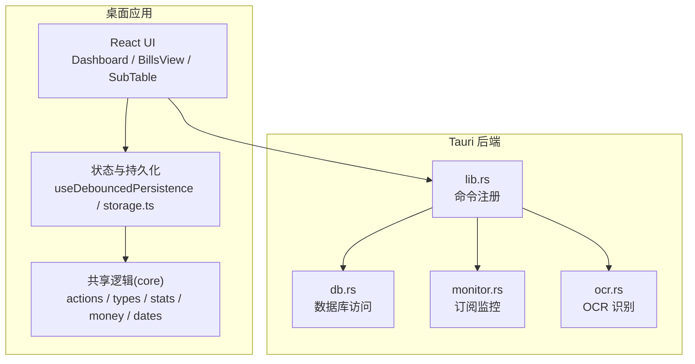
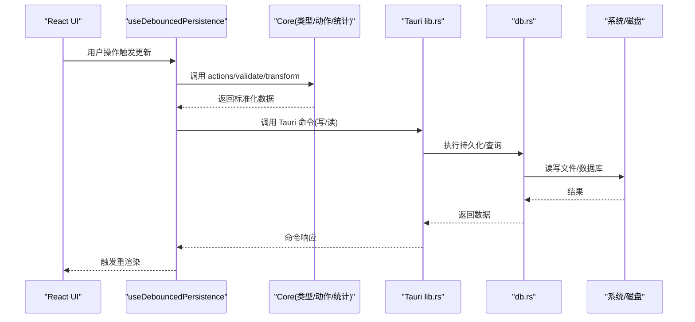
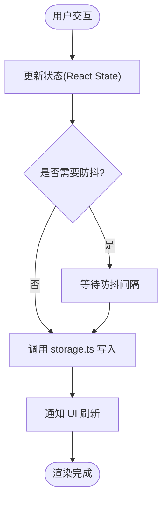
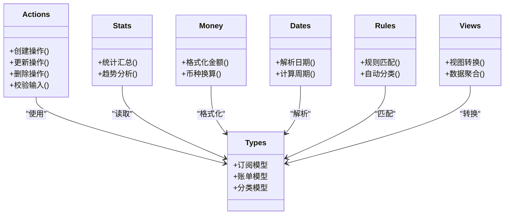
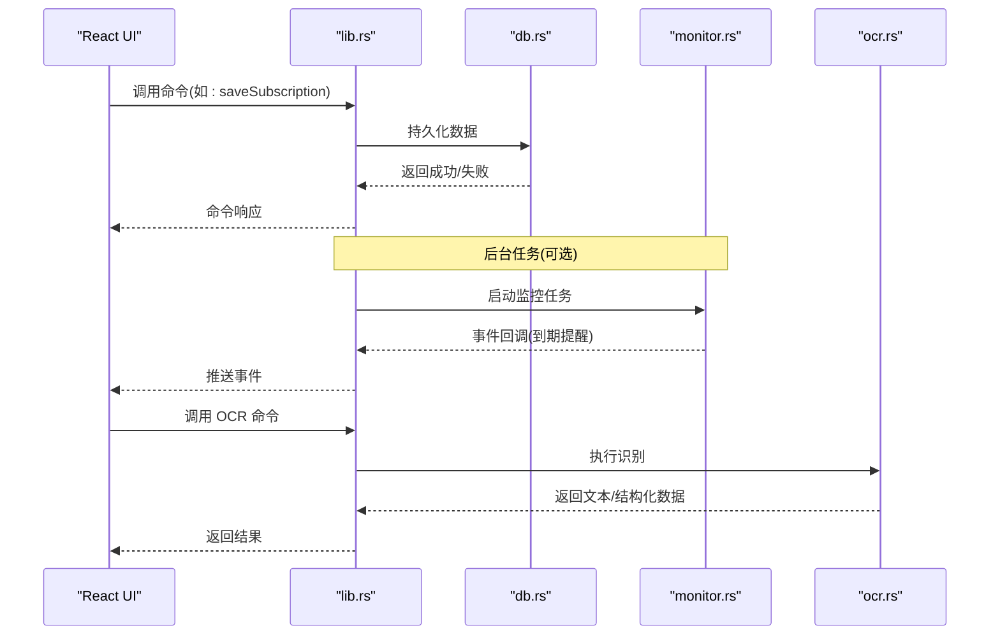
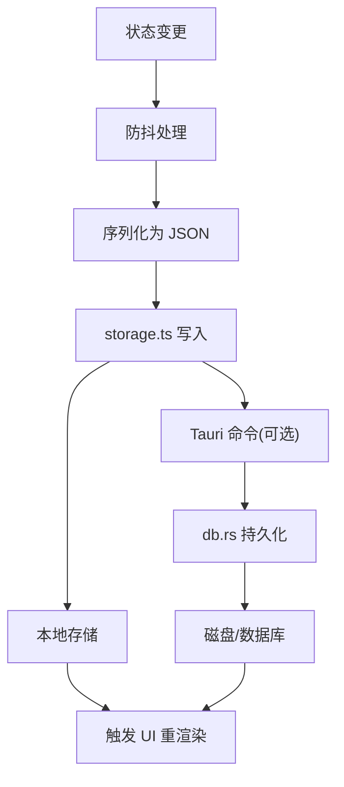
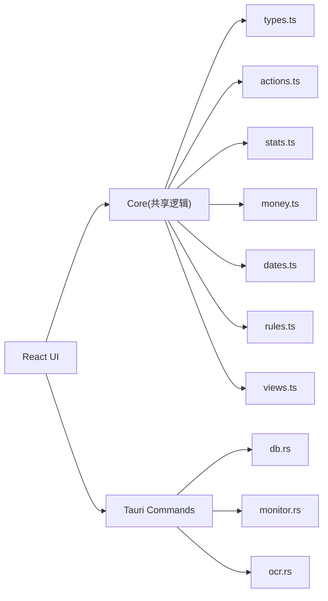

# 系统架构

<cite>
**本文引用的文件**   
- [apps/desktop/src/App.tsx](file://apps/desktop/src/App.tsx)
- [apps/desktop/src/main.tsx](file://apps/desktop/src/main.tsx)
- [apps/desktop/src/storage.ts](file://apps/desktop/src/storage.ts)
- [apps/desktop/src/useDebouncedPersistence.ts](file://apps/desktop/src/useDebouncedPersistence.ts)
- [apps/desktop/src/Dashboard.tsx](file://apps/desktop/src/Dashboard.tsx)
- [apps/desktop/src/BillsView.tsx](file://apps/desktop/src/BillsView.tsx)
- [apps/desktop/src/SubTable.tsx](file://apps/desktop/src/SubTable.tsx)
- [apps/desktop/src/subTableHandlers.ts](file://apps/desktop/src/subTableHandlers.ts)
- [apps/desktop/src/subscriptionFields.ts](file://apps/desktop/src/subscriptionFields.ts)
- [apps/desktop/src/i18n.ts](file://apps/desktop/src/i18n.ts)
- [apps/desktop/src-tauri/src/lib.rs](file://apps/desktop/src-tauri/src/lib.rs)
- [apps/desktop/src-tauri/src/db.rs](file://apps/desktop/src-tauri/src/db.rs)
- [apps/desktop/src-tauri/src/monitor.rs](file://apps/desktop/src-tauri/src/monitor.rs)
- [apps/desktop/src-tauri/src/ocr.rs](file://apps/desktop/src-tauri/src/ocr.rs)
- [apps/desktop/src-tauri/Cargo.toml](file://apps/desktop/src-tauri/Cargo.toml)
- [apps/desktop/src-tauri/tauri.conf.json](file://apps/desktop/src-tauri/tauri.conf.json)
- [packages/core/src/index.ts](file://packages/core/src/index.ts)
- [packages/core/src/types.ts](file://packages/core/src/types.ts)
- [packages/core/src/actions.ts](file://packages/core/src/actions.ts)
- [packages/core/src/load.ts](file://packages/core/src/load.ts)
- [packages/core/src/money.ts](file://packages/core/src/money.ts)
- [packages/core/src/stats.ts](file://packages/core/src/stats.ts)
- [packages/core/src/dates.ts](file://packages/core/src/dates.ts)
- [packages/core/src/rules.ts](file://packages/core/src/rules.ts)
- [packages/core/src/views.ts](file://packages/core/src/views.ts)
</cite>

## 目录
1. [简介](#简介)
2. [项目结构](#项目结构)
3. [核心组件](#核心组件)
4. [架构总览](#架构总览)
5. [详细组件分析](#详细组件分析)
6. [依赖关系分析](#依赖关系分析)
7. [性能考虑](#性能考虑)
8. [故障排查指南](#故障排查指南)
9. [结论](#结论)
10. [附录](#附录)

## 简介
本系统采用基于 Tauri 的混合架构：前端为 React 应用，后端为 Rust 原生能力。通过 Tauri 的命令与事件通道实现前后端通信，将 UI 层、业务逻辑层（core 包）与数据存储层（Rust 数据库/文件系统）解耦。数据流从 UI 发起请求，经 core 进行领域计算与校验，再由 Tauri 命令调用 Rust 持久化或系统能力，最终结果回传至 UI 渲染。

## 项目结构
- apps/desktop：桌面端 React 应用，包含页面、状态管理、本地存储与国际化等。
- apps/desktop/src-tauri：Tauri 后端，暴露 Rust 命令给前端，封装数据库、监控、OCR 等能力。
- packages/core：跨平台共享的业务逻辑与类型定义，被桌面端与未来其他端复用。

**图表来源**
- [apps/desktop/src/Dashboard.tsx](file://apps/desktop/src/Dashboard.tsx)
- [apps/desktop/src/BillsView.tsx](file://apps/desktop/src/BillsView.tsx)
- [apps/desktop/src/SubTable.tsx](file://apps/desktop/src/SubTable.tsx)
- [apps/desktop/src/useDebouncedPersistence.ts](file://apps/desktop/src/useDebouncedPersistence.ts)
- [apps/desktop/src/storage.ts](file://apps/desktop/src/storage.ts)
- [packages/core/src/index.ts](file://packages/core/src/index.ts)
- [apps/desktop/src-tauri/src/lib.rs](file://apps/desktop/src-tauri/src/lib.rs)
- [apps/desktop/src-tauri/src/db.rs](file://apps/desktop/src-tauri/src/db.rs)
- [apps/desktop/src-tauri/src/monitor.rs](file://apps/desktop/src-tauri/src/monitor.rs)
- [apps/desktop/src-tauri/src/ocr.rs](file://apps/desktop/src-tauri/src/ocr.rs)

**章节来源**
- [apps/desktop/src/main.tsx](file://apps/desktop/src/main.tsx)
- [apps/desktop/src-tauri/tauri.conf.json](file://apps/desktop/src-tauri/tauri.conf.json)
- [apps/desktop/src-tauri/Cargo.toml](file://apps/desktop/src-tauri/Cargo.toml)

## 核心组件
- React UI 层：Dashboard、BillsView、SubTable 等页面组件负责用户交互与展示。
- 状态与持久化：useDebouncedPersistence 提供防抖持久化 Hook；storage.ts 封装本地存储策略。
- 共享逻辑(core)：types 定义领域模型；actions 定义操作；stats/money/dates/rules/views 提供统计、金额、日期、规则与视图转换等能力。
- Tauri 后端：lib.rs 注册命令；db.rs 提供数据读写；monitor.rs 提供订阅监控；ocr.rs 提供 OCR 能力。

**章节来源**
- [apps/desktop/src/Dashboard.tsx](file://apps/desktop/src/Dashboard.tsx)
- [apps/desktop/src/BillsView.tsx](file://apps/desktop/src/BillsView.tsx)
- [apps/desktop/src/SubTable.tsx](file://apps/desktop/src/SubTable.tsx)
- [apps/desktop/src/useDebouncedPersistence.ts](file://apps/desktop/src/useDebouncedPersistence.ts)
- [apps/desktop/src/storage.ts](file://apps/desktop/src/storage.ts)
- [packages/core/src/types.ts](file://packages/core/src/types.ts)
- [packages/core/src/actions.ts](file://packages/core/src/actions.ts)
- [packages/core/src/stats.ts](file://packages/core/src/stats.ts)
- [packages/core/src/money.ts](file://packages/core/src/money.ts)
- [packages/core/src/dates.ts](file://packages/core/src/dates.ts)
- [packages/core/src/rules.ts](file://packages/core/src/rules.ts)
- [packages/core/src/views.ts](file://packages/core/src/views.ts)
- [apps/desktop/src-tauri/src/lib.rs](file://apps/desktop/src-tauri/src/lib.rs)
- [apps/desktop/src-tauri/src/db.rs](file://apps/desktop/src-tauri/src/db.rs)
- [apps/desktop/src-tauri/src/monitor.rs](file://apps/desktop/src-tauri/src/monitor.rs)
- [apps/desktop/src-tauri/src/ocr.rs](file://apps/desktop/src-tauri/src/ocr.rs)

## 架构总览
整体采用“UI → Core → Tauri Command → Rust 服务”的分层架构。UI 层通过 Hooks 与工具函数驱动状态变化；Core 层保证领域逻辑与数据格式一致性；Tauri 命令作为桥接层，将前端调用映射到 Rust 能力；Rust 层负责数据库、系统 API 与外部集成。

**图表来源**
- [apps/desktop/src/useDebouncedPersistence.ts](file://apps/desktop/src/useDebouncedPersistence.ts)
- [apps/desktop/src/storage.ts](file://apps/desktop/src/storage.ts)
- [packages/core/src/actions.ts](file://packages/core/src/actions.ts)
- [packages/core/src/types.ts](file://packages/core/src/types.ts)
- [apps/desktop/src-tauri/src/lib.rs](file://apps/desktop/src-tauri/src/lib.rs)
- [apps/desktop/src-tauri/src/db.rs](file://apps/desktop/src-tauri/src/db.rs)

## 详细组件分析

### UI 层与状态管理
- Dashboard、BillsView、SubTable 等组件组织页面结构与交互。
- useDebouncedPersistence 提供防抖写入，避免频繁 I/O；storage.ts 统一本地存储接口。
- i18n.ts 提供多语言支持，确保界面文案可切换。

**图表来源**
- [apps/desktop/src/useDebouncedPersistence.ts](file://apps/desktop/src/useDebouncedPersistence.ts)
- [apps/desktop/src/storage.ts](file://apps/desktop/src/storage.ts)
- [apps/desktop/src/Dashboard.tsx](file://apps/desktop/src/Dashboard.tsx)
- [apps/desktop/src/BillsView.tsx](file://apps/desktop/src/BillsView.tsx)
- [apps/desktop/src/SubTable.tsx](file://apps/desktop/src/SubTable.tsx)
- [apps/desktop/src/i18n.ts](file://apps/desktop/src/i18n.ts)

**章节来源**
- [apps/desktop/src/Dashboard.tsx](file://apps/desktop/src/Dashboard.tsx)
- [apps/desktop/src/BillsView.tsx](file://apps/desktop/src/BillsView.tsx)
- [apps/desktop/src/SubTable.tsx](file://apps/desktop/src/SubTable.tsx)
- [apps/desktop/src/useDebouncedPersistence.ts](file://apps/desktop/src/useDebouncedPersistence.ts)
- [apps/desktop/src/storage.ts](file://apps/desktop/src/storage.ts)
- [apps/desktop/src/i18n.ts](file://apps/desktop/src/i18n.ts)

### 共享逻辑(core)模块
- types.ts：定义订阅、账单、分类等核心数据结构。
- actions.ts：定义创建、更新、删除等操作，以及输入校验与转换。
- stats.ts：统计汇总（如月度支出、到期提醒）。
- money.ts：金额格式化、币种处理。
- dates.ts：日期解析、周期计算。
- rules.ts：自动分类与规则匹配。
- views.ts：视图转换与聚合。

**图表来源**
- [packages/core/src/types.ts](file://packages/core/src/types.ts)
- [packages/core/src/actions.ts](file://packages/core/src/actions.ts)
- [packages/core/src/stats.ts](file://packages/core/src/stats.ts)
- [packages/core/src/money.ts](file://packages/core/src/money.ts)
- [packages/core/src/dates.ts](file://packages/core/src/dates.ts)
- [packages/core/src/rules.ts](file://packages/core/src/rules.ts)
- [packages/core/src/views.ts](file://packages/core/src/views.ts)

**章节来源**
- [packages/core/src/index.ts](file://packages/core/src/index.ts)
- [packages/core/src/types.ts](file://packages/core/src/types.ts)
- [packages/core/src/actions.ts](file://packages/core/src/actions.ts)
- [packages/core/src/load.ts](file://packages/core/src/load.ts)
- [packages/core/src/money.ts](file://packages/core/src/money.ts)
- [packages/core/src/stats.ts](file://packages/core/src/stats.ts)
- [packages/core/src/dates.ts](file://packages/core/src/dates.ts)
- [packages/core/src/rules.ts](file://packages/core/src/rules.ts)
- [packages/core/src/views.ts](file://packages/core/src/views.ts)

### Tauri 后端与命令
- lib.rs：注册 Tauri 命令，暴露给前端调用。
- db.rs：封装数据库访问，提供增删改查。
- monitor.rs：订阅监控，定时检查续费时间。
- ocr.rs：OCR 识别，用于票据或截图解析。

**图表来源**
- [apps/desktop/src-tauri/src/lib.rs](file://apps/desktop/src-tauri/src/lib.rs)
- [apps/desktop/src-tauri/src/db.rs](file://apps/desktop/src-tauri/src/db.rs)
- [apps/desktop/src-tauri/src/monitor.rs](file://apps/desktop/src-tauri/src/monitor.rs)
- [apps/desktop/src-tauri/src/ocr.rs](file://apps/desktop/src-tauri/src/ocr.rs)

**章节来源**
- [apps/desktop/src-tauri/src/lib.rs](file://apps/desktop/src-tauri/src/lib.rs)
- [apps/desktop/src-tauri/src/db.rs](file://apps/desktop/src-tauri/src/db.rs)
- [apps/desktop/src-tauri/src/monitor.rs](file://apps/desktop/src-tauri/src/monitor.rs)
- [apps/desktop/src-tauri/src/ocr.rs](file://apps/desktop/src-tauri/src/ocr.rs)
- [apps/desktop/src-tauri/Cargo.toml](file://apps/desktop/src-tauri/Cargo.toml)

### 数据流与持久化策略
- 前端状态变更通过 useDebouncedPersistence 防抖后写入 storage.ts。
- storage.ts 决定具体存储位置（IndexedDB/LocalStorage/文件系统），并序列化数据。
- 需要系统级能力时，通过 Tauri 命令调用 Rust 层进行持久化或计算。

**图表来源**
- [apps/desktop/src/useDebouncedPersistence.ts](file://apps/desktop/src/useDebouncedPersistence.ts)
- [apps/desktop/src/storage.ts](file://apps/desktop/src/storage.ts)
- [apps/desktop/src-tauri/src/db.rs](file://apps/desktop/src-tauri/src/db.rs)

**章节来源**
- [apps/desktop/src/useDebouncedPersistence.ts](file://apps/desktop/src/useDebouncedPersistence.ts)
- [apps/desktop/src/storage.ts](file://apps/desktop/src/storage.ts)
- [apps/desktop/src-tauri/src/db.rs](file://apps/desktop/src-tauri/src/db.rs)

## 依赖关系分析
- UI 层依赖 core 包进行数据校验与转换。
- UI 层通过 Tauri 命令与 Rust 后端通信。
- Rust 后端依赖 db/monitor/ocr 等模块提供系统能力。
- core 包独立于平台，可被多端复用。

**图表来源**
- [apps/desktop/src/Dashboard.tsx](file://apps/desktop/src/Dashboard.tsx)
- [apps/desktop/src/BillsView.tsx](file://apps/desktop/src/BillsView.tsx)
- [apps/desktop/src/SubTable.tsx](file://apps/desktop/src/SubTable.tsx)
- [packages/core/src/index.ts](file://packages/core/src/index.ts)
- [apps/desktop/src-tauri/src/lib.rs](file://apps/desktop/src-tauri/src/lib.rs)
- [apps/desktop/src-tauri/src/db.rs](file://apps/desktop/src-tauri/src/db.rs)
- [apps/desktop/src-tauri/src/monitor.rs](file://apps/desktop/src-tauri/src/monitor.rs)
- [apps/desktop/src-tauri/src/ocr.rs](file://apps/desktop/src-tauri/src/ocr.rs)

**章节来源**
- [apps/desktop/src-tauri/Cargo.toml](file://apps/desktop/src-tauri/Cargo.toml)
- [apps/desktop/src-tauri/tauri.conf.json](file://apps/desktop/src-tauri/tauri.conf.json)

## 性能考虑
- 使用防抖持久化减少频繁 I/O 操作。
- 在 core 层进行批量数据处理，降低 UI 阻塞。
- 将重型计算（如统计、OCR）下沉到 Rust 后端，提升性能。
- 合理拆分模块，避免不必要的依赖与重渲染。

[本节为通用指导，不直接分析具体文件]

## 故障排查指南
- 若 UI 未更新，检查 useDebouncedPersistence 的防抖配置与 storage.ts 的写入是否成功。
- 若 Tauri 命令失败，查看 lib.rs 的错误处理与 db.rs 的异常返回。
- 若 OCR 识别失败，检查 ocr.rs 的输入格式与权限配置。
- 若监控未触发，确认 monitor.rs 的任务调度与事件回调机制。

**章节来源**
- [apps/desktop/src/useDebouncedPersistence.ts](file://apps/desktop/src/useDebouncedPersistence.ts)
- [apps/desktop/src/storage.ts](file://apps/desktop/src/storage.ts)
- [apps/desktop/src-tauri/src/lib.rs](file://apps/desktop/src-tauri/src/lib.rs)
- [apps/desktop/src-tauri/src/db.rs](file://apps/desktop/src-tauri/src/db.rs)
- [apps/desktop/src-tauri/src/ocr.rs](file://apps/desktop/src-tauri/src/ocr.rs)
- [apps/desktop/src-tauri/src/monitor.rs](file://apps/desktop/src-tauri/src/monitor.rs)

## 结论
本系统通过 Tauri 实现了前后端分离与能力互补：React 负责交互与展示，core 保障领域逻辑一致性，Rust 提供高性能与系统级能力。模块化设计使代码职责清晰，易于扩展与维护。建议继续优化错误处理与日志记录，进一步提升稳定性与可观测性。

[本节为总结性内容，不直接分析具体文件]

## 附录
- 配置文件：tauri.conf.json 控制应用打包与权限。
- 构建脚本：scripts/sign-macos-app.sh 用于 macOS 签名。
- 文档：docs/ 包含产品说明与部署指南。

[本节为补充信息，不直接分析具体文件]