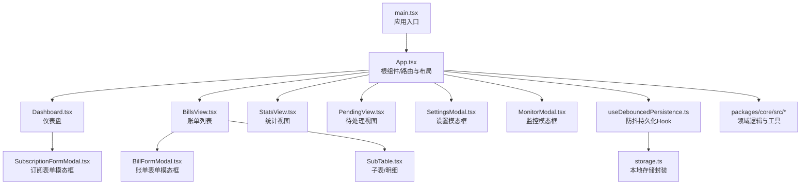
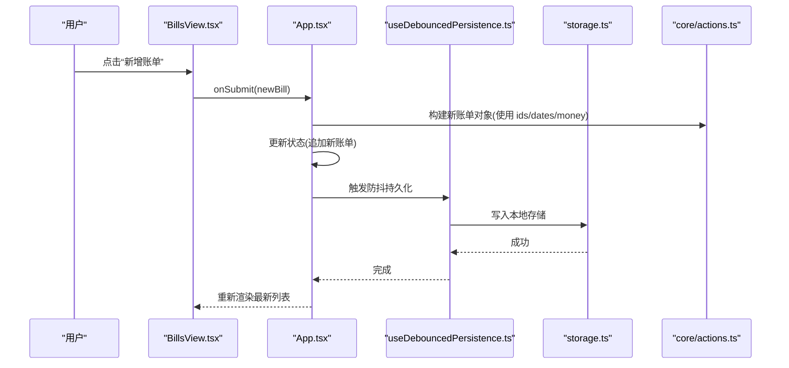
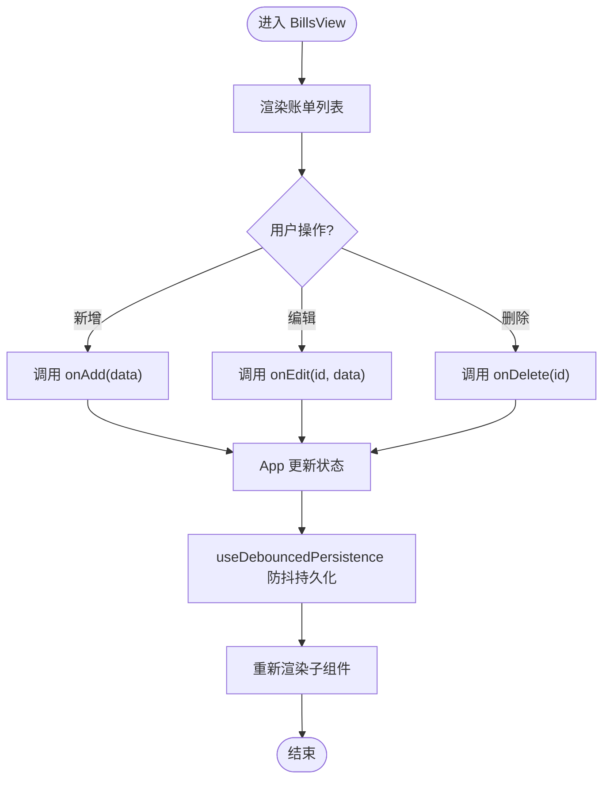
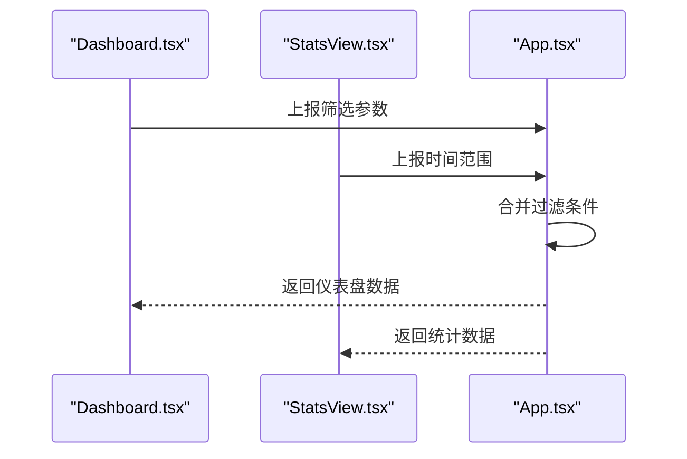
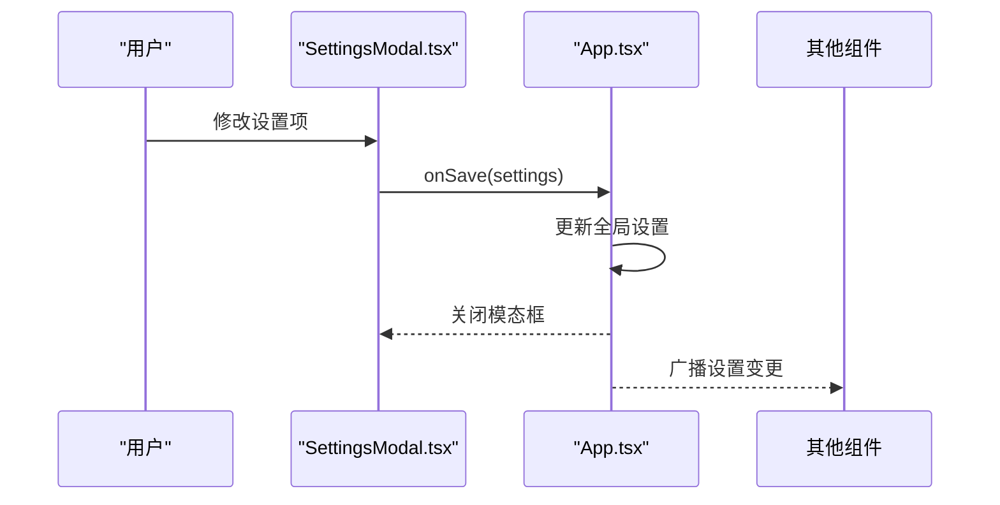
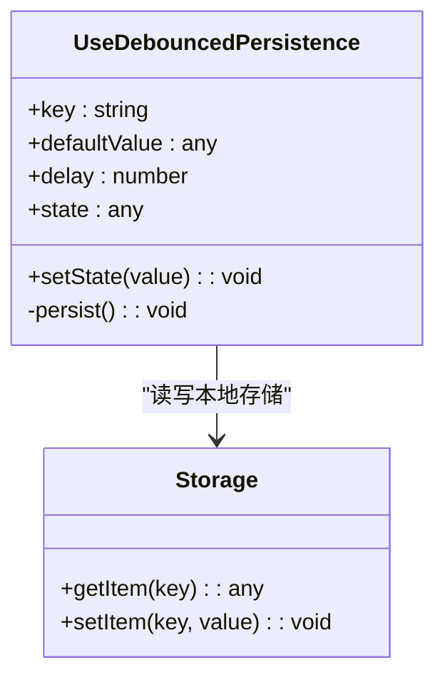
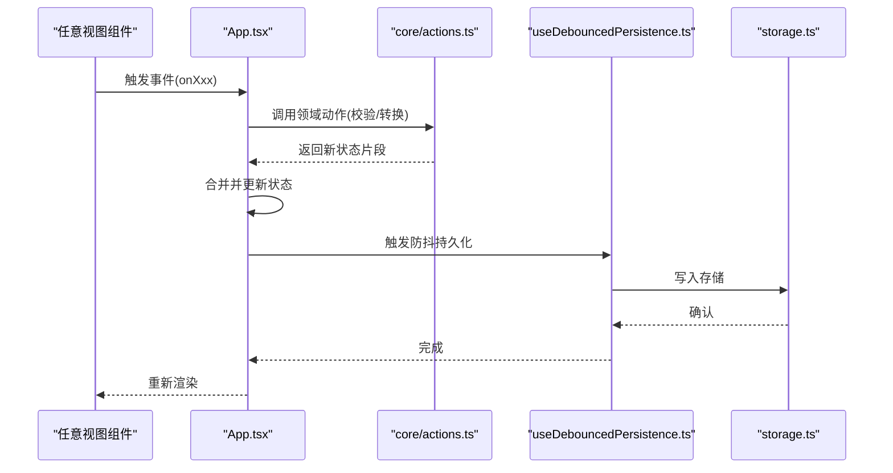
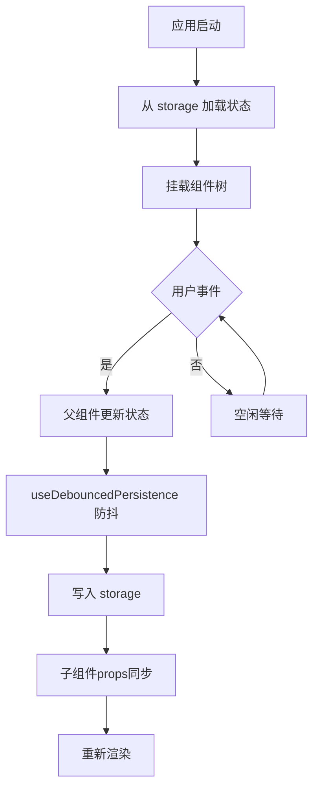
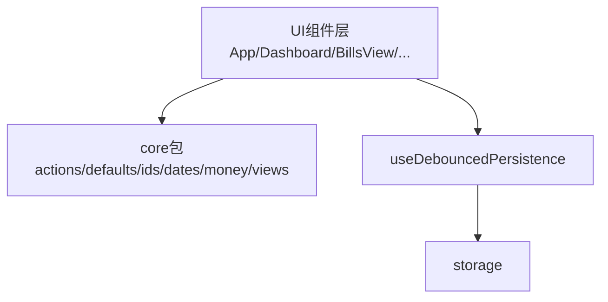

# 组件通信机制

<cite>
**本文引用的文件**   
- [App.tsx](file://apps/desktop/src/App.tsx)
- [Dashboard.tsx](file://apps/desktop/src/Dashboard.tsx)
- [BillsView.tsx](file://apps/desktop/src/BillsView.tsx)
- [StatsView.tsx](file://apps/desktop/src/StatsView.tsx)
- [PendingView.tsx](file://apps/desktop/src/PendingView.tsx)
- [SubscriptionFormModal.tsx](file://apps/desktop/src/SubscriptionFormModal.tsx)
- [BillFormModal.tsx](file://apps/desktop/src/BillFormModal.tsx)
- [SettingsModal.tsx](file://apps/desktop/src/SettingsModal.tsx)
- [MonitorModal.tsx](file://apps/desktop/src/MonitorModal.tsx)
- [SubTable.tsx](file://apps/desktop/src/SubTable.tsx)
- [useDebouncedPersistence.ts](file://apps/desktop/src/useDebouncedPersistence.ts)
- [storage.ts](file://apps/desktop/src/storage.ts)
- [main.tsx](file://apps/desktop/src/main.tsx)
- [actions.ts](file://packages/core/src/actions.ts)
- [defaults.ts](file://packages/core/src/defaults.ts)
- [ids.ts](file://packages/core/src/ids.ts)
- [dates.ts](file://packages/core/src/dates.ts)
- [money.ts](file://packages/core/src/money.ts)
- [views.ts](file://packages/core/src/views.ts)
</cite>

## 目录
1. [简介](#简介)
2. [项目结构](#项目结构)
3. [核心组件与职责](#核心组件与职责)
4. [架构总览](#架构总览)
5. [详细组件分析](#详细组件分析)
6. [依赖关系分析](#依赖关系分析)
7. [性能考虑](#性能考虑)
8. [故障排查指南](#故障排查指南)
9. [结论](#结论)
10. [附录](#附录)

## 简介
本文件聚焦于React桌面应用中的组件通信机制，系统阐述父子、兄弟与跨层级组件间的数据传递与事件通信模式。文档重点包括：
- 状态提升与共享状态管理策略
- 自定义Hook（如 useDebouncedPersistence）在组件间的复用
- 事件驱动架构的实现与用户操作响应流程
- 组件生命周期管理与状态同步策略
- 组件关系图与通信流程图

## 项目结构
该仓库采用多包结构，前端逻辑集中在 apps/desktop/src，核心领域逻辑位于 packages/core/src。关键入口为 main.tsx，根组件 App.tsx 负责装配页面视图与全局状态；各视图组件（Dashboard、BillsView、StatsView、PendingView）通过 props 与回调进行通信；模态框组件（SubscriptionFormModal、BillFormModal、SettingsModal、MonitorModal）通过父级传入的 open/close 与表单数据回调完成交互；表格 SubTable 用于展示明细数据并触发编辑/删除等事件。

图表来源
- [main.tsx:1-50](file://apps/desktop/src/main.tsx#L1-L50)
- [App.tsx:1-120](file://apps/desktop/src/App.tsx#L1-L120)
- [Dashboard.tsx:1-120](file://apps/desktop/src/Dashboard.tsx#L1-L120)
- [BillsView.tsx:1-120](file://apps/desktop/src/BillsView.tsx#L1-L120)
- [StatsView.tsx:1-120](file://apps/desktop/src/StatsView.tsx#L1-L120)
- [PendingView.tsx:1-120](file://apps/desktop/src/PendingView.tsx#L1-L120)
- [SubscriptionFormModal.tsx:1-120](file://apps/desktop/src/SubscriptionFormModal.tsx#L1-L120)
- [BillFormModal.tsx:1-120](file://apps/desktop/src/BillFormModal.tsx#L1-L120)
- [SettingsModal.tsx:1-120](file://apps/desktop/src/SettingsModal.tsx#L1-L120)
- [MonitorModal.tsx:1-120](file://apps/desktop/src/MonitorModal.tsx#L1-L120)
- [SubTable.tsx:1-120](file://apps/desktop/src/SubTable.tsx#L1-L120)
- [useDebouncedPersistence.ts:1-120](file://apps/desktop/src/useDebouncedPersistence.ts#L1-L120)
- [storage.ts:1-120](file://apps/desktop/src/storage.ts#L1-L120)

章节来源
- [main.tsx:1-50](file://apps/desktop/src/main.tsx#L1-L50)
- [App.tsx:1-120](file://apps/desktop/src/App.tsx#L1-L120)

## 核心组件与职责
- 根组件 App.tsx：集中管理全局状态（如主题、语言、订阅集合、账单集合），提供状态提升后的回调函数给子视图，协调模态框显示与数据提交。
- 视图组件（Dashboard、BillsView、StatsView、PendingView）：消费上层状态，渲染各自视图，并通过回调向父级上报用户操作（新增、编辑、删除、筛选）。
- 模态框组件（SubscriptionFormModal、BillFormModal、SettingsModal、MonitorModal）：接收 open/close 控制与初始数据，提交表单后通过回调将变更回传给父级。
- 子表 SubTable：展示明细数据，支持行内操作（编辑、删除），向上抛出事件。
- 自定义Hook useDebouncedPersistence：对状态变更进行防抖并持久化到 storage，避免频繁I/O。
- 存储 storage：封装本地读写接口，供Hook或组件直接调用。
- 核心包 core：提供领域模型、默认值、ID生成、日期/金额工具、视图计算等能力，被UI层复用。

章节来源
- [App.tsx:1-120](file://apps/desktop/src/App.tsx#L1-L120)
- [BillsView.tsx:1-120](file://apps/desktop/src/BillsView.tsx#L1-L120)
- [SubTable.tsx:1-120](file://apps/desktop/src/SubTable.tsx#L1-L120)
- [useDebouncedPersistence.ts:1-120](file://apps/desktop/src/useDebouncedPersistence.ts#L1-L120)
- [storage.ts:1-120](file://apps/desktop/src/storage.ts#L1-L120)
- [actions.ts:1-120](file://packages/core/src/actions.ts#L1-L120)
- [defaults.ts:1-120](file://packages/core/src/defaults.ts#L1-L120)
- [ids.ts:1-120](file://packages/core/src/ids.ts#L1-L120)
- [dates.ts:1-120](file://packages/core/src/dates.ts#L1-L120)
- [money.ts:1-120](file://packages/core/src/money.ts#L1-L120)
- [views.ts:1-120](file://packages/core/src/views.ts#L1-L120)

## 架构总览
整体采用“状态提升 + 回调”的事件驱动架构。根组件持有权威状态，子组件仅消费状态并通过回调上报变更。持久化由 useDebouncedPersistence 统一处理，降低写入频率。领域逻辑集中于 core 包，保证UI与业务解耦。

图表来源
- [BillsView.tsx:1-120](file://apps/desktop/src/BillsView.tsx#L1-L120)
- [App.tsx:1-120](file://apps/desktop/src/App.tsx#L1-L120)
- [useDebouncedPersistence.ts:1-120](file://apps/desktop/src/useDebouncedPersistence.ts#L1-L120)
- [storage.ts:1-120](file://apps/desktop/src/storage.ts#L1-L120)
- [actions.ts:1-120](file://packages/core/src/actions.ts#L1-L120)
- [ids.ts:1-120](file://packages/core/src/ids.ts#L1-L120)
- [dates.ts:1-120](file://packages/core/src/dates.ts#L1-L120)
- [money.ts:1-120](file://packages/core/src/money.ts#L1-L120)

## 详细组件分析

### 父子组件通信（以 BillsView 与 App 为例）
- 父组件 App 维护账单集合与相关状态，并向 BillsView 传入数据与回调（如 onAdd、onEdit、onDelete）。
- BillsView 渲染列表与操作按钮，用户操作时调用回调，将变更事件上抛至 App。
- App 收到事件后更新权威状态，必要时触发 useDebouncedPersistence 进行持久化。

图表来源
- [BillsView.tsx:1-120](file://apps/desktop/src/BillsView.tsx#L1-L120)
- [App.tsx:1-120](file://apps/desktop/src/App.tsx#L1-L120)
- [useDebouncedPersistence.ts:1-120](file://apps/desktop/src/useDebouncedPersistence.ts#L1-L120)

章节来源
- [BillsView.tsx:1-120](file://apps/desktop/src/BillsView.tsx#L1-L120)
- [App.tsx:1-120](file://apps/desktop/src/App.tsx#L1-L120)

### 兄弟组件通信（以 Dashboard 与 StatsView 为例）
- 兄弟组件之间不直接通信，而是通过共同父组件（App）作为中介。
- Dashboard 与 StatsView 分别向 App 上报筛选条件或时间范围，App 汇总后向下分发所需数据。
- 这种模式确保单一数据源与可预测的状态流。

图表来源
- [Dashboard.tsx:1-120](file://apps/desktop/src/Dashboard.tsx#L1-L120)
- [StatsView.tsx:1-120](file://apps/desktop/src/StatsView.tsx#L1-L120)
- [App.tsx:1-120](file://apps/desktop/src/App.tsx#L1-L120)

章节来源
- [Dashboard.tsx:1-120](file://apps/desktop/src/Dashboard.tsx#L1-L120)
- [StatsView.tsx:1-120](file://apps/desktop/src/StatsView.tsx#L1-L120)
- [App.tsx:1-120](file://apps/desktop/src/App.tsx#L1-L120)

### 跨层级组件通信（以 SettingsModal 与 App 为例）
- SettingsModal 由 App 控制 open/close，并通过 props 传入当前设置项。
- 用户在模态框中修改设置后，通过回调将新设置回传至 App，App 更新全局配置并通知所有依赖设置的子组件。

图表来源
- [SettingsModal.tsx:1-120](file://apps/desktop/src/SettingsModal.tsx#L1-L120)
- [App.tsx:1-120](file://apps/desktop/src/App.tsx#L1-L120)

章节来源
- [SettingsModal.tsx:1-120](file://apps/desktop/src/SettingsModal.tsx#L1-L120)
- [App.tsx:1-120](file://apps/desktop/src/App.tsx#L1-L120)

### 自定义Hook复用（useDebouncedPersistence）
- useDebouncedPersistence 接收键名、默认值与防抖延迟，返回 [state, setState]。
- setState 在防抖后将 state 写入 storage，避免频繁I/O。
- 多个组件可独立使用该Hook实现各自的持久化需求，保持代码复用与一致性。

图表来源
- [useDebouncedPersistence.ts:1-120](file://apps/desktop/src/useDebouncedPersistence.ts#L1-L120)
- [storage.ts:1-120](file://apps/desktop/src/storage.ts#L1-L120)

章节来源
- [useDebouncedPersistence.ts:1-120](file://apps/desktop/src/useDebouncedPersistence.ts#L1-L120)
- [storage.ts:1-120](file://apps/desktop/src/storage.ts#L1-L120)

### 事件驱动架构与用户操作响应
- 用户操作在各视图中触发回调，回调最终汇聚到 App 进行状态更新。
- 对于需要异步或批量处理的场景，可在 App 中编排 actions（来自 core/actions.ts），再触发持久化与UI刷新。
- 模态框组件通过 open/close 与数据回调参与事件流，形成清晰的请求-响应链路。

图表来源
- [App.tsx:1-120](file://apps/desktop/src/App.tsx#L1-L120)
- [actions.ts:1-120](file://packages/core/src/actions.ts#L1-L120)
- [useDebouncedPersistence.ts:1-120](file://apps/desktop/src/useDebouncedPersistence.ts#L1-L120)
- [storage.ts:1-120](file://apps/desktop/src/storage.ts#L1-L120)

章节来源
- [App.tsx:1-120](file://apps/desktop/src/App.tsx#L1-L120)
- [actions.ts:1-120](file://packages/core/src/actions.ts#L1-L120)

### 组件生命周期管理与状态同步策略
- 初始化阶段：从 storage 读取默认或上次保存的状态，注入到各组件的 Hook 或状态中。
- 运行期：用户操作触发回调，父组件更新权威状态，子组件通过 props 自动同步。
- 持久化：useDebouncedPersistence 在状态变更后防抖写入 storage，减少I/O开销。
- 卸载清理：模态框关闭时清理临时状态，避免内存泄漏。

图表来源
- [storage.ts:1-120](file://apps/desktop/src/storage.ts#L1-L120)
- [useDebouncedPersistence.ts:1-120](file://apps/desktop/src/useDebouncedPersistence.ts#L1-L120)
- [App.tsx:1-120](file://apps/desktop/src/App.tsx#L1-L120)

章节来源
- [storage.ts:1-120](file://apps/desktop/src/storage.ts#L1-L120)
- [useDebouncedPersistence.ts:1-120](file://apps/desktop/src/useDebouncedPersistence.ts#L1-L120)
- [App.tsx:1-120](file://apps/desktop/src/App.tsx#L1-L120)

## 依赖关系分析
UI层依赖 core 包提供的领域逻辑与工具函数，同时通过 useDebouncedPersistence 与 storage 进行持久化。视图组件之间通过父组件进行间接通信，避免直接耦合。

图表来源
- [App.tsx:1-120](file://apps/desktop/src/App.tsx#L1-L120)
- [actions.ts:1-120](file://packages/core/src/actions.ts#L1-L120)
- [defaults.ts:1-120](file://packages/core/src/defaults.ts#L1-L120)
- [ids.ts:1-120](file://packages/core/src/ids.ts#L1-L120)
- [dates.ts:1-120](file://packages/core/src/dates.ts#L1-L120)
- [money.ts:1-120](file://packages/core/src/money.ts#L1-L120)
- [views.ts:1-120](file://packages/core/src/views.ts#L1-L120)
- [useDebouncedPersistence.ts:1-120](file://apps/desktop/src/useDebouncedPersistence.ts#L1-L120)
- [storage.ts:1-120](file://apps/desktop/src/storage.ts#L1-L120)

章节来源
- [actions.ts:1-120](file://packages/core/src/actions.ts#L1-L120)
- [defaults.ts:1-120](file://packages/core/src/defaults.ts#L1-L120)
- [ids.ts:1-120](file://packages/core/src/ids.ts#L1-L120)
- [dates.ts:1-120](file://packages/core/src/dates.ts#L1-L120)
- [money.ts:1-120](file://packages/core/src/money.ts#L1-L120)
- [views.ts:1-120](file://packages/core/src/views.ts#L1-L120)
- [useDebouncedPersistence.ts:1-120](file://apps/desktop/src/useDebouncedPersistence.ts#L1-L120)
- [storage.ts:1-120](file://apps/desktop/src/storage.ts#L1-L120)

## 性能考虑
- 使用 useDebouncedPersistence 对高频状态变更进行防抖，降低本地存储写入次数，提高响应速度。
- 将昂贵计算（如统计、视图聚合）放在 core 包的 views.ts 中，按需调用，避免重复计算。
- 合理拆分组件，减少不必要的重渲染；仅在必要处使用 memoization。
- 大列表渲染建议使用虚拟滚动或分页，结合 SubTable 的局部更新策略。

## 故障排查指南
- 数据未持久化：检查 useDebouncedPersistence 的防抖延迟是否过长，以及 storage 写入是否成功。
- 状态不同步：确认父组件是否正确更新权威状态，子组件是否通过 props 正确消费。
- 模态框无法关闭：检查 open/close 控制逻辑与回调是否被正确调用。
- 领域逻辑错误：核对 core/actions.ts 中的数据处理与校验规则，确保输入合法性。

章节来源
- [useDebouncedPersistence.ts:1-120](file://apps/desktop/src/useDebouncedPersistence.ts#L1-L120)
- [storage.ts:1-120](file://apps/desktop/src/storage.ts#L1-L120)
- [actions.ts:1-120](file://packages/core/src/actions.ts#L1-L120)

## 结论
本项目的组件通信机制以“状态提升 + 回调”为核心，辅以自定义Hook实现统一的持久化策略，并通过 core 包解耦领域逻辑。该架构清晰、可扩展，适合复杂桌面应用的长期演进。建议持续优化防抖策略与渲染性能，完善错误边界与日志记录，以提升用户体验与可维护性。

## 附录
- 术语说明
  - 状态提升：将共享状态提升到最近的共同父组件中进行管理。
  - 防抖：限制函数执行频率，避免短时间内多次触发。
  - 权威状态：唯一真实数据来源，所有子组件基于其派生状态。
- 最佳实践
  - 单一数据源与单向数据流
  - 组件职责单一，避免过度耦合
  - 使用Hook封装通用逻辑，提高复用性
  - 明确错误处理与用户反馈