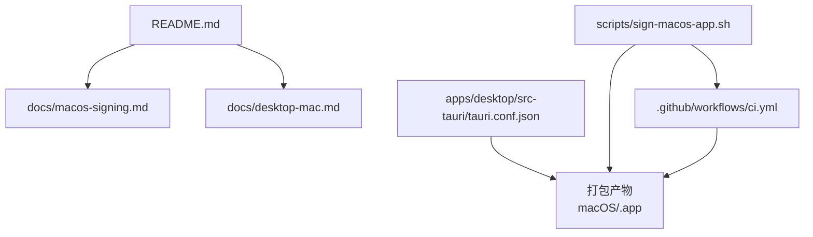
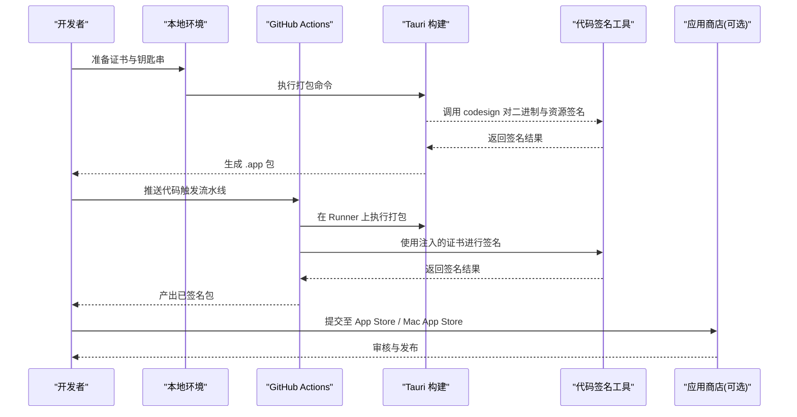
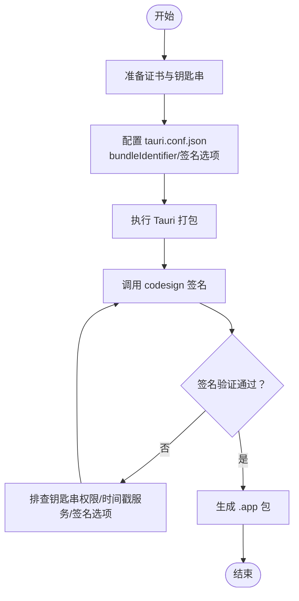
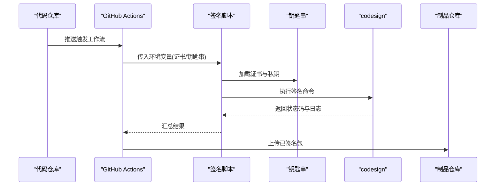
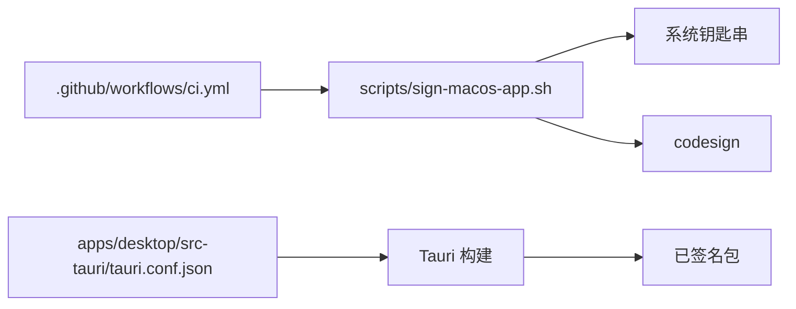

# 代码签名

<cite>
**本文引用的文件**   
- [macos-signing.md](file://docs/macos-signing.md)
- [desktop-mac.md](file://docs/desktop-mac.md)
- [sign-macos-app.sh](file://scripts/sign-macos-app.sh)
- [ci.yml](file://.github/workflows/ci.yml)
- [tauri.conf.json](file://apps/desktop/src-tauri/tauri.conf.json)
- [README.md](file://README.md)
</cite>

## 目录
1. [简介](#简介)
2. [项目结构](#项目结构)
3. [核心组件](#核心组件)
4. [架构总览](#架构总览)
5. [详细组件分析](#详细组件分析)
6. [依赖关系分析](#依赖关系分析)
7. [性能与可靠性考虑](#性能与可靠性考虑)
8. [故障排除指南](#故障排除指南)
9. [结论](#结论)
10. [附录](#附录)

## 简介
本文件面向 macOS、Windows 与 Linux 应用的代码签名实践，结合仓库中的 Tauri 桌面应用与相关脚本、工作流，给出从证书获取、安装配置到自动化签名的完整说明。重点包括：
- macOS 开发者证书的获取、安装与配置；Tauri 打包与签名流程
- Windows 数字签名设置与证书管理（通用指导）
- Linux 签名要求与可选方案（通用指导）
- 自动化签名脚本使用方法与 CI 集成要点
- 应用商店上架所需的签名要求说明

## 项目结构
本项目为基于 Tauri 的跨平台桌面应用，前端使用 React/Vite，后端 Rust 通过 Tauri 桥接。签名相关内容主要分布在文档、脚本与构建配置中：
- 文档：macOS 签名与桌面端说明
- 脚本：macOS 应用签名脚本
- 工作流：CI 流水线定义
- 构建配置：Tauri 配置文件（含平台相关字段）

**图表来源** 
- [macos-signing.md](file://docs/macos-signing.md)
- [desktop-mac.md](file://docs/desktop-mac.md)
- [sign-macos-app.sh](file://scripts/sign-macos-app.sh)
- [ci.yml](file://.github/workflows/ci.yml)
- [tauri.conf.json](file://apps/desktop/src-tauri/tauri.conf.json)

**章节来源**
- [README.md](file://README.md)

## 核心组件
- macOS 签名文档与脚本：提供本地与 CI 环境下的签名步骤、环境变量与工具链要求
- Tauri 构建配置：包含平台相关能力与签名所需字段（如 bundleIdentifier、codesign 相关项等）
- CI 工作流：在 GitHub Actions 中执行构建与签名任务，通常需注入证书与密钥环信息

**章节来源**
- [macos-signing.md](file://docs/macos-signing.md)
- [sign-macos-app.sh](file://scripts/sign-macos-app.sh)
- [ci.yml](file://.github/workflows/ci.yml)
- [tauri.conf.json](file://apps/desktop/src-tauri/tauri.conf.json)

## 架构总览
下图展示了 macOS 应用从源码到可分发包的签名流程概览，涵盖本地与 CI 两条路径。

**图表来源** 
- [macos-signing.md](file://docs/macos-signing.md)
- [sign-macos-app.sh](file://scripts/sign-macos-app.sh)
- [ci.yml](file://.github/workflows/ci.yml)
- [tauri.conf.json](file://apps/desktop/src-tauri/tauri.conf.json)

## 详细组件分析

### macOS 签名流程与证书配置
- 开发者证书获取与安装
  - 通过 Apple Developer 账号创建并下载开发者证书与描述文件
  - 将证书导入系统钥匙串，并确保私钥可用且未受保护
- 钥匙串与权限
  - 确保签名时能访问私钥，必要时配置自动解锁或 CI 环境的钥匙串访问策略
- Tauri 打包与签名
  - 在 tauri.conf.json 中配置 bundleIdentifier、签名相关字段（如 codesign 选项）
  - 使用 Tauri CLI 执行打包，内部会调用系统 codesign 对二进制与资源进行签名
- 本地验证
  - 使用系统工具校验签名状态与时间戳服务可用性
- CI 集成
  - 在 GitHub Actions 中注入证书与钥匙串，执行签名任务并产出可分发包

**图表来源** 
- [macos-signing.md](file://docs/macos-signing.md)
- [tauri.conf.json](file://apps/desktop/src-tauri/tauri.conf.json)

**章节来源**
- [macos-signing.md](file://docs/macos-signing.md)
- [desktop-mac.md](file://docs/desktop-mac.md)
- [tauri.conf.json](file://apps/desktop/src-tauri/tauri.conf.json)

### Windows 数字签名设置与证书管理（通用指导）
- 证书类型
  - 推荐使用 EV 代码签名证书以获得更好的信任链与用户提示优化
- 工具链
  - 使用 signtool 进行签名与时间戳服务配置
- 证书管理
  - 将证书导入本地计算机存储，确保私钥可被签名进程访问
- 签名流程
  - 先对主程序签名，再对依赖 DLL/插件按顺序签名
  - 配置可靠的时间戳服务器以保证过期后仍可验证
- 验证与回滚
  - 使用系统工具检查签名状态与证书链完整性
  - 出现问题时清理缓存并重试

[本节为通用指导，不直接分析具体文件]

### Linux 签名要求与可选方案（通用指导）
- 默认情况
  - Linux 发行版通常不强制要求二进制签名即可运行
- 可选方案
  - 使用 RPM/DEB 包签名提升可信度
  - 对静态库或二进制进行 gpg 签名，配合包管理器验证
- 企业场景
  - 结合内部 CA 与设备策略进行白名单控制

[本节为通用指导，不直接分析具体文件]

### 自动化签名脚本与 CI 集成
- 脚本职责
  - 封装 macOS 签名流程，统一处理证书加载、签名参数与错误输出
- 环境变量
  - 通过环境变量注入证书、钥匙串名称与密码等敏感信息
- CI 流水线
  - 在 GitHub Actions 中定义构建与签名任务，安全地注入凭据并产出制品
- 最佳实践
  - 最小权限原则：仅授予必要访问范围
  - 日志脱敏：避免泄露证书指纹或密码片段

**图表来源** 
- [sign-macos-app.sh](file://scripts/sign-macos-app.sh)
- [ci.yml](file://.github/workflows/ci.yml)

**章节来源**
- [sign-macos-app.sh](file://scripts/sign-macos-app.sh)
- [ci.yml](file://.github/workflows/ci.yml)

### 应用商店上架签名要求（通用指导）
- macOS
  - 必须使用有效的开发者证书签名
  - 建议启用时间戳服务以确保长期有效性
  - 针对 Mac App Store 需遵循沙盒与权限声明要求
- Windows
  - 建议使用 EV 证书并通过 Microsoft Store 或第三方渠道分发
  - 确保签名链完整且时间戳有效
- Linux
  - 若通过发行版商店分发，需满足其包签名策略

[本节为通用指导，不直接分析具体文件]

## 依赖关系分析
- 脚本与工作流
  - 签名脚本被 CI 工作流调用，负责在构建阶段完成签名
- 构建配置
  - Tauri 配置文件驱动打包行为，影响签名时的目标与资源集合
- 外部依赖
  - macOS 依赖系统 codesign 与钥匙串
  - Windows 依赖 signtool 与时间戳服务
  - Linux 视分发方式选择签名工具链

**图表来源** 
- [ci.yml](file://.github/workflows/ci.yml)
- [sign-macos-app.sh](file://scripts/sign-macos-app.sh)
- [tauri.conf.json](file://apps/desktop/src-tauri/tauri.conf.json)

**章节来源**
- [ci.yml](file://.github/workflows/ci.yml)
- [sign-macos-app.sh](file://scripts/sign-macos-app.sh)
- [tauri.conf.json](file://apps/desktop/src-tauri/tauri.conf.json)

## 性能与可靠性考虑
- 签名性能
  - 批量签名时优先复用钥匙串会话，减少重复认证开销
  - 合理并行化子模块签名，注意互斥锁与资源竞争
- 可靠性
  - 引入重试机制应对网络波动（时间戳服务）
  - 记录关键步骤日志与退出码，便于快速定位问题
- 安全性
  - 严格限制证书与私钥的访问范围
  - 在 CI 中使用加密变量与临时钥匙串，避免持久化敏感数据

[本节为通用指导，不直接分析具体文件]

## 故障排除指南
- 常见错误与排查
  - 钥匙串访问失败：检查私钥是否可用、是否被锁定或需要输入密码
  - 签名失败：确认签名选项与资源清单一致，检查代码签名权限
  - 时间戳服务不可用：更换备用时间戳服务器或离线重试
- 验证手段
  - 使用系统工具检查签名状态与证书链
  - 对比开发环境与 CI 环境差异（工具版本、环境变量）
- 日志与调试
  - 开启详细日志输出，捕获签名命令的完整参数与返回码
  - 在本地复现 CI 环境，逐步缩小问题范围

**章节来源**
- [macos-signing.md](file://docs/macos-signing.md)
- [sign-macos-app.sh](file://scripts/sign-macos-app.sh)
- [ci.yml](file://.github/workflows/ci.yml)

## 结论
本指南围绕 macOS、Windows 与 Linux 的代码签名实践，结合仓库中的 Tauri 配置、签名脚本与 CI 工作流，提供了从证书管理到自动化签名的完整路径。建议在团队内统一证书管理与签名规范，完善 CI 安全策略，确保构建产物的一致性与可追溯性。

## 附录
- 术语
  - 代码签名：对二进制与资源附加数字签名以证明来源与完整性
  - 时间戳服务：在签名时记录时间，保证证书过期后仍可验证
  - 钥匙串：操作系统提供的证书与私钥存储与管理工具
- 参考
  - 仓库文档与脚本用于本地与 CI 环境下的签名流程实现

[本节为通用指导，不直接分析具体文件]