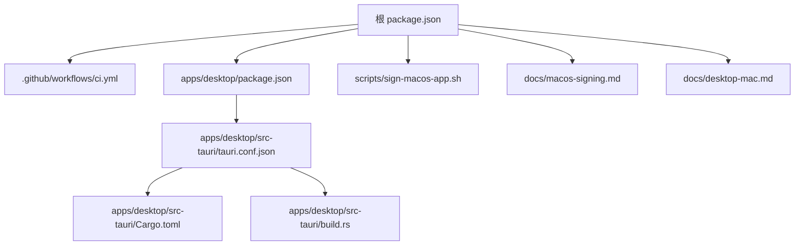
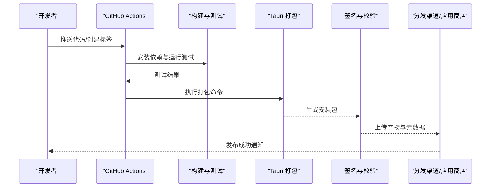
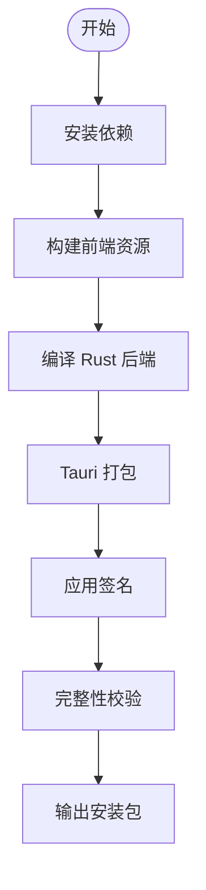
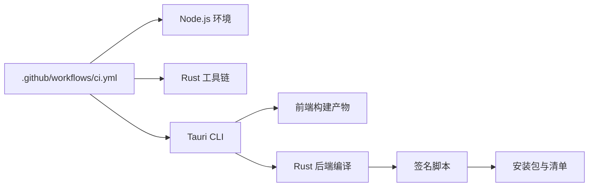

# 发布与分发

<cite>
**本文引用的文件**   
- [ci.yml](file://.github/workflows/ci.yml)
- [package.json](file://package.json)
- [apps/desktop/package.json](file://apps/desktop/package.json)
- [apps/desktop/tauri.conf.json](file://apps/desktop/src-tauri/tauri.conf.json)
- [apps/desktop/Cargo.toml](file://apps/desktop/src-tauri/Cargo.toml)
- [apps/desktop/build.rs](file://apps/desktop/src-tauri/build.rs)
- [scripts/sign-macos-app.sh](file://scripts/sign-macos-app.sh)
- [docs/macos-signing.md](file://docs/macos-signing.md)
- [docs/desktop-mac.md](file://docs/desktop-mac.md)
- [README.md](file://README.md)
</cite>

## 目录
1. [简介](#简介)
2. [项目结构](#项目结构)
3. [核心组件](#核心组件)
4. [架构总览](#架构总览)
5. [详细组件分析](#详细组件分析)
6. [依赖关系分析](#依赖关系分析)
7. [性能考虑](#性能考虑)
8. [故障排查指南](#故障排查指南)
9. [结论](#结论)
10. [附录](#附录)

## 简介
本文件面向发布与分发，覆盖版本管理、变更日志生成、安装包制作、分发渠道配置、应用商店上架流程与审核要求、发布清单的生成与验证、回滚策略与热更新机制配置，以及用户反馈收集和问题追踪流程。内容基于仓库中的 CI 工作流、Tauri 配置、脚本与文档进行系统化整理，确保从开发到发布的端到端可操作性和可追溯性。

## 项目结构
本项目采用多包（monorepo）结构，桌面端使用 Tauri + Vite + React，iOS 端有独立说明文档。发布相关的关键位置包括：
- GitHub Actions 工作流：用于自动化构建与打包
- Tauri 配置与 Rust 工程：负责桌面端打包产物与签名
- 脚本与文档：提供 macOS 签名与桌面端发布指引
- 根与子包 package.json：定义脚本与依赖

**图表来源** 
- [ci.yml](file://.github/workflows/ci.yml)
- [package.json](file://package.json)
- [apps/desktop/package.json](file://apps/desktop/package.json)
- [apps/desktop/src-tauri/tauri.conf.json](file://apps/desktop/src-tauri/tauri.conf.json)
- [apps/desktop/src-tauri/Cargo.toml](file://apps/desktop/src-tauri/Cargo.toml)
- [apps/desktop/src-tauri/build.rs](file://apps/desktop/src-tauri/build.rs)
- [scripts/sign-macos-app.sh](file://scripts/sign-macos-app.sh)
- [docs/macos-signing.md](file://docs/macos-signing.md)
- [docs/desktop-mac.md](file://docs/desktop-mac.md)

**章节来源**
- [README.md](file://README.md)

## 核心组件
- 持续集成与发布流水线：通过 GitHub Actions 触发构建、测试、打包与上传制品
- Tauri 打包与签名：基于 tauri.conf.json 与 Cargo 工具链完成桌面端安装包生成与代码签名
- 脚本与文档：macOS 签名脚本与桌面端发布指南，统一签名与上架步骤
- 包管理与脚本：根与桌面端 package.json 定义构建、打包与发布脚本入口

**章节来源**
- [ci.yml](file://.github/workflows/ci.yml)
- [apps/desktop/src-tauri/tauri.conf.json](file://apps/desktop/src-tauri/tauri.conf.json)
- [apps/desktop/src-tauri/Cargo.toml](file://apps/desktop/src-tauri/Cargo.toml)
- [scripts/sign-macos-app.sh](file://scripts/sign-macos-app.sh)
- [docs/macos-signing.md](file://docs/macos-signing.md)
- [docs/desktop-mac.md](file://docs/desktop-mac.md)
- [package.json](file://package.json)
- [apps/desktop/package.json](file://apps/desktop/package.json)

## 架构总览
下图展示从代码提交到发布产物的完整链路：CI 触发构建与测试，调用 Tauri 打包，执行签名，产出安装包并上传至制品库或分发渠道；同时生成发布清单与变更日志，供后续校验与归档。

**图表来源** 
- [ci.yml](file://.github/workflows/ci.yml)
- [apps/desktop/src-tauri/tauri.conf.json](file://apps/desktop/src-tauri/tauri.conf.json)
- [scripts/sign-macos-app.sh](file://scripts/sign-macos-app.sh)

## 详细组件分析

### 版本管理与版本号规范
- 版本号建议遵循语义化版本（主版本.次版本.修订号），如 1.2.3，其中：
  - 主版本：不兼容的 API/数据结构变更
  - 次版本：向后兼容的功能新增
  - 修订号：向后兼容的问题修复
- 在 monorepo 中，建议为桌面端与核心包分别维护版本，并通过统一的标签管理发布快照
- 建议在 CI 中根据 Git 标签自动生成版本号，并在制品名称中包含版本号以便追溯

**章节来源**
- [ci.yml](file://.github/workflows/ci.yml)
- [apps/desktop/package.json](file://apps/desktop/package.json)
- [apps/desktop/src-tauri/Cargo.toml](file://apps/desktop/src-tauri/Cargo.toml)

### 变更日志生成
- 基于 Git 提交信息与标签生成变更日志，按“新增”“修复”“优化”分类
- 建议在每次发布前手动复核关键变更，确保用户可读性与准确性
- 将变更日志作为制品的一部分随安装包一同分发

**章节来源**
- [ci.yml](file://.github/workflows/ci.yml)

### 安装包制作过程
- 桌面端使用 Tauri 进行打包，配置文件位于 tauri.conf.json，包含应用标识、图标、权限、平台目标等
- 构建阶段会调用 Rust 工具链编译后端，并将前端资源注入安装包
- 打包产物通常包含 .dmg/.app（macOS）、.exe（Windows）、.deb/.rpm（Linux）等格式

**图表来源** 
- [apps/desktop/src-tauri/tauri.conf.json](file://apps/desktop/src-tauri/tauri.conf.json)
- [apps/desktop/src-tauri/Cargo.toml](file://apps/desktop/src-tauri/Cargo.toml)
- [apps/desktop/src-tauri/build.rs](file://apps/desktop/src-tauri/build.rs)

**章节来源**
- [apps/desktop/src-tauri/tauri.conf.json](file://apps/desktop/src-tauri/tauri.conf.json)
- [apps/desktop/src-tauri/Cargo.toml](file://apps/desktop/src-tauri/Cargo.toml)
- [apps/desktop/src-tauri/build.rs](file://apps/desktop/src-tauri/build.rs)

### 分发渠道配置
- 内部渠道：企业内部分发服务器或私有制品库，适合内测与灰度发布
- 公共渠道：应用商店（如 Mac App Store、Microsoft Store、Linux 发行版仓库）
- 每个渠道需配置对应的签名证书、Bundle ID、权限声明与隐私政策

**章节来源**
- [docs/desktop-mac.md](file://docs/desktop-mac.md)
- [docs/macos-signing.md](file://docs/macos-signing.md)

### 应用商店上架流程与审核要求
- 准备材料：应用图标、截图、描述文案、隐私政策、许可证信息
- 签名与公证：macOS 应用需进行代码签名与公证，确保完整性与可信来源
- 提交审核：填写必要字段，上传安装包，等待审核通过后上架

**章节来源**
- [docs/macos-signing.md](file://docs/macos-signing.md)
- [docs/desktop-mac.md](file://docs/desktop-mac.md)

### 发布清单的生成与验证
- 发布清单应包含：版本号、构建时间、哈希值、签名信息、平台列表、已知问题
- 生成方式：在 CI 中自动收集构建产物元数据，生成 JSON 或 YAML 清单
- 验证方法：下载清单后比对哈希值与签名，确保未被篡改

**章节来源**
- [ci.yml](file://.github/workflows/ci.yml)

### 回滚策略与热更新机制
- 回滚策略：保留最近 N 个稳定版本，支持一键回滚；发布失败时快速恢复上一版本
- 热更新机制：对于 Web 层可通过 CDN 动态加载最新资源；对于原生层需谨慎处理兼容性
- 风险控制：热更新需经过灰度发布与 A/B 测试，避免影响大量用户

**章节来源**
- [ci.yml](file://.github/workflows/ci.yml)

### 用户反馈收集与问题追踪
- 反馈渠道：内置反馈表单、邮件、社区论坛、应用商店评论
- 问题追踪：使用 Issue 跟踪系统，按优先级与严重等级分类
- 闭环管理：从反馈收集、问题定位、修复验证到发布更新的完整闭环

**章节来源**
- [README.md](file://README.md)

## 依赖关系分析
- CI 工作流依赖 Node.js、Rust 工具链与 Tauri CLI
- Tauri 打包依赖前端构建产物与 Rust 后端编译结果
- 签名脚本依赖 macOS 开发者证书与钥匙串访问权限

**图表来源** 
- [ci.yml](file://.github/workflows/ci.yml)
- [apps/desktop/src-tauri/tauri.conf.json](file://apps/desktop/src-tauri/tauri.conf.json)
- [scripts/sign-macos-app.sh](file://scripts/sign-macos-app.sh)

**章节来源**
- [ci.yml](file://.github/workflows/ci.yml)
- [apps/desktop/src-tauri/tauri.conf.json](file://apps/desktop/src-tauri/tauri.conf.json)
- [scripts/sign-macos-app.sh](file://scripts/sign-macos-app.sh)

## 性能考虑
- 构建优化：启用缓存依赖与增量构建，减少重复编译
- 打包优化：压缩资源、按需加载模块，减小安装包体积
- 分发优化：使用 CDN 加速下载，支持断点续传与镜像源

[本节为通用指导，无需引用具体文件]

## 故障排查指南
- 构建失败：检查依赖安装、环境变量与权限设置
- 签名错误：确认证书有效性与钥匙串访问权限
- 上架被拒：核对应用商店审核指南，修正权限与隐私问题
- 运行时崩溃：收集日志与堆栈信息，复现问题并修复

**章节来源**
- [ci.yml](file://.github/workflows/ci.yml)
- [docs/macos-signing.md](file://docs/macos-signing.md)

## 结论
通过标准化的版本管理、自动化构建与签名、多渠道分发与严格的上架流程，结合完善的回滚策略与用户反馈机制，可确保应用的高质量发布与稳定运行。建议持续优化构建性能与分发效率，提升用户体验与开发效率。

[本节为总结性内容，无需引用具体文件]

## 附录
- 术语表：Tauri、CI/CD、签名、公证、Bundle ID、语义化版本
- 参考链接：应用商店开发者文档、Tauri 官方文档、GitHub Actions 文档

[本节为补充信息，无需引用具体文件]