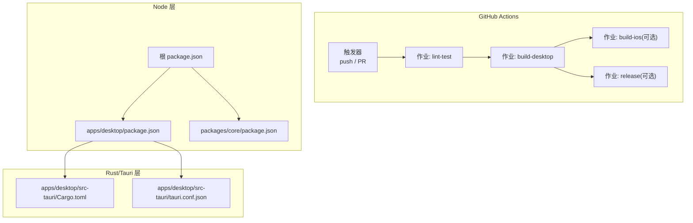
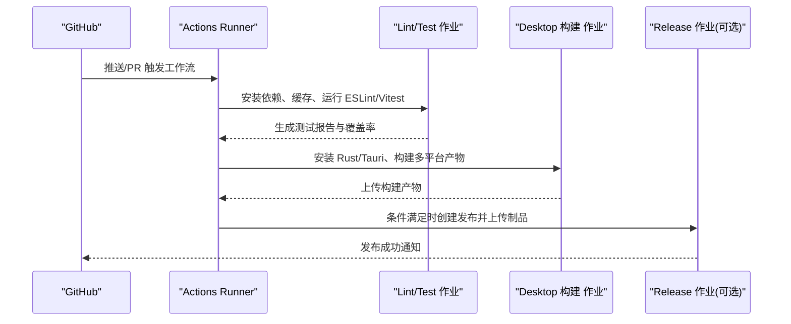
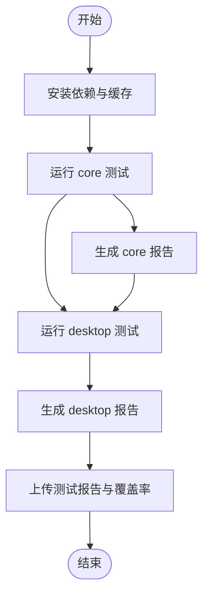
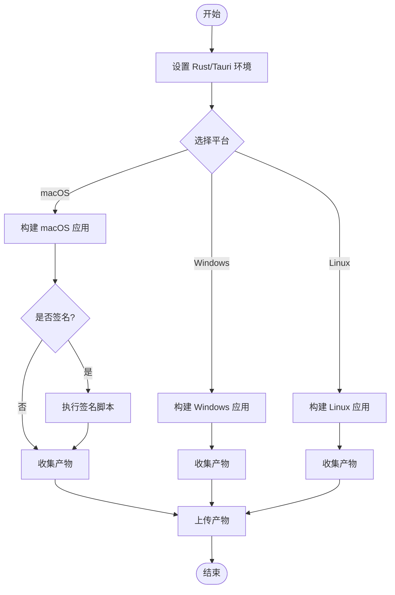
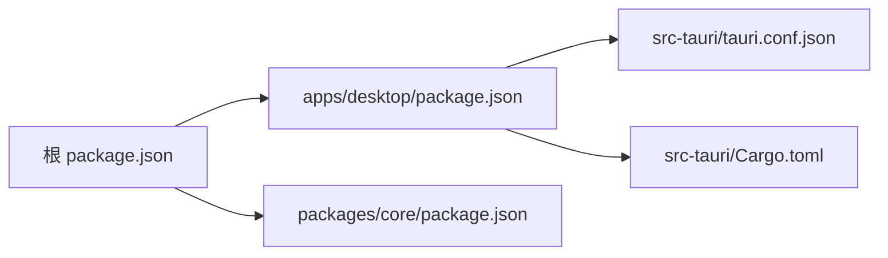

# 持续集成与部署

<cite>
**本文引用的文件**   
- [ci.yml](file://.github/workflows/ci.yml)
- [package.json](file://package.json)
- [apps/desktop/package.json](file://apps/desktop/package.json)
- [apps/desktop/vitest.config.ts](file://apps/desktop/vitest.config.ts)
- [packages/core/package.json](file://packages/core/package.json)
- [packages/core/vitest.config.ts](file://packages/core/vitest.config.ts)
- [apps/desktop/src-tauri/Cargo.toml](file://apps/desktop/src-tauri/Cargo.toml)
- [apps/desktop/src-tauri/tauri.conf.json](file://apps/desktop/src-tauri/tauri.conf.json)
- [scripts/sign-macos-app.sh](file://scripts/sign-macos-app.sh)
</cite>

## 目录
1. [简介](#简介)
2. [项目结构](#项目结构)
3. [核心组件](#核心组件)
4. [架构总览](#架构总览)
5. [详细组件分析](#详细组件分析)
6. [依赖分析](#依赖分析)
7. [性能考虑](#性能考虑)
8. [故障排查指南](#故障排查指南)
9. [结论](#结论)
10. [附录](#附录)

## 简介
本文件面向开发者与维护者，系统化说明本仓库的持续集成与持续交付（CI/CD）流水线。内容涵盖：
- GitHub Actions 工作流配置与执行流程
- 代码检查、测试、构建与发布步骤
- 自动化测试集成与测试结果报告
- 多平台并行构建策略与产物管理
- 自定义工作流模板与扩展方法
- 流水线监控、日志查看与问题诊断

## 项目结构
仓库采用多包（monorepo）组织，包含桌面应用（Tauri + Vite）、核心库与脚本工具等。CI 主要围绕以下目标展开：
- 统一安装依赖与缓存加速
- 前端与核心库的静态检查与单元测试
- Tauri 跨平台构建（macOS、Windows、Linux）
- 可选的签名与打包产物上传

图表来源
- [ci.yml](file://.github/workflows/ci.yml)
- [package.json](file://package.json)
- [apps/desktop/package.json](file://apps/desktop/package.json)
- [packages/core/package.json](file://packages/core/package.json)
- [apps/desktop/src-tauri/Cargo.toml](file://apps/desktop/src-tauri/Cargo.toml)
- [apps/desktop/src-tauri/tauri.conf.json](file://apps/desktop/src-tauri/tauri.conf.json)

章节来源
- [ci.yml](file://.github/workflows/ci.yml)
- [package.json](file://package.json)

## 核心组件
- 工作流入口：.github/workflows/ci.yml
- Node 依赖与脚本：根 package.json、各子包 package.json
- 测试框架与配置：vitest（desktop、core）
- Tauri 构建：Cargo.toml、tauri.conf.json
- macOS 签名脚本：scripts/sign-macos-app.sh

章节来源
- [ci.yml](file://.github/workflows/ci.yml)
- [package.json](file://package.json)
- [apps/desktop/package.json](file://apps/desktop/package.json)
- [packages/core/package.json](file://packages/core/package.json)
- [apps/desktop/vitest.config.ts](file://apps/desktop/vitest.config.ts)
- [packages/core/vitest.config.ts](file://packages/core/vitest.config.ts)
- [apps/desktop/src-tauri/Cargo.toml](file://apps/desktop/src-tauri/Cargo.toml)
- [apps/desktop/src-tauri/tauri.conf.json](file://apps/desktop/src-tauri/tauri.conf.json)
- [scripts/sign-macos-app.sh](file://scripts/sign-macos-app.sh)

## 架构总览
下图展示一次典型 CI 执行的端到端流程：从触发到测试、构建、产物归档与可选发布。

图表来源
- [ci.yml](file://.github/workflows/ci.yml)

章节来源
- [ci.yml](file://.github/workflows/ci.yml)

## 详细组件分析

### 工作流定义与触发条件
- 触发事件：通常包括 push 与 pull_request，可按分支或标签过滤
- 并发控制：建议启用取消重复运行，避免队列堆积
- 环境矩阵：按操作系统（macOS、Windows、Ubuntu）并行执行构建任务

章节来源
- [ci.yml](file://.github/workflows/ci.yml)

### 代码检查（Lint）
- 使用 ESLint 对 TypeScript/JS 进行静态检查
- 可结合 Prettier（若存在）统一格式
- 失败即阻断后续步骤，保证代码质量基线

章节来源
- [package.json](file://package.json)
- [apps/desktop/package.json](file://apps/desktop/package.json)
- [eslint.config.js](file://eslint.config.js)

### 自动化测试与报告
- 测试框架：Vitest（desktop、core）
- 执行策略：
  - 在各自包目录下运行测试，确保隔离与并行
  - 输出 JUnit 或 JSON 结果以便归档
- 覆盖率：可开启覆盖率收集并上传至覆盖服务（如 Codecov）

图表来源
- [apps/desktop/vitest.config.ts](file://apps/desktop/vitest.config.ts)
- [packages/core/vitest.config.ts](file://packages/core/vitest.config.ts)

章节来源
- [apps/desktop/vitest.config.ts](file://apps/desktop/vitest.config.ts)
- [packages/core/vitest.config.ts](file://packages/core/vitest.config.ts)
- [apps/desktop/package.json](file://apps/desktop/package.json)
- [packages/core/package.json](file://packages/core/package.json)

### 多平台构建（Tauri Desktop）
- 前置准备：安装 Rust Toolchain、Tauri CLI、平台 SDK
- 构建目标：macOS、Windows、Linux 并行执行
- 产物位置：根据 tauri.conf.json 与平台默认路径收集
- 可选步骤：macOS 应用签名与公证

图表来源
- [apps/desktop/src-tauri/Cargo.toml](file://apps/desktop/src-tauri/Cargo.toml)
- [apps/desktop/src-tauri/tauri.conf.json](file://apps/desktop/src-tauri/tauri.conf.json)
- [scripts/sign-macos-app.sh](file://scripts/sign-macos-app.sh)

章节来源
- [apps/desktop/src-tauri/Cargo.toml](file://apps/desktop/src-tauri/Cargo.toml)
- [apps/desktop/src-tauri/tauri.conf.json](file://apps/desktop/src-tauri/tauri.conf.json)
- [scripts/sign-macos-app.sh](file://scripts/sign-macos-app.sh)

### 发布流程（可选）
- 触发条件：基于标签（如 v*.*.*）或手动触发
- 产物：将各平台构建产物作为 Release Assets 上传
- 版本信息：从 Git 标签或环境变量注入版本号

章节来源
- [ci.yml](file://.github/workflows/ci.yml)

### iOS 构建（可选）
- 若包含 iOS 应用或相关资源，可在独立作业中执行
- 需要 Xcode 环境与证书配置

章节来源
- [apps/ios/README.md](file://apps/ios/README.md)

## 依赖分析
- Node 依赖：根 package.json 协调子包依赖；建议使用 pnpm/npm/yarn 锁定版本
- Rust/Tauri 依赖：Cargo.lock 锁定版本，确保构建可重现
- 缓存策略：缓存 node_modules 与 Cargo 目标目录，显著缩短构建时间

图表来源
- [package.json](file://package.json)
- [apps/desktop/package.json](file://apps/desktop/package.json)
- [packages/core/package.json](file://packages/core/package.json)
- [apps/desktop/src-tauri/tauri.conf.json](file://apps/desktop/src-tauri/tauri.conf.json)
- [apps/desktop/src-tauri/Cargo.toml](file://apps/desktop/src-tauri/Cargo.toml)

章节来源
- [package.json](file://package.json)
- [apps/desktop/package.json](file://apps/desktop/package.json)
- [packages/core/package.json](file://packages/core/package.json)
- [apps/desktop/src-tauri/Cargo.toml](file://apps/desktop/src-tauri/Cargo.toml)
- [apps/desktop/src-tauri/tauri.conf.json](file://apps/desktop/src-tauri/tauri.conf.json)

## 性能考虑
- 并行化：
  - 使用矩阵策略并行构建多平台
  - 测试与构建作业解耦，减少阻塞
- 缓存：
  - 缓存 Node 模块与 Rust 编译产物
  - 合理设置缓存键，避免污染
- 增量构建：
  - 仅变更包重新构建（通过工作流输入或条件判断）
- 资源限制：
  - 为大型构建分配更大 runner 或增加内存/CPU

[本节为通用指导，不直接分析具体文件]

## 故障排查指南
- 常见问题定位：
  - 依赖安装失败：检查网络代理、镜像源与锁文件一致性
  - 测试失败：查看 JUnit/JSON 报告与控制台输出
  - Tauri 构建失败：确认 Rust 工具链、平台 SDK 与签名证书
  - 签名失败：校验证书有效期、钥匙串权限与脚本参数
- 日志查看：
  - 在 GitHub Actions 页面查看作业日志
  - 下载工件以离线分析产物与日志
- 快速恢复：
  - 清理缓存并重试
  - 回滚到上一个稳定提交验证

章节来源
- [ci.yml](file://.github/workflows/ci.yml)
- [scripts/sign-macos-app.sh](file://scripts/sign-macos-app.sh)

## 结论
本 CI/CD 方案通过模块化作业与并行策略，实现了从代码检查、测试到多平台构建与发布的完整闭环。借助缓存与报告机制，兼顾了速度与可观测性。建议在后续迭代中逐步引入更细粒度的触发与发布策略，进一步提升效率与稳定性。

[本节为总结性内容，不直接分析具体文件]

## 附录

### 自定义工作流模板与扩展方法
- 复用步骤：将常用步骤抽取为 reusable workflow，减少重复配置
- 环境变量与密钥：通过 GitHub Secrets 管理敏感信息
- 条件执行：基于分支、标签或变量控制作业运行
- 通知与告警：集成 Slack/Discord/邮件等通知渠道

章节来源
- [ci.yml](file://.github/workflows/ci.yml)

### 关键配置文件参考
- 工作流定义：.github/workflows/ci.yml
- Node 脚本与依赖：package.json、apps/desktop/package.json、packages/core/package.json
- 测试配置：apps/desktop/vitest.config.ts、packages/core/vitest.config.ts
- Tauri 配置：apps/desktop/src-tauri/Cargo.toml、apps/desktop/src-tauri/tauri.conf.json
- macOS 签名：scripts/sign-macos-app.sh

章节来源
- [ci.yml](file://.github/workflows/ci.yml)
- [package.json](file://package.json)
- [apps/desktop/package.json](file://apps/desktop/package.json)
- [packages/core/package.json](file://packages/core/package.json)
- [apps/desktop/vitest.config.ts](file://apps/desktop/vitest.config.ts)
- [packages/core/vitest.config.ts](file://packages/core/vitest.config.ts)
- [apps/desktop/src-tauri/Cargo.toml](file://apps/desktop/src-tauri/Cargo.toml)
- [apps/desktop/src-tauri/tauri.conf.json](file://apps/desktop/src-tauri/tauri.conf.json)
- [scripts/sign-macos-app.sh](file://scripts/sign-macos-app.sh)