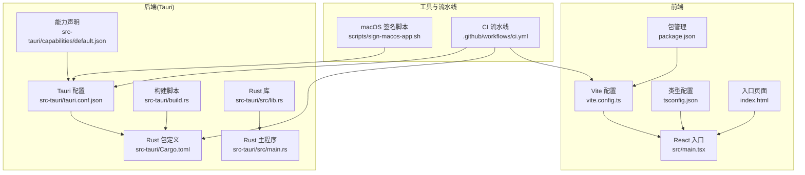
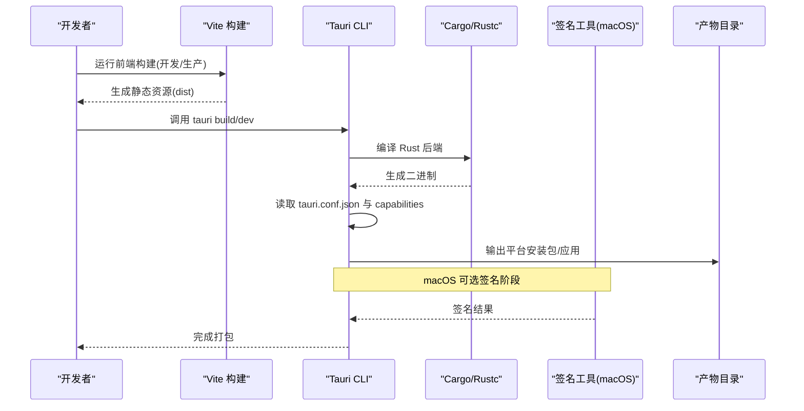
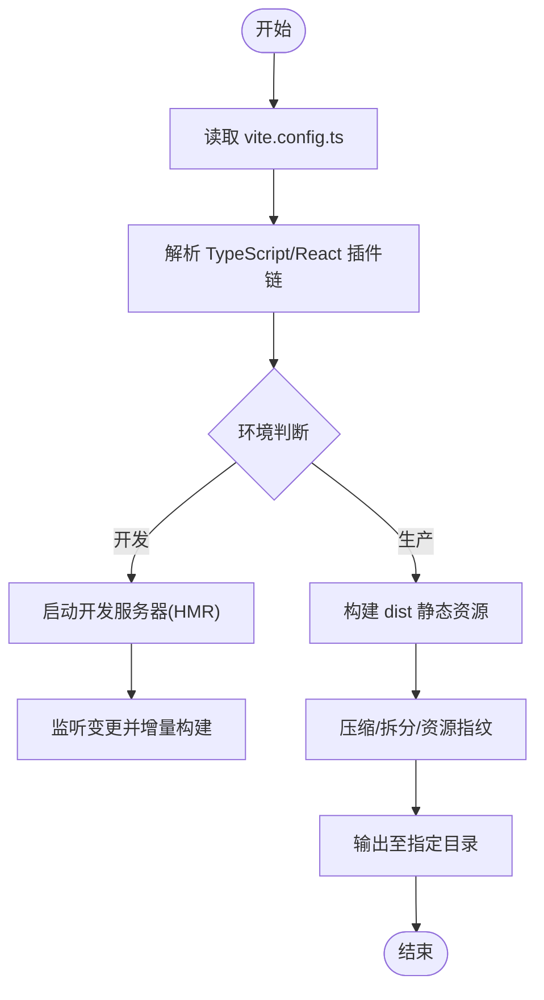
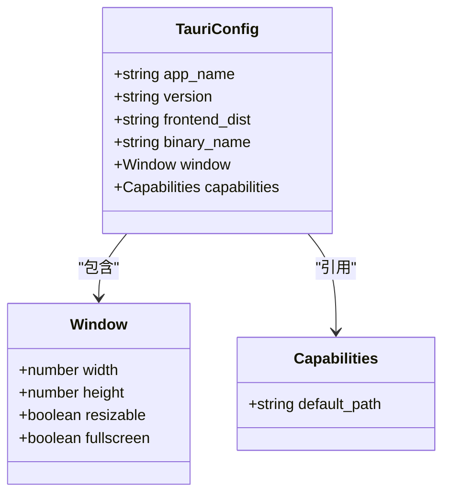
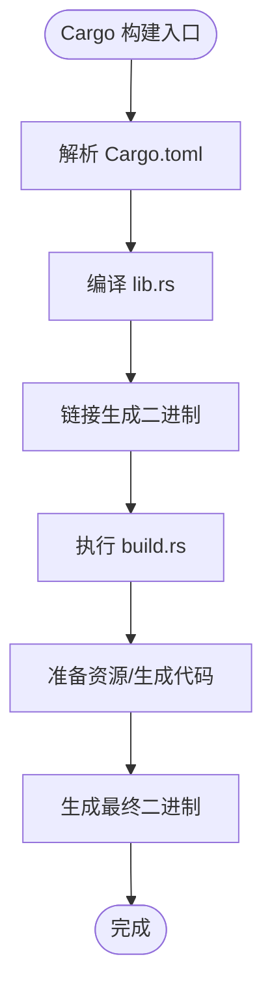
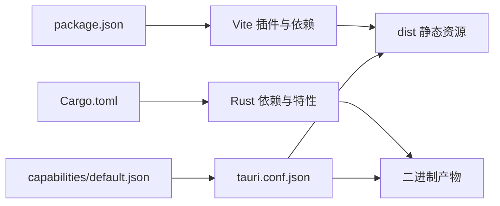

# 构建与打包

<cite>
**本文引用的文件**
- [apps/desktop/vite.config.ts](file://apps/desktop/vite.config.ts)
- [apps/desktop/package.json](file://apps/desktop/package.json)
- [apps/desktop/tsconfig.json](file://apps/desktop/tsconfig.json)
- [apps/desktop/index.html](file://apps/desktop/index.html)
- [apps/desktop/src/main.tsx](file://apps/desktop/src/main.tsx)
- [apps/desktop/src-tauri/tauri.conf.json](file://apps/desktop/src-tauri/tauri.conf.json)
- [apps/desktop/src-tauri/Cargo.toml](file://apps/desktop/src-tauri/Cargo.toml)
- [apps/desktop/src-tauri/build.rs](file://apps/desktop/src-tauri/build.rs)
- [apps/desktop/src-tauri/src/lib.rs](file://apps/desktop/src-tauri/src/lib.rs)
- [apps/desktop/src-tauri/src/main.rs](file://apps/desktop/src-tauri/src/main.rs)
- [apps/desktop/src-tauri/capabilities/default.json](file://apps/desktop/src-tauri/capabilities/default.json)
- [scripts/sign-macos-app.sh](file://scripts/sign-macos-app.sh)
- [.github/workflows/ci.yml](file://.github/workflows/ci.yml)
</cite>

## 目录
1. [简介](#简介)
2. [项目结构](#项目结构)
3. [核心组件](#核心组件)
4. [架构总览](#架构总览)
5. [详细组件分析](#详细组件分析)
6. [依赖关系分析](#依赖关系分析)
7. [性能考虑](#性能考虑)
8. [故障排查指南](#故障排查指南)
9. [结论](#结论)
10. [附录](#附录)

## 简介
本文件面向开发者与维护者，系统化说明该 Tauri 应用的构建与打包流程，涵盖：
- 前端 Vite 构建配置与优化策略
- 后端 Rust 编译流程与产物管理
- Tauri 应用打包（多平台）命令、参数与签名
- 资源文件处理与依赖管理
- 本地开发优化与生产打包最佳实践
- 常见构建问题定位与解决方案

## 项目结构
本项目采用前后端分离的 Tauri 工程组织方式：
- 前端位于 apps/desktop，使用 Vite + TypeScript + React
- 后端位于 apps/desktop/src-tauri，使用 Rust + Tauri
- 脚本与 CI 分别位于 scripts 与 .github/workflows

图表来源
- [apps/desktop/vite.config.ts](file://apps/desktop/vite.config.ts)
- [apps/desktop/package.json](file://apps/desktop/package.json)
- [apps/desktop/tsconfig.json](file://apps/desktop/tsconfig.json)
- [apps/desktop/index.html](file://apps/desktop/index.html)
- [apps/desktop/src/main.tsx](file://apps/desktop/src/main.tsx)
- [apps/desktop/src-tauri/tauri.conf.json](file://apps/desktop/src-tauri/tauri.conf.json)
- [apps/desktop/src-tauri/Cargo.toml](file://apps/desktop/src-tauri/Cargo.toml)
- [apps/desktop/src-tauri/build.rs](file://apps/desktop/src-tauri/build.rs)
- [apps/desktop/src-tauri/src/lib.rs](file://apps/desktop/src-tauri/src/lib.rs)
- [apps/desktop/src-tauri/src/main.rs](file://apps/desktop/src-tauri/src/main.rs)
- [apps/desktop/src-tauri/capabilities/default.json](file://apps/desktop/src-tauri/capabilities/default.json)
- [scripts/sign-macos-app.sh](file://scripts/sign-macos-app.sh)
- [.github/workflows/ci.yml](file://.github/workflows/ci.yml)

章节来源
- [apps/desktop/vite.config.ts](file://apps/desktop/vite.config.ts)
- [apps/desktop/package.json](file://apps/desktop/package.json)
- [apps/desktop/tsconfig.json](file://apps/desktop/tsconfig.json)
- [apps/desktop/index.html](file://apps/desktop/index.html)
- [apps/desktop/src/main.tsx](file://apps/desktop/src/main.tsx)
- [apps/desktop/src-tauri/tauri.conf.json](file://apps/desktop/src-tauri/tauri.conf.json)
- [apps/desktop/src-tauri/Cargo.toml](file://apps/desktop/src-tauri/Cargo.toml)
- [apps/desktop/src-tauri/build.rs](file://apps/desktop/src-tauri/build.rs)
- [apps/desktop/src-tauri/src/lib.rs](file://apps/desktop/src-tauri/src/lib.rs)
- [apps/desktop/src-tauri/src/main.rs](file://apps/desktop/src-tauri/src/main.rs)
- [apps/desktop/src-tauri/capabilities/default.json](file://apps/desktop/src-tauri/capabilities/default.json)
- [scripts/sign-macos-app.sh](file://scripts/sign-macos-app.sh)
- [.github/workflows/ci.yml](file://.github/workflows/ci.yml)

## 核心组件
- Vite 构建系统：负责前端资源的编译、转译、压缩与静态资源处理。
- Tauri 配置：定义窗口、图标、权限、后端二进制名、前端输出目录等。
- Rust/Tauri 后端：通过 Cargo 管理依赖，build.rs 参与构建期逻辑，lib.rs 暴露给前端的 API。
- 能力与权限：capabilities/default.json 控制 Tauri 安全模型下的能力访问。
- 脚本与 CI：自动化签名与持续集成构建。

章节来源
- [apps/desktop/vite.config.ts](file://apps/desktop/vite.config.ts)
- [apps/desktop/src-tauri/tauri.conf.json](file://apps/desktop/src-tauri/tauri.conf.json)
- [apps/desktop/src-tauri/Cargo.toml](file://apps/desktop/src-tauri/Cargo.toml)
- [apps/desktop/src-tauri/build.rs](file://apps/desktop/src-tauri/build.rs)
- [apps/desktop/src-tauri/src/lib.rs](file://apps/desktop/src-tauri/src/lib.rs)
- [apps/desktop/src-tauri/capabilities/default.json](file://apps/desktop/src-tauri/capabilities/default.json)

## 架构总览
下图展示从源码到可执行包的端到端构建流程，包括 Vite 前端构建、Rust 后端编译、Tauri 打包与产物输出。

图表来源
- [apps/desktop/vite.config.ts](file://apps/desktop/vite.config.ts)
- [apps/desktop/src-tauri/tauri.conf.json](file://apps/desktop/src-tauri/tauri.conf.json)
- [apps/desktop/src-tauri/Cargo.toml](file://apps/desktop/src-tauri/Cargo.toml)
- [scripts/sign-macos-app.sh](file://scripts/sign-macos-app.sh)
- [.github/workflows/ci.yml](file://.github/workflows/ci.yml)

## 详细组件分析

### Vite 前端构建配置
- 作用域与目标：基于 TypeScript/React，需确保 tsconfig 与 Vite 插件链一致。
- 关键配置点：
  - 入口 HTML 与 JS 入口映射
  - 开发服务器与热更新
  - 生产构建优化（代码分割、压缩、资源哈希）
  - 静态资源路径与代理设置（如有）
- 与 Tauri 的协作：
  - 构建产物目录需与 tauri.conf.json 中前端路径一致
  - 开发模式可通过 devServer 提供本地预览

图表来源
- [apps/desktop/vite.config.ts](file://apps/desktop/vite.config.ts)
- [apps/desktop/tsconfig.json](file://apps/desktop/tsconfig.json)
- [apps/desktop/index.html](file://apps/desktop/index.html)
- [apps/desktop/src/main.tsx](file://apps/desktop/src/main.tsx)

章节来源
- [apps/desktop/vite.config.ts](file://apps/desktop/vite.config.ts)
- [apps/desktop/tsconfig.json](file://apps/desktop/tsconfig.json)
- [apps/desktop/index.html](file://apps/desktop/index.html)
- [apps/desktop/src/main.tsx](file://apps/desktop/src/main.tsx)

### Tauri 配置与打包
- tauri.conf.json 关键项：
  - 前端构建输出目录
  - 应用元数据（名称、版本、图标）
  - 窗口行为与尺寸
  - 后端二进制名与构建目标
  - 能力与权限（capabilities）
- 打包流程：
  - 先触发前端构建（或复用已有 dist）
  - 调用 Cargo 编译 Rust 后端
  - 将前端资源与后端二进制打包为平台安装包/应用

图表来源
- [apps/desktop/src-tauri/tauri.conf.json](file://apps/desktop/src-tauri/tauri.conf.json)
- [apps/desktop/src-tauri/capabilities/default.json](file://apps/desktop/src-tauri/capabilities/default.json)

章节来源
- [apps/desktop/src-tauri/tauri.conf.json](file://apps/desktop/src-tauri/tauri.conf.json)
- [apps/desktop/src-tauri/capabilities/default.json](file://apps/desktop/src-tauri/capabilities/default.json)

### Rust 后端编译与构建脚本
- Cargo.toml：定义 crate 名称、依赖、特性与构建目标。
- build.rs：在构建期执行自定义逻辑（如拷贝资源、生成代码）。
- lib.rs：对外暴露 Tauri 命令与业务逻辑。
- main.rs：Tauri 应用入口，初始化运行时与窗口。

图表来源
- [apps/desktop/src-tauri/Cargo.toml](file://apps/desktop/src-tauri/Cargo.toml)
- [apps/desktop/src-tauri/build.rs](file://apps/desktop/src-tauri/build.rs)
- [apps/desktop/src-tauri/src/lib.rs](file://apps/desktop/src-tauri/src/lib.rs)
- [apps/desktop/src-tauri/src/main.rs](file://apps/desktop/src-tauri/src/main.rs)

章节来源
- [apps/desktop/src-tauri/Cargo.toml](file://apps/desktop/src-tauri/Cargo.toml)
- [apps/desktop/src-tauri/build.rs](file://apps/desktop/src-tauri/build.rs)
- [apps/desktop/src-tauri/src/lib.rs](file://apps/desktop/src-tauri/src/lib.rs)
- [apps/desktop/src-tauri/src/main.rs](file://apps/desktop/src-tauri/src/main.rs)

### 资源文件处理与依赖管理
- 前端资源：
  - 静态资源由 Vite 处理，支持按需加载与缓存
  - 图片、字体等应放入 public 或通过 import 引用以纳入构建图
- 后端资源：
  - 通过 build.rs 或 Tauri 配置进行拷贝与嵌入
- 依赖管理：
  - 前端依赖由 package.json 管理
  - 后端依赖由 Cargo.toml 管理，锁定版本使用 Cargo.lock

章节来源
- [apps/desktop/package.json](file://apps/desktop/package.json)
- [apps/desktop/src-tauri/Cargo.toml](file://apps/desktop/src-tauri/Cargo.toml)
- [apps/desktop/src-tauri/build.rs](file://apps/desktop/src-tauri/build.rs)

### 多平台构建命令与参数
- 通用命令：
  - 开发：启动 Vite 开发服务器与 Tauri 调试
  - 构建：先构建前端，再调用 Tauri 打包
- 平台差异：
  - Windows：MSVC/MinGW 工具链要求
  - macOS：需要 Xcode 命令行工具与签名证书
  - Linux：依赖系统库与打包格式（AppImage/Deb/Rpm）
- 常用参数：
  - 指定目标平台与架构
  - 启用/禁用调试符号
  - 指定签名与公证流程（macOS）

章节来源
- [.github/workflows/ci.yml](file://.github/workflows/ci.yml)
- [scripts/sign-macos-app.sh](file://scripts/sign-macos-app.sh)

### 本地开发与生产打包最佳实践
- 本地开发：
  - 开启 Vite HMR，减少冷启动时间
  - 使用增量构建与并行编译
  - 合理划分模块，避免大依赖一次性加载
- 生产打包：
  - 启用 Tree-shaking、代码压缩与资源指纹
  - 关闭调试信息与日志输出
  - 预构建依赖缓存（npm/yarn/pnpm 与 Cargo 缓存）
  - 对 macOS 应用进行签名与公证

章节来源
- [apps/desktop/vite.config.ts](file://apps/desktop/vite.config.ts)
- [apps/desktop/package.json](file://apps/desktop/package.json)
- [apps/desktop/src-tauri/tauri.conf.json](file://apps/desktop/src-tauri/tauri.conf.json)
- [scripts/sign-macos-app.sh](file://scripts/sign-macos-app.sh)

## 依赖关系分析
- 前端依赖：
  - React、TypeScript、Vite 插件链
  - 第三方 UI 与工具库
- 后端依赖：
  - Tauri 框架与 Rust 标准库
  - 业务相关 crate（数据库、OCR、监控等）
- 构建期依赖：
  - Node.js 与 Rust Toolchain
  - 平台特定工具（Xcode、cargo-sign、codesign）

图表来源
- [apps/desktop/package.json](file://apps/desktop/package.json)
- [apps/desktop/src-tauri/Cargo.toml](file://apps/desktop/src-tauri/Cargo.toml)
- [apps/desktop/src-tauri/tauri.conf.json](file://apps/desktop/src-tauri/tauri.conf.json)
- [apps/desktop/src-tauri/capabilities/default.json](file://apps/desktop/src-tauri/capabilities/default.json)

章节来源
- [apps/desktop/package.json](file://apps/desktop/package.json)
- [apps/desktop/src-tauri/Cargo.toml](file://apps/desktop/src-tauri/Cargo.toml)
- [apps/desktop/src-tauri/tauri.conf.json](file://apps/desktop/src-tauri/tauri.conf.json)
- [apps/desktop/src-tauri/capabilities/default.json](file://apps/desktop/src-tauri/capabilities/default.json)

## 性能考虑
- 前端：
  - 合理使用动态导入与懒加载
  - 控制第三方库体积，优先选择轻量替代
  - 利用浏览器缓存与资源指纹
- 后端：
  - 精简依赖，避免不必要的特性开关
  - 合理设计异步任务，避免阻塞 UI
- 构建：
  - 启用并行编译与增量构建
  - 缓存 Node 与 Cargo 依赖，缩短 CI 时间

## 故障排查指南
- 常见问题与解决思路：
  - 端口占用：修改 Vite 端口或释放占用进程
  - 环境变量缺失：检查 .env 与构建脚本注入的环境变量
  - 路径错误：确认 tauri.conf.json 的前端输出路径与 Vite 一致
  - 权限不足：Linux/macOS 下检查文件系统与签名权限
  - 签名失败：校验证书有效期、钥匙串权限与签名脚本参数
  - 依赖冲突：统一 Node/Rust 版本，清理锁文件后重新安装
- 诊断建议：
  - 逐步缩小范围（仅前端/仅后端）
  - 查看构建日志中的错误堆栈与警告
  - 使用最小化复现用例验证问题

章节来源
- [apps/desktop/vite.config.ts](file://apps/desktop/vite.config.ts)
- [apps/desktop/src-tauri/tauri.conf.json](file://apps/desktop/src-tauri/tauri.conf.json)
- [scripts/sign-macos-app.sh](file://scripts/sign-macos-app.sh)
- [.github/workflows/ci.yml](file://.github/workflows/ci.yml)

## 结论
通过明确 Vite 与 Tauri 的职责边界、规范资源与依赖管理、制定跨平台构建与签名流程，并结合本地与生产的优化策略，可以显著提升构建效率与交付质量。建议在团队内统一构建脚本与环境配置，结合 CI 实现自动化构建与测试，保障一致性。

## 附录
- 快速参考：
  - 本地开发：启动 Vite 开发服务器与 Tauri 调试
  - 生产构建：构建前端并调用 Tauri 打包
  - macOS 签名：执行签名脚本并完成公证
- 相关文件路径：
  - 前端构建配置：[apps/desktop/vite.config.ts](file://apps/desktop/vite.config.ts)
  - Tauri 配置：[apps/desktop/src-tauri/tauri.conf.json](file://apps/desktop/src-tauri/tauri.conf.json)
  - Rust 依赖：[apps/desktop/src-tauri/Cargo.toml](file://apps/desktop/src-tauri/Cargo.toml)
  - 构建脚本：[apps/desktop/src-tauri/build.rs](file://apps/desktop/src-tauri/build.rs)
  - 能力声明：[apps/desktop/src-tauri/capabilities/default.json](file://apps/desktop/src-tauri/capabilities/default.json)
  - 签名脚本：[scripts/sign-macos-app.sh](file://scripts/sign-macos-app.sh)
  - CI 流水线：[.github/workflows/ci.yml](file://.github/workflows/ci.yml)