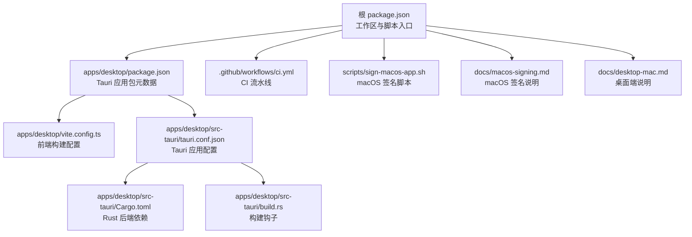
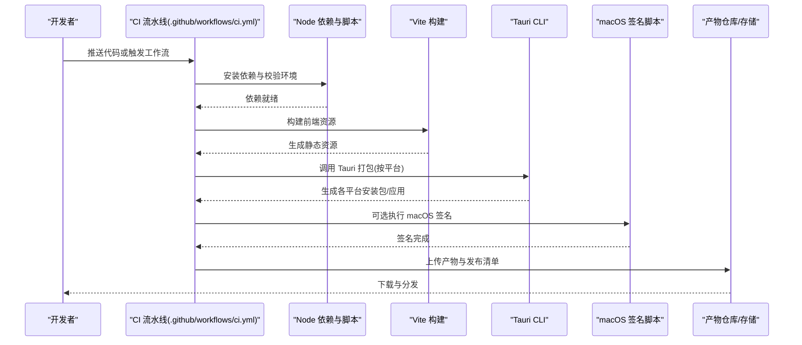
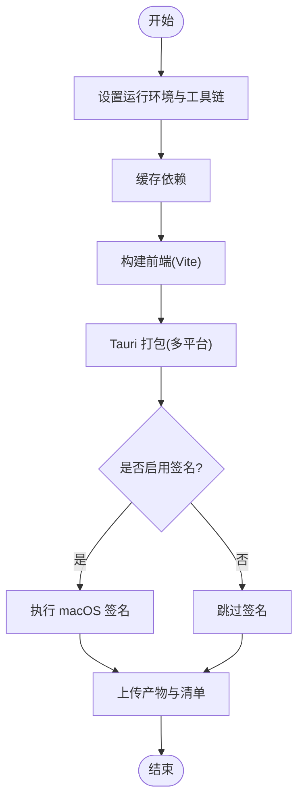
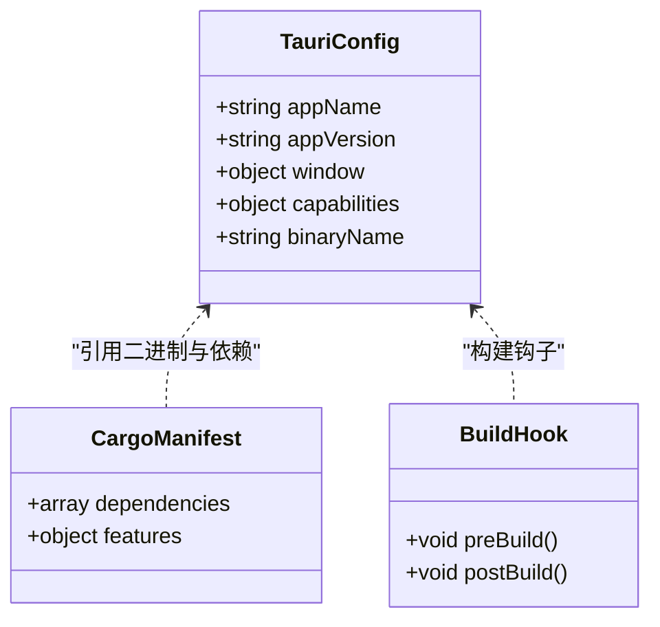
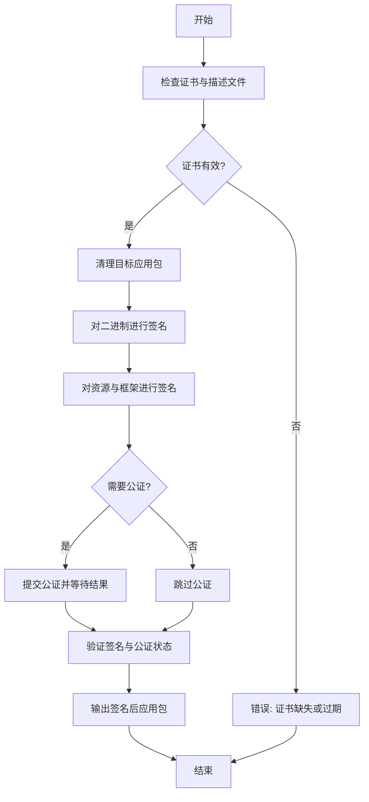
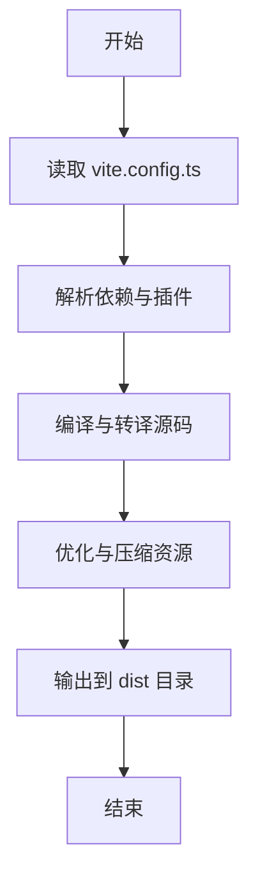
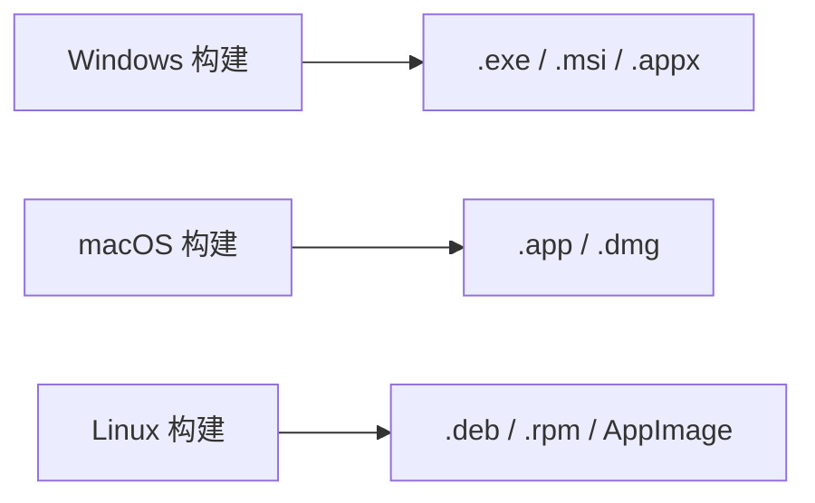
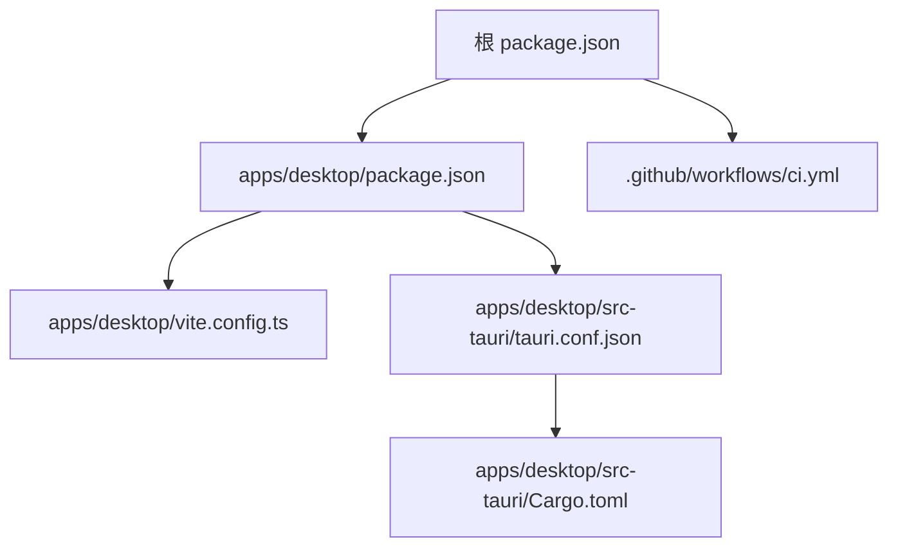

# 部署指南

<cite>
**本文引用的文件**   
- [ci.yml](file://.github/workflows/ci.yml)
- [package.json](file://package.json)
- [apps/desktop/package.json](file://apps/desktop/package.json)
- [apps/desktop/vite.config.ts](file://apps/desktop/vite.config.ts)
- [apps/desktop/src-tauri/tauri.conf.json](file://apps/desktop/src-tauri/tauri.conf.json)
- [apps/desktop/src-tauri/Cargo.toml](file://apps/desktop/src-tauri/Cargo.toml)
- [apps/desktop/src-tauri/build.rs](file://apps/desktop/src-tauri/build.rs)
- [scripts/sign-macos-app.sh](file://scripts/sign-macos-app.sh)
- [docs/macos-signing.md](file://docs/macos-signing.md)
- [docs/desktop-mac.md](file://docs/desktop-mac.md)
</cite>

## 目录
1. [简介](#简介)
2. [项目结构](#项目结构)
3. [核心组件](#核心组件)
4. [架构总览](#架构总览)
5. [详细组件分析](#详细组件分析)
6. [依赖分析](#依赖分析)
7. [性能考虑](#性能考虑)
8. [故障排查指南](#故障排查指南)
9. [结论](#结论)
10. [附录](#附录)

## 简介
本指南面向需要在 Windows、macOS、Linux 上构建、打包、签名并自动化发布桌面应用（基于 Tauri）的工程师与运维人员。内容涵盖：
- 多平台构建与打包流程
- 代码签名与证书配置（重点 macOS 应用签名）
- 持续集成流水线配置与自动化部署
- 发布版本构建脚本与发布清单
- 安装包制作与应用商店上架指导
- 版本管理与更新机制

## 项目结构
本项目采用 Monorepo 组织，前端与 Tauri 后端位于 apps/desktop，核心业务逻辑在 packages/core，CI 配置在 .github/workflows，脚本与文档分别在 scripts 与 docs。

**图表来源**
- [package.json](file://package.json)
- [apps/desktop/package.json](file://apps/desktop/package.json)
- [apps/desktop/vite.config.ts](file://apps/desktop/vite.config.ts)
- [apps/desktop/src-tauri/tauri.conf.json](file://apps/desktop/src-tauri/tauri.conf.json)
- [apps/desktop/src-tauri/Cargo.toml](file://apps/desktop/src-tauri/Cargo.toml)
- [apps/desktop/src-tauri/build.rs](file://apps/desktop/src-tauri/build.rs)
- [ci.yml](file://.github/workflows/ci.yml)
- [scripts/sign-macos-app.sh](file://scripts/sign-macos-app.sh)
- [docs/macos-signing.md](file://docs/macos-signing.md)
- [docs/desktop-mac.md](file://docs/desktop-mac.md)

**章节来源**
- [package.json](file://package.json)
- [apps/desktop/package.json](file://apps/desktop/package.json)
- [apps/desktop/vite.config.ts](file://apps/desktop/vite.config.ts)
- [apps/desktop/src-tauri/tauri.conf.json](file://apps/desktop/src-tauri/tauri.conf.json)
- [apps/desktop/src-tauri/Cargo.toml](file://apps/desktop/src-tauri/Cargo.toml)
- [apps/desktop/src-tauri/build.rs](file://apps/desktop/src-tauri/build.rs)
- [ci.yml](file://.github/workflows/ci.yml)
- [scripts/sign-macos-app.sh](file://scripts/sign-macos-app.sh)
- [docs/macos-signing.md](file://docs/macos-signing.md)
- [docs/desktop-mac.md](file://docs/desktop-mac.md)

## 核心组件
- 前端构建：Vite 负责资源编译与优化，输出静态资源供 Tauri 加载。
- Tauri 应用：通过 tauri.conf.json 定义应用元信息、窗口行为、能力权限等；Cargo.toml 管理 Rust 后端依赖；build.rs 提供构建钩子。
- CI 流水线：GitHub Actions 统一执行安装依赖、构建、测试、打包与产物上传。
- 签名脚本：macOS 应用签名由专用脚本驱动，配合 Apple 开发者证书与描述文件完成。

**章节来源**
- [apps/desktop/vite.config.ts](file://apps/desktop/vite.config.ts)
- [apps/desktop/src-tauri/tauri.conf.json](file://apps/desktop/src-tauri/tauri.conf.json)
- [apps/desktop/src-tauri/Cargo.toml](file://apps/desktop/src-tauri/Cargo.toml)
- [apps/desktop/src-tauri/build.rs](file://apps/desktop/src-tauri/build.rs)
- [ci.yml](file://.github/workflows/ci.yml)
- [scripts/sign-macos-app.sh](file://scripts/sign-macos-app.sh)

## 架构总览
下图展示了从源码到可分发产物的整体流程，包括前端构建、Tauri 打包、可选签名与产物归档。

**图表来源**
- [ci.yml](file://.github/workflows/ci.yml)
- [apps/desktop/vite.config.ts](file://apps/desktop/vite.config.ts)
- [apps/desktop/src-tauri/tauri.conf.json](file://apps/desktop/src-tauri/tauri.conf.json)
- [scripts/sign-macos-app.sh](file://scripts/sign-macos-app.sh)

## 详细组件分析

### 持续集成流水线（GitHub Actions）
- 作用：统一执行依赖安装、构建、测试、打包、签名与产物上传。
- 关键要点：
  - 设置 Node.js 与 Rust 工具链
  - 缓存依赖加速构建
  - 并行构建多平台产物
  - 使用环境变量注入签名所需凭据
  - 将产物上传至仓库或对象存储

**图表来源**
- [ci.yml](file://.github/workflows/ci.yml)

**章节来源**
- [ci.yml](file://.github/workflows/ci.yml)

### Tauri 应用配置与构建
- tauri.conf.json：定义应用名称、版本、图标、窗口、能力权限、后端二进制名等。
- Cargo.toml：声明 Rust 依赖与特性开关。
- build.rs：可在构建阶段执行额外任务（如生成文件、拷贝资源）。

**图表来源**
- [apps/desktop/src-tauri/tauri.conf.json](file://apps/desktop/src-tauri/tauri.conf.json)
- [apps/desktop/src-tauri/Cargo.toml](file://apps/desktop/src-tauri/Cargo.toml)
- [apps/desktop/src-tauri/build.rs](file://apps/desktop/src-tauri/build.rs)

**章节来源**
- [apps/desktop/src-tauri/tauri.conf.json](file://apps/desktop/src-tauri/tauri.conf.json)
- [apps/desktop/src-tauri/Cargo.toml](file://apps/desktop/src-tauri/Cargo.toml)
- [apps/desktop/src-tauri/build.rs](file://apps/desktop/src-tauri/build.rs)

### macOS 应用签名流程
- 前置条件：Apple Developer 账号、已安装的证书与描述文件、钥匙串中私钥可用。
- 步骤概览：
  - 准备签名证书与描述文件
  - 清理并验证应用包结构
  - 对二进制与资源进行签名与公证（如需）
  - 输出签名后的应用包用于分发

**图表来源**
- [scripts/sign-macos-app.sh](file://scripts/sign-macos-app.sh)
- [docs/macos-signing.md](file://docs/macos-signing.md)

**章节来源**
- [scripts/sign-macos-app.sh](file://scripts/sign-macos-app.sh)
- [docs/macos-signing.md](file://docs/macos-signing.md)

### 前端构建（Vite）
- 职责：编译 TypeScript/JSX、样式与静态资源，输出到指定目录供 Tauri 加载。
- 关键点：生产模式优化、路径别名、插件扩展、环境变量注入。

**图表来源**
- [apps/desktop/vite.config.ts](file://apps/desktop/vite.config.ts)

**章节来源**
- [apps/desktop/vite.config.ts](file://apps/desktop/vite.config.ts)

### 跨平台构建与打包
- Windows：生成 .exe 或 .msi/.appx 安装包（取决于 Tauri 配置与插件）。
- macOS：生成 .app 与 .dmg 安装包，支持代码签名与公证。
- Linux：生成 .deb/.rpm/AppImage（取决于 Tauri 配置与系统环境）。

[此图为概念性流程图，不直接映射具体源文件]

### 发布清单与产物管理
- 建议包含：版本号、构建时间、平台列表、哈希值、下载地址、签名状态、公证状态。
- 存储位置：仓库 Releases、对象存储或 CDN。
- 校验方式：SHA256/SHA512 校验与签名验证。

[本节为通用实践说明，未直接分析具体文件]

### 版本管理与更新机制
- 版本来源：package.json 与 tauri.conf.json 中的版本字段需保持一致。
- 更新策略：
  - 客户端启动时检查远程更新清单
  - 下载增量或全量更新包
  - 校验签名与完整性后替换应用
- 回滚机制：保留上一版本以便失败回滚

[本节为通用实践说明，未直接分析具体文件]

## 依赖分析
- Node 层：根 package.json 与工作区脚本协调前端与 Tauri 构建。
- Tauri 层：tauri.conf.json 与 Cargo.toml 共同决定打包产物与能力。
- CI 层：ci.yml 串联所有步骤，确保一致性与可重复性。

**图表来源**
- [package.json](file://package.json)
- [apps/desktop/package.json](file://apps/desktop/package.json)
- [apps/desktop/vite.config.ts](file://apps/desktop/vite.config.ts)
- [apps/desktop/src-tauri/tauri.conf.json](file://apps/desktop/src-tauri/tauri.conf.json)
- [apps/desktop/src-tauri/Cargo.toml](file://apps/desktop/src-tauri/Cargo.toml)
- [ci.yml](file://.github/workflows/ci.yml)

**章节来源**
- [package.json](file://package.json)
- [apps/desktop/package.json](file://apps/desktop/package.json)
- [apps/desktop/vite.config.ts](file://apps/desktop/vite.config.ts)
- [apps/desktop/src-tauri/tauri.conf.json](file://apps/desktop/src-tauri/tauri.conf.json)
- [apps/desktop/src-tauri/Cargo.toml](file://apps/desktop/src-tauri/Cargo.toml)
- [ci.yml](file://.github/workflows/ci.yml)

## 性能考虑
- 依赖缓存：在 CI 中使用 npm/yarn/pnpm 缓存与 Rust 工具链缓存减少构建时间。
- 并行构建：多平台构建并行执行，缩短总体耗时。
- 资源优化：Vite 生产模式开启压缩与代码分割；避免大体积图片与字体。
- 增量构建：合理配置构建缓存与输入变更检测，避免全量重建。

[本节为通用实践说明，未直接分析具体文件]

## 故障排查指南
- 签名失败：
  - 检查证书有效期与钥匙串权限
  - 确认描述文件与应用 ID 匹配
  - 查看签名日志定位具体步骤
- 构建失败：
  - 检查 Node/Rust 版本与环境变量
  - 清理缓存后重试
  - 查看 Vite/Tauri 构建日志
- 产物不可用：
  - 校验哈希与签名
  - 在不同平台验证安装与运行

**章节来源**
- [scripts/sign-macos-app.sh](file://scripts/sign-macos-app.sh)
- [docs/macos-signing.md](file://docs/macos-signing.md)
- [docs/desktop-mac.md](file://docs/desktop-mac.md)

## 结论
通过统一的 CI 流水线、规范的 Tauri 配置与严格的签名流程，可实现跨平台稳定构建与可靠分发。建议在发布前进行多平台回归测试，并建立完善的版本与更新机制以保障用户体验与安全。

[本节为总结性内容，未直接分析具体文件]

## 附录
- 快速命令参考：
  - 安装依赖：在根目录执行包管理器安装命令
  - 本地构建前端：进入 apps/desktop 目录执行构建脚本
  - 打包应用：使用 Tauri CLI 指定平台参数
  - 执行签名：运行 macOS 签名脚本并传入必要参数
- 相关文档：
  - macOS 签名说明：docs/macos-signing.md
  - 桌面端说明：docs/desktop-mac.md

[本节为补充信息，未直接分析具体文件]