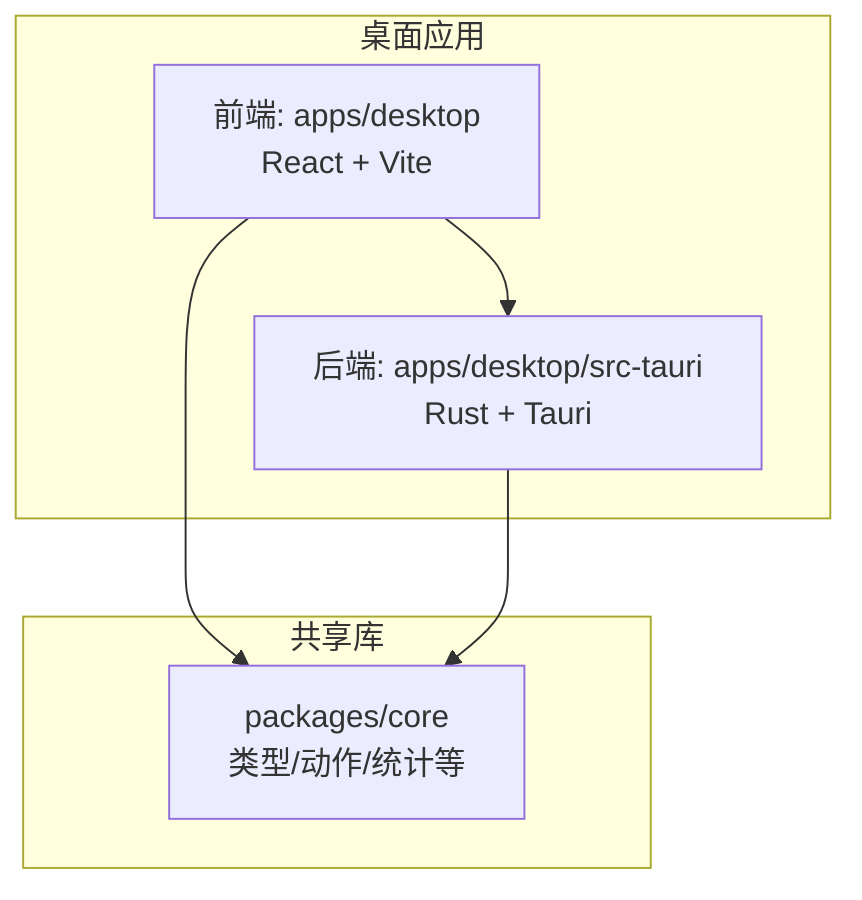
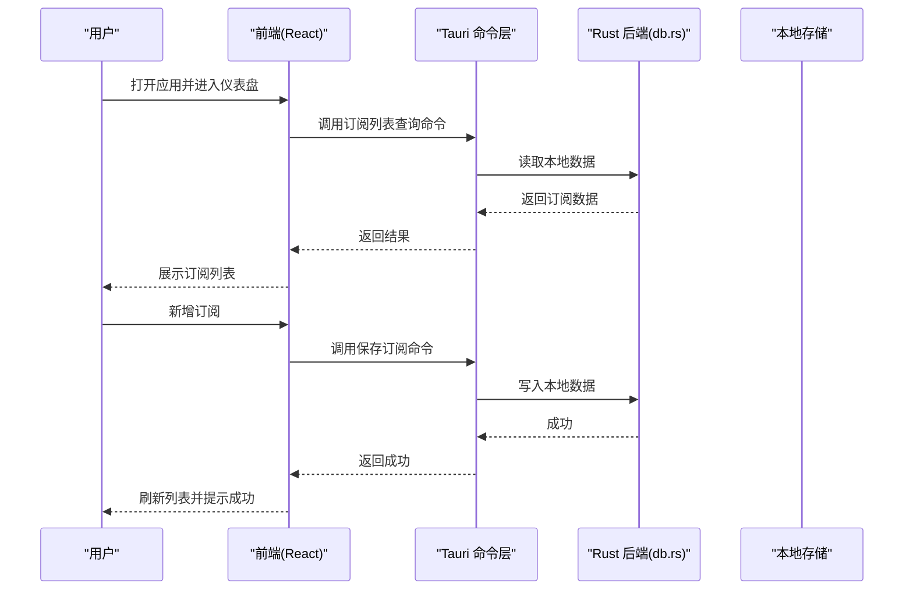
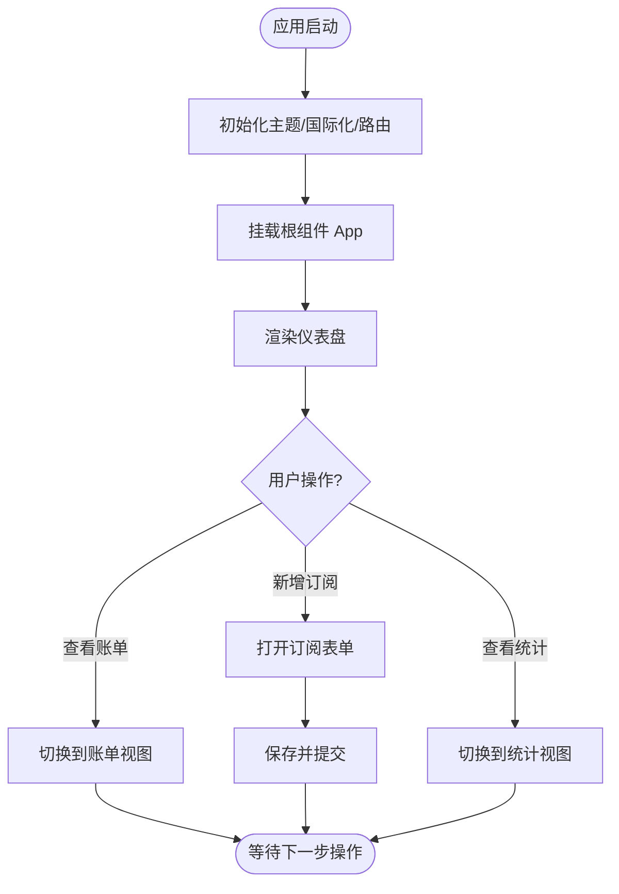
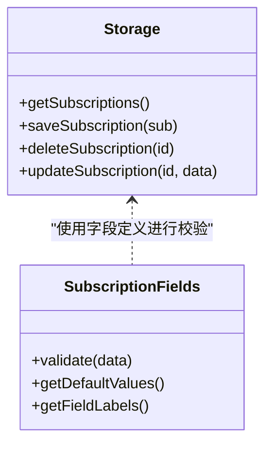
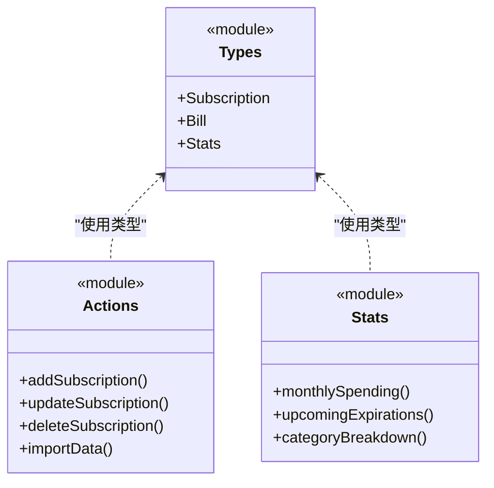
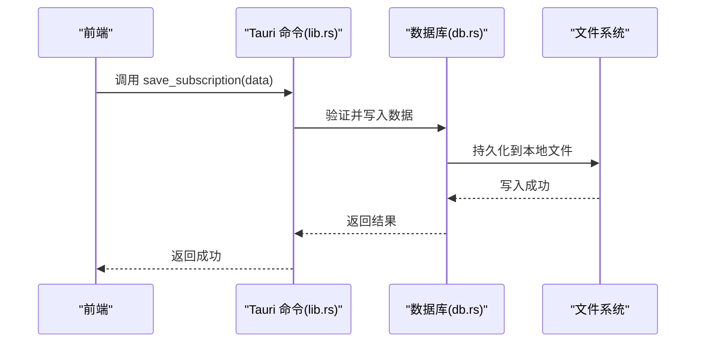
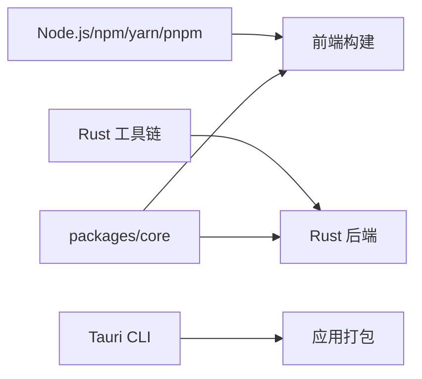

# 快速开始

<cite>
**本文引用的文件**   
- [README.md](file://README.md)
- [package.json](file://package.json)
- [apps/desktop/package.json](file://apps/desktop/package.json)
- [apps/desktop/src/main.tsx](file://apps/desktop/src/main.tsx)
- [apps/desktop/src/App.tsx](file://apps/desktop/src/App.tsx)
- [apps/desktop/src/storage.ts](file://apps/desktop/src/storage.ts)
- [apps/desktop/src/subscriptionFields.ts](file://apps/desktop/src/subscriptionFields.ts)
- [apps/desktop/src/BillsView.tsx](file://apps/desktop/src/BillsView.tsx)
- [apps/desktop/src/Dashboard.tsx](file://apps/desktop/src/Dashboard.tsx)
- [apps/desktop/src-tauri/Cargo.toml](file://apps/desktop/src-tauri/Cargo.toml)
- [apps/desktop/src-tauri/tauri.conf.json](file://apps/desktop/src-tauri/tauri.conf.json)
- [apps/desktop/src-tauri/src/lib.rs](file://apps/desktop/src-tauri/src/lib.rs)
- [apps/desktop/src-tauri/src/db.rs](file://apps/desktop/src-tauri/src/db.rs)
- [packages/core/package.json](file://packages/core/package.json)
- [packages/core/src/index.ts](file://packages/core/src/index.ts)
- [packages/core/src/types.ts](file://packages/core/src/types.ts)
- [packages/core/src/actions.ts](file://packages/core/src/actions.ts)
- [packages/core/src/stats.ts](file://packages/core/src/stats.ts)
</cite>

## 目录
1. [简介](#简介)
2. [项目结构](#项目结构)
3. [核心组件](#核心组件)
4. [架构总览](#架构总览)
5. [详细组件分析](#详细组件分析)
6. [依赖关系分析](#依赖关系分析)
7. [性能注意事项](#性能注意事项)
8. [故障排除指南](#故障排除指南)
9. [结论](#结论)
10. [附录](#附录)

## 简介
本快速开始指南面向首次接触“AI账号订阅管理”项目的用户，帮助你从零开始完成环境准备、安装构建、首次启动与基本配置，并通过创建第一个订阅的完整流程熟悉日常操作。项目采用 Tauri + React（Vite）+ Rust 的桌面应用架构，前端使用 TypeScript/React，后端通过 Tauri 调用 Rust 模块进行本地数据持久化与系统能力扩展。

## 项目结构
本项目为多包仓库，包含：
- apps/desktop：Tauri 桌面应用（前端 React/Vite + 后端 Rust）
- packages/core：跨端共享逻辑与类型定义
- docs：产品文档与设计说明
- scripts：构建与签名脚本
- .github/workflows/ci.yml：CI 流水线

图表来源
- [apps/desktop/package.json](file://apps/desktop/package.json)
- [apps/desktop/src-tauri/Cargo.toml](file://apps/desktop/src-tauri/Cargo.toml)
- [packages/core/package.json](file://packages/core/package.json)

章节来源
- [README.md](file://README.md)
- [package.json](file://package.json)
- [apps/desktop/package.json](file://apps/desktop/package.json)
- [apps/desktop/src-tauri/Cargo.toml](file://apps/desktop/src-tauri/Cargo.toml)
- [packages/core/package.json](file://packages/core/package.json)

## 核心组件
- 前端入口与路由
  - main.tsx：应用初始化与挂载
  - App.tsx：根组件与页面组织
  - Dashboard.tsx：概览仪表盘
  - BillsView.tsx：账单列表视图
- 状态与存储
  - storage.ts：本地持久化（IndexedDB/文件系统）
  - subscriptionFields.ts：订阅字段定义与校验
- 共享核心库
  - types.ts：领域模型与类型
  - actions.ts：数据操作与业务动作
  - stats.ts：统计计算
- Tauri/Rust 后端
  - lib.rs：Tauri 命令注册
  - db.rs：数据库访问封装
  - tauri.conf.json：Tauri 应用配置

章节来源
- [apps/desktop/src/main.tsx](file://apps/desktop/src/main.tsx)
- [apps/desktop/src/App.tsx](file://apps/desktop/src/App.tsx)
- [apps/desktop/src/Dashboard.tsx](file://apps/desktop/src/Dashboard.tsx)
- [apps/desktop/src/BillsView.tsx](file://apps/desktop/src/BillsView.tsx)
- [apps/desktop/src/storage.ts](file://apps/desktop/src/storage.ts)
- [apps/desktop/src/subscriptionFields.ts](file://apps/desktop/src/subscriptionFields.ts)
- [packages/core/src/types.ts](file://packages/core/src/types.ts)
- [packages/core/src/actions.ts](file://packages/core/src/actions.ts)
- [packages/core/src/stats.ts](file://packages/core/src/stats.ts)
- [apps/desktop/src-tauri/src/lib.rs](file://apps/desktop/src-tauri/src/lib.rs)
- [apps/desktop/src-tauri/src/db.rs](file://apps/desktop/src-tauri/src/db.rs)
- [apps/desktop/src-tauri/tauri.conf.json](file://apps/desktop/src-tauri/tauri.conf.json)

## 架构总览
整体采用前后端分离但紧密集成的 Tauri 架构：
- 前端通过 Tauri 命令与 Rust 后端通信，实现本地文件/数据库读写
- 共享核心库提供统一的数据模型、动作与统计能力
- 桌面应用打包后具备原生能力（如通知、监控等）

图表来源
- [apps/desktop/src/main.tsx](file://apps/desktop/src/main.tsx)
- [apps/desktop/src/App.tsx](file://apps/desktop/src/App.tsx)
- [apps/desktop/src-tauri/src/lib.rs](file://apps/desktop/src-tauri/src/lib.rs)
- [apps/desktop/src-tauri/src/db.rs](file://apps/desktop/src-tauri/src/db.rs)

## 详细组件分析

### 前端应用初始化与页面组织
- main.tsx：负责应用初始化、主题与国际化设置、挂载根组件
- App.tsx：定义路由与页面容器，集成仪表盘、账单、统计等视图
- Dashboard.tsx：聚合关键指标（订阅数量、即将到期、月度支出等）

图表来源
- [apps/desktop/src/main.tsx](file://apps/desktop/src/main.tsx)
- [apps/desktop/src/App.tsx](file://apps/desktop/src/App.tsx)
- [apps/desktop/src/Dashboard.tsx](file://apps/desktop/src/Dashboard.tsx)

章节来源
- [apps/desktop/src/main.tsx](file://apps/desktop/src/main.tsx)
- [apps/desktop/src/App.tsx](file://apps/desktop/src/App.tsx)
- [apps/desktop/src/Dashboard.tsx](file://apps/desktop/src/Dashboard.tsx)

### 数据存储与订阅字段
- storage.ts：封装本地存储（IndexedDB/文件系统），提供增删改查与批量操作
- subscriptionFields.ts：定义订阅字段（名称、价格、周期、币种、到期日等）及校验规则

图表来源
- [apps/desktop/src/storage.ts](file://apps/desktop/src/storage.ts)
- [apps/desktop/src/subscriptionFields.ts](file://apps/desktop/src/subscriptionFields.ts)

章节来源
- [apps/desktop/src/storage.ts](file://apps/desktop/src/storage.ts)
- [apps/desktop/src/subscriptionFields.ts](file://apps/desktop/src/subscriptionFields.ts)

### 共享核心库（类型、动作、统计）
- types.ts：定义订阅、账单、统计等核心类型
- actions.ts：提供统一的业务动作（新增、更新、删除、导入导出等）
- stats.ts：计算月度支出、到期提醒、分类统计等

图表来源
- [packages/core/src/types.ts](file://packages/core/src/types.ts)
- [packages/core/src/actions.ts](file://packages/core/src/actions.ts)
- [packages/core/src/stats.ts](file://packages/core/src/stats.ts)
- [packages/core/src/index.ts](file://packages/core/src/index.ts)

章节来源
- [packages/core/src/types.ts](file://packages/core/src/types.ts)
- [packages/core/src/actions.ts](file://packages/core/src/actions.ts)
- [packages/core/src/stats.ts](file://packages/core/src/stats.ts)
- [packages/core/src/index.ts](file://packages/core/src/index.ts)

### Tauri/Rust 后端（命令与数据库）
- lib.rs：注册 Tauri 命令，暴露给前端调用
- db.rs：封装本地数据库/文件读写，保证数据安全与一致性
- tauri.conf.json：应用元信息、权限与安全策略

图表来源
- [apps/desktop/src-tauri/src/lib.rs](file://apps/desktop/src-tauri/src/lib.rs)
- [apps/desktop/src-tauri/src/db.rs](file://apps/desktop/src-tauri/src/db.rs)
- [apps/desktop/src-tauri/tauri.conf.json](file://apps/desktop/src-tauri/tauri.conf.json)

章节来源
- [apps/desktop/src-tauri/src/lib.rs](file://apps/desktop/src-tauri/src/lib.rs)
- [apps/desktop/src-tauri/src/db.rs](file://apps/desktop/src-tauri/src/db.rs)
- [apps/desktop/src-tauri/tauri.conf.json](file://apps/desktop/src-tauri/tauri.conf.json)

## 依赖关系分析
- Node.js 与包管理器：用于前端构建与开发
- Rust 工具链：用于 Tauri 后端编译
- Tauri CLI：用于打包与调试
- 共享 core 包：被前端与后端共同引用

图表来源
- [package.json](file://package.json)
- [apps/desktop/package.json](file://apps/desktop/package.json)
- [apps/desktop/src-tauri/Cargo.toml](file://apps/desktop/src-tauri/Cargo.toml)
- [packages/core/package.json](file://packages/core/package.json)

章节来源
- [package.json](file://package.json)
- [apps/desktop/package.json](file://apps/desktop/package.json)
- [apps/desktop/src-tauri/Cargo.toml](file://apps/desktop/src-tauri/Cargo.toml)
- [packages/core/package.json](file://packages/core/package.json)

## 性能注意事项
- 首次启动时避免一次性加载大量数据，建议分页或懒加载
- 本地存储读写应批量合并，减少频繁 I/O
- 统计计算可缓存结果，仅在数据变更时重新计算
- 前端 UI 渲染注意虚拟列表与防抖处理，提升交互流畅度

## 故障排除指南
常见问题与解决思路：
- Node.js 版本不匹配：确保使用推荐的 LTS 版本，清理 node_modules 后重装依赖
- Rust 工具链缺失：安装 rustup 并确保目标平台已配置
- Tauri 构建失败：检查系统依赖（如 macOS 上的 Xcode 命令行工具）
- 端口占用：修改开发服务器端口或关闭占用进程
- 权限问题：确认对本地存储路径有读写权限

章节来源
- [apps/desktop/package.json](file://apps/desktop/package.json)
- [apps/desktop/src-tauri/Cargo.toml](file://apps/desktop/src-tauri/Cargo.toml)
- [apps/desktop/src-tauri/tauri.conf.json](file://apps/desktop/src-tauri/tauri.conf.json)

## 结论
通过本快速开始指南，你已完成环境准备、安装构建、首次启动与基本配置，并掌握了创建第一个订阅的完整流程。建议在日常使用中结合仪表盘与账单视图，定期核对订阅状态与到期提醒，保持订阅管理的清晰与可控。

## 附录

### 环境准备要求
- Node.js：建议使用稳定版（LTS），与 package.json 中 engines 字段保持一致
- Rust 工具链：rustc、cargo、rustup，确保目标平台已正确配置
- 操作系统：Windows/macOS/Linux（具体支持以 Tauri 文档为准）
- 其他：Git、终端、文本编辑器或 IDE

章节来源
- [package.json](file://package.json)
- [apps/desktop/package.json](file://apps/desktop/package.json)
- [apps/desktop/src-tauri/Cargo.toml](file://apps/desktop/src-tauri/Cargo.toml)

### 安装与构建步骤
- 克隆仓库并进入项目目录
- 安装前端依赖（在 apps/desktop 目录下执行）
- 安装 Rust 依赖（在 apps/desktop/src-tauri 目录下执行）
- 构建前端资源
- 启动开发模式（含热重载）
- 构建生产包（可选）

章节来源
- [apps/desktop/package.json](file://apps/desktop/package.json)
- [apps/desktop/src-tauri/Cargo.toml](file://apps/desktop/src-tauri/Cargo.toml)

### 首次启动与基本配置
- 运行开发模式，浏览器窗口将自动打开
- 首次进入仪表盘，确认数据为空
- 打开设置界面，配置语言、主题、货币单位等
- 验证本地存储是否正常工作（新增一条测试订阅）

章节来源
- [apps/desktop/src/main.tsx](file://apps/desktop/src/main.tsx)
- [apps/desktop/src/App.tsx](file://apps/desktop/src/App.tsx)
- [apps/desktop/src/Dashboard.tsx](file://apps/desktop/src/Dashboard.tsx)

### 创建第一个订阅的完整流程
- 从仪表盘点击“新增订阅”
- 填写订阅名称、价格、周期、币种、到期日等必填字段
- 选择分类与备注（可选）
- 提交保存，返回列表确认新增成功
- 查看仪表盘指标变化（订阅总数、月度支出等）

章节来源
- [apps/desktop/src/subscriptionFields.ts](file://apps/desktop/src/subscriptionFields.ts)
- [apps/desktop/src/BillsView.tsx](file://apps/desktop/src/BillsView.tsx)
- [apps/desktop/src/Dashboard.tsx](file://apps/desktop/src/Dashboard.tsx)
- [packages/core/src/actions.ts](file://packages/core/src/actions.ts)

### 数据输入与查看方法
- 数据输入：通过表单提交，字段校验由 subscriptionFields.ts 提供
- 数据查看：账单视图按时间排序，仪表盘汇总关键指标
- 数据导出：使用核心库提供的导出动作（如有）

章节来源
- [apps/desktop/src/subscriptionFields.ts](file://apps/desktop/src/subscriptionFields.ts)
- [apps/desktop/src/BillsView.tsx](file://apps/desktop/src/BillsView.tsx)
- [packages/core/src/actions.ts](file://packages/core/src/actions.ts)

### 常见日常使用场景与技巧
- 定期核对即将到期的订阅，提前续费或取消
- 使用分类统计了解各服务支出占比
- 利用搜索与筛选快速定位特定订阅
- 开启到期提醒，避免忘记续费导致服务中断

[本节为通用使用建议，不直接分析具体文件]

### 截图与示例（占位）
- 仪表盘截图：展示订阅总数、月度支出、即将到期列表
- 新增订阅表单截图：标注必填字段与校验提示
- 账单列表截图：展示排序、筛选与操作按钮

[本节为概念性内容，不包含代码映射]