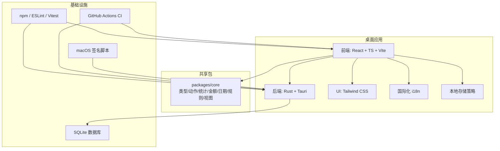
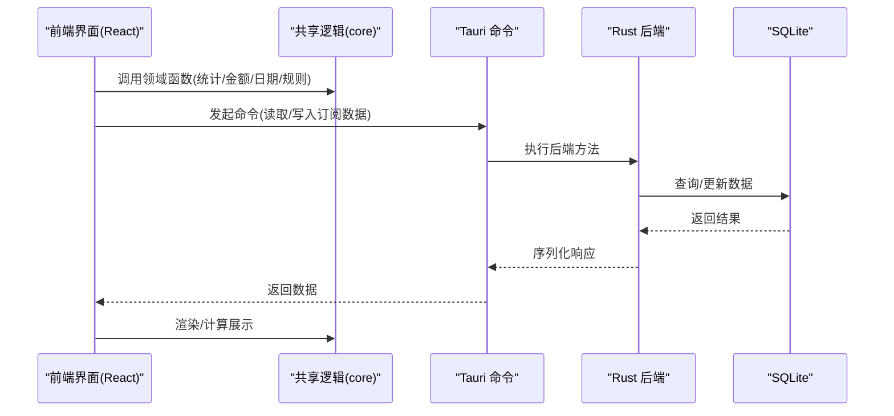
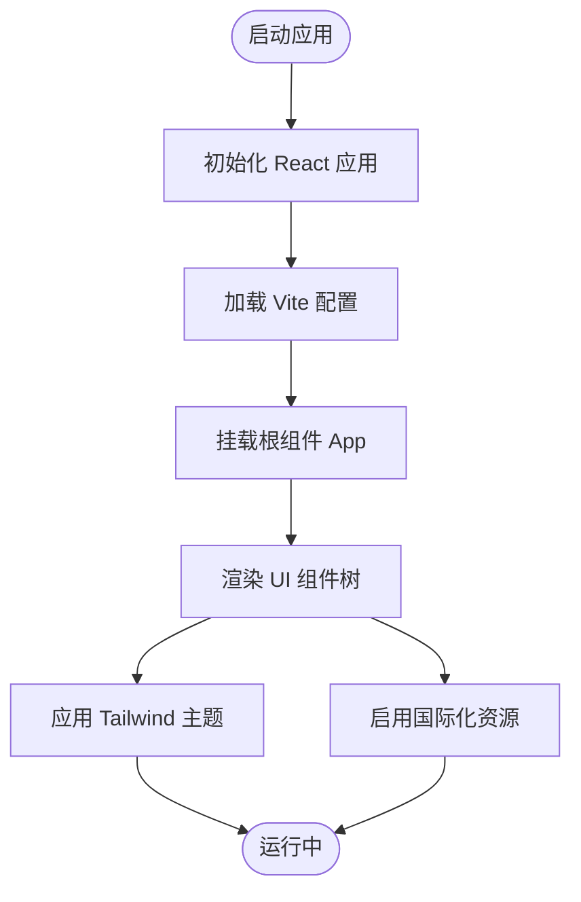
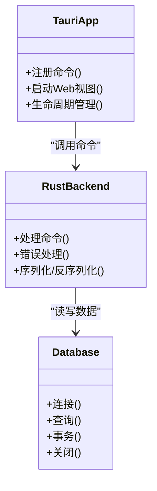
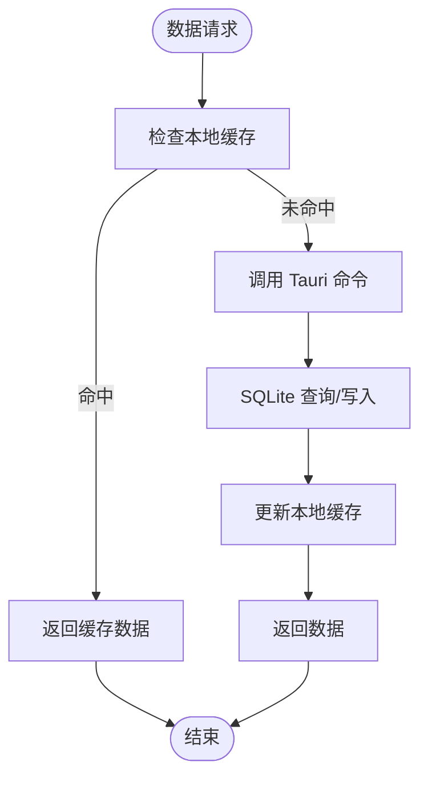
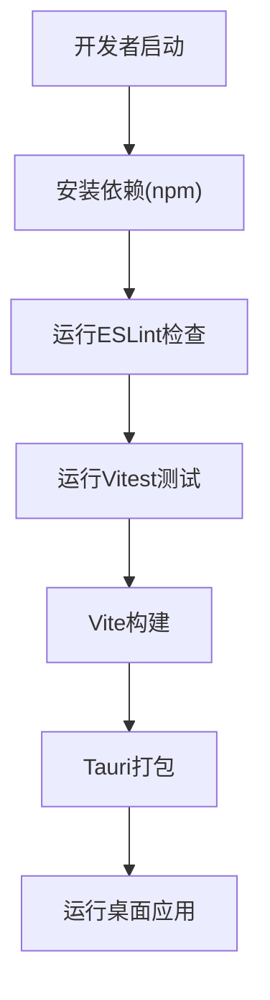
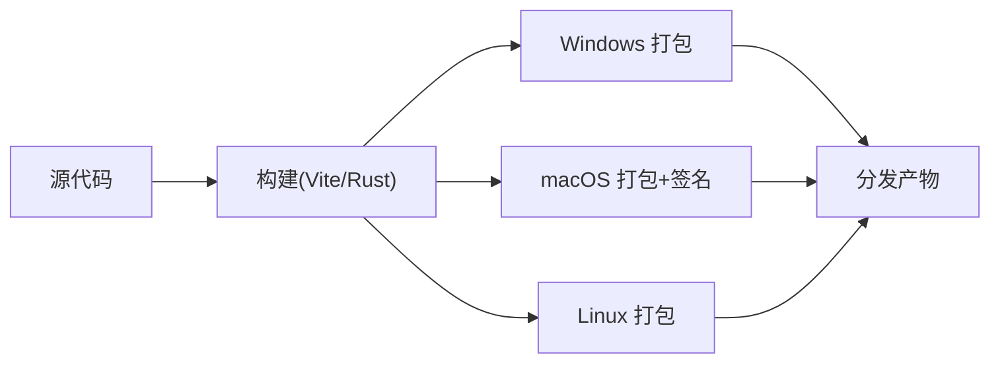
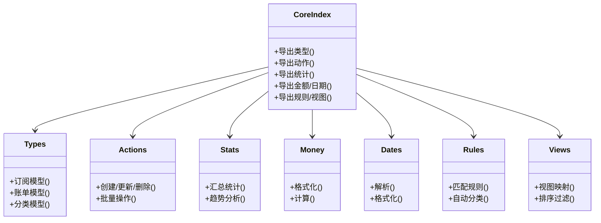
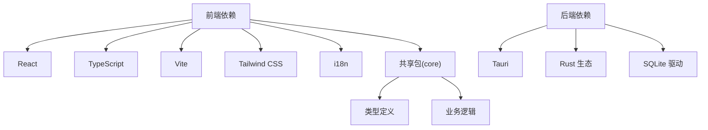

# 技术栈

<cite>
**本文引用的文件**   
- [package.json](file://package.json)
- [apps/desktop/package.json](file://apps/desktop/package.json)
- [apps/desktop/tsconfig.json](file://apps/desktop/tsconfig.json)
- [apps/desktop/vite.config.ts](file://apps/desktop/vite.config.ts)
- [apps/desktop/vitest.config.ts](file://apps/desktop/vitest.config.ts)
- [eslint.config.js](file://eslint.config.js)
- [apps/desktop/src/main.tsx](file://apps/desktop/src/main.tsx)
- [apps/desktop/src/App.tsx](file://apps/desktop/src/App.tsx)
- [apps/desktop/src/storage.ts](file://apps/desktop/src/storage.ts)
- [apps/desktop/src/i18n.ts](file://apps/desktop/src/i18n.ts)
- [apps/desktop/src/styles.css](file://apps/desktop/src/styles.css)
- [apps/desktop/src-tauri/Cargo.toml](file://apps/desktop/src-tauri/Cargo.toml)
- [apps/desktop/src-tauri/tauri.conf.json](file://apps/desktop/src-tauri/tauri.conf.json)
- [apps/desktop/src-tauri/src/lib.rs](file://apps/desktop/src-tauri/src/lib.rs)
- [apps/desktop/src-tauri/src/db.rs](file://apps/desktop/src-tauri/src/db.rs)
- [packages/core/package.json](file://packages/core/package.json)
- [packages/core/src/index.ts](file://packages/core/src/index.ts)
- [packages/core/src/types.ts](file://packages/core/src/types.ts)
- [packages/core/src/actions.ts](file://packages/core/src/actions.ts)
- [packages/core/src/stats.ts](file://packages/core/src/stats.ts)
- [packages/core/src/money.ts](file://packages/core/src/money.ts)
- [packages/core/src/dates.ts](file://packages/core/src/dates.ts)
- [packages/core/src/defaults.ts](file://packages/core/src/defaults.ts)
- [packages/core/src/load.ts](file://packages/core/src/load.ts)
- [packages/core/src/normalize.ts](file://packages/core/src/normalize.ts)
- [packages/core/src/paste.ts](file://packages/core/src/paste.ts)
- [packages/core/src/rules.ts](file://packages/core/src/rules.ts)
- [packages/core/src/views.ts](file://packages/core/src/views.ts)
- [packages/core/src/analytics.ts](file://packages/core/src/analytics.ts)
- [scripts/sign-macos-app.sh](file://scripts/sign-macos-app.sh)
- [.github/workflows/ci.yml](file://.github/workflows/ci.yml)
</cite>

## 目录
1. [简介](#简介)
2. [项目结构](#项目结构)
3. [核心组件](#核心组件)
4. [架构总览](#架构总览)
5. [详细组件分析](#详细组件分析)
6. [依赖分析](#依赖分析)
7. [性能考虑](#性能考虑)
8. [故障排查指南](#故障排查指南)
9. [结论](#结论)
10. [附录](#附录)

## 简介
本技术栈文档面向“AI账号订阅管理”桌面应用，系统梳理前端、后端与跨平台方案。前端采用 React + TypeScript + Vite + Tailwind CSS；后端基于 Rust 与 Tauri 构建本地能力；数据存储以 SQLite 为核心并结合本地持久化策略；开发工具链包含 npm、ESLint、Vitest 等；跨平台支持 Windows、macOS、Linux，并提供 macOS 签名脚本与 CI 流水线。

## 项目结构
仓库采用 Monorepo 组织：
- apps/desktop：Tauri 桌面应用（前端 React/TS/Vite，后端 Rust/Tauri）
- packages/core：共享业务逻辑与类型定义（纯 TS）
- scripts：打包与签名辅助脚本
- .github/workflows：CI 配置

**图表来源** 
- [apps/desktop/package.json](file://apps/desktop/package.json)
- [apps/desktop/src-tauri/Cargo.toml](file://apps/desktop/src-tauri/Cargo.toml)
- [packages/core/package.json](file://packages/core/package.json)
- [.github/workflows/ci.yml](file://.github/workflows/ci.yml)

**章节来源**
- [apps/desktop/package.json](file://apps/desktop/package.json)
- [apps/desktop/src-tauri/Cargo.toml](file://apps/desktop/src-tauri/Cargo.toml)
- [packages/core/package.json](file://packages/core/package.json)

## 核心组件
- 前端框架与语言：React + TypeScript，提供强类型与更好的可维护性
- 构建与开发：Vite，快速热更新与优化打包
- 样式体系：Tailwind CSS，原子化样式与主题定制
- 后端运行时：Rust + Tauri，安全高效的本地能力封装
- 数据层：SQLite 作为主存储，结合本地持久化策略（如 IndexedDB/文件系统）
- 测试与质量：Vitest 单元测试，ESLint 代码规范检查
- 共享逻辑：packages/core 暴露类型、动作、统计、金额处理、日期工具、规则引擎与视图映射

**章节来源**
- [apps/desktop/src/main.tsx](file://apps/desktop/src/main.tsx)
- [apps/desktop/src/App.tsx](file://apps/desktop/src/App.tsx)
- [apps/desktop/src/storage.ts](file://apps/desktop/src/storage.ts)
- [apps/desktop/src/i18n.ts](file://apps/desktop/src/i18n.ts)
- [apps/desktop/src/styles.css](file://apps/desktop/src/styles.css)
- [apps/desktop/src-tauri/src/lib.rs](file://apps/desktop/src-tauri/src/lib.rs)
- [apps/desktop/src-tauri/src/db.rs](file://apps/desktop/src-tauri/src/db.rs)
- [packages/core/src/index.ts](file://packages/core/src/index.ts)

## 架构总览
整体为“前端 UI + 共享逻辑 + Tauri 后端 + SQLite”的分层架构。前端通过 Tauri 命令调用 Rust 后端，后端操作 SQLite 并返回结构化数据；共享包 core 被前后端复用，保证领域模型与计算一致性。

**图表来源** 
- [apps/desktop/src/App.tsx](file://apps/desktop/src/App.tsx)
- [apps/desktop/src-tauri/src/lib.rs](file://apps/desktop/src-tauri/src/lib.rs)
- [apps/desktop/src-tauri/src/db.rs](file://apps/desktop/src-tauri/src/db.rs)
- [packages/core/src/actions.ts](file://packages/core/src/actions.ts)
- [packages/core/src/stats.ts](file://packages/core/src/stats.ts)

## 详细组件分析

### 前端技术栈（React + TypeScript + Vite + Tailwind CSS）
- React：组件化 UI，状态管理与事件驱动
- TypeScript：类型约束提升健壮性与可维护性
- Vite：现代构建工具，提供快速 HMR 与优化输出
- Tailwind CSS：原子化样式，配合主题文件实现一致设计

关键入口与配置：
- 应用入口与根组件：[apps/desktop/src/main.tsx](file://apps/desktop/src/main.tsx)、[apps/desktop/src/App.tsx](file://apps/desktop/src/App.tsx)
- 构建配置：[apps/desktop/vite.config.ts](file://apps/desktop/vite.config.ts)
- 样式与主题：[apps/desktop/src/styles.css](file://apps/desktop/src/styles.css)
- 国际化：[apps/desktop/src/i18n.ts](file://apps/desktop/src/i18n.ts)

**图表来源** 
- [apps/desktop/src/main.tsx](file://apps/desktop/src/main.tsx)
- [apps/desktop/src/App.tsx](file://apps/desktop/src/App.tsx)
- [apps/desktop/vite.config.ts](file://apps/desktop/vite.config.ts)
- [apps/desktop/src/styles.css](file://apps/desktop/src/styles.css)
- [apps/desktop/src/i18n.ts](file://apps/desktop/src/i18n.ts)

**章节来源**
- [apps/desktop/src/main.tsx](file://apps/desktop/src/main.tsx)
- [apps/desktop/src/App.tsx](file://apps/desktop/src/App.tsx)
- [apps/desktop/vite.config.ts](file://apps/desktop/vite.config.ts)
- [apps/desktop/src/styles.css](file://apps/desktop/src/styles.css)
- [apps/desktop/src/i18n.ts](file://apps/desktop/src/i18n.ts)

### 后端技术栈（Rust + Tauri）
- Rust：内存安全、高性能、零成本抽象，适合系统级与本地能力封装
- Tauri：轻量级宿主，将 Web 前端与 Rust 后端桥接，提供安全命令通道与原生能力访问

关键文件：
- Tauri 配置：[apps/desktop/src-tauri/tauri.conf.json](file://apps/desktop/src-tauri/tauri.conf.json)
- Rust 工程与依赖：[apps/desktop/src-tauri/Cargo.toml](file://apps/desktop/src-tauri/Cargo.toml)
- 后端入口与命令注册：[apps/desktop/src-tauri/src/lib.rs](file://apps/desktop/src-tauri/src/lib.rs)
- 数据库模块：[apps/desktop/src-tauri/src/db.rs](file://apps/desktop/src-tauri/src/db.rs)

**图表来源** 
- [apps/desktop/src-tauri/src/lib.rs](file://apps/desktop/src-tauri/src/lib.rs)
- [apps/desktop/src-tauri/src/db.rs](file://apps/desktop/src-tauri/src/db.rs)
- [apps/desktop/src-tauri/tauri.conf.json](file://apps/desktop/src-tauri/tauri.conf.json)

**章节来源**
- [apps/desktop/src-tauri/Cargo.toml](file://apps/desktop/src-tauri/Cargo.toml)
- [apps/desktop/src-tauri/tauri.conf.json](file://apps/desktop/src-tauri/tauri.conf.json)
- [apps/desktop/src-tauri/src/lib.rs](file://apps/desktop/src-tauri/src/lib.rs)
- [apps/desktop/src-tauri/src/db.rs](file://apps/desktop/src-tauri/src/db.rs)

### 数据存储方案（SQLite + 本地持久化）
- SQLite：轻量、嵌入式关系型数据库，适合桌面端离线场景
- 本地持久化：结合前端本地存储（如 IndexedDB/文件系统）进行缓存或临时数据管理

关键文件：
- 数据库模块：[apps/desktop/src-tauri/src/db.rs](file://apps/desktop/src-tauri/src/db.rs)
- 前端存储策略：[apps/desktop/src/storage.ts](file://apps/desktop/src/storage.ts)

**图表来源** 
- [apps/desktop/src-tauri/src/db.rs](file://apps/desktop/src-tauri/src/db.rs)
- [apps/desktop/src/storage.ts](file://apps/desktop/src/storage.ts)

**章节来源**
- [apps/desktop/src-tauri/src/db.rs](file://apps/desktop/src-tauri/src/db.rs)
- [apps/desktop/src/storage.ts](file://apps/desktop/src/storage.ts)

### 开发工具与依赖管理（npm、ESLint、Vitest）
- npm：统一依赖管理与脚本编排
- ESLint：代码风格与静态检查
- Vitest：前端与共享包的单元测试

关键文件：
- 根与桌面应用包配置：[package.json](file://package.json)、[apps/desktop/package.json](file://apps/desktop/package.json)
- 代码检查：[eslint.config.js](file://eslint.config.js)
- 测试配置：[apps/desktop/vitest.config.ts](file://apps/desktop/vitest.config.ts)

**图表来源** 
- [package.json](file://package.json)
- [apps/desktop/package.json](file://apps/desktop/package.json)
- [eslint.config.js](file://eslint.config.js)
- [apps/desktop/vitest.config.ts](file://apps/desktop/vitest.config.ts)

**章节来源**
- [package.json](file://package.json)
- [apps/desktop/package.json](file://apps/desktop/package.json)
- [eslint.config.js](file://eslint.config.js)
- [apps/desktop/vitest.config.ts](file://apps/desktop/vitest.config.ts)

### 跨平台支持（Windows、macOS、Linux）
- Tauri 原生支持多平台打包与分发
- macOS 签名脚本保障应用完整性与可信度
- CI 流水线自动化构建与验证

关键文件：
- Tauri 配置：[apps/desktop/src-tauri/tauri.conf.json](file://apps/desktop/src-tauri/tauri.conf.json)
- macOS 签名脚本：[scripts/sign-macos-app.sh](file://scripts/sign-macos-app.sh)
- CI 配置：[.github/workflows/ci.yml](file://.github/workflows/ci.yml)

**图表来源** 
- [apps/desktop/src-tauri/tauri.conf.json](file://apps/desktop/src-tauri/tauri.conf.json)
- [scripts/sign-macos-app.sh](file://scripts/sign-macos-app.sh)
- [.github/workflows/ci.yml](file://.github/workflows/ci.yml)

**章节来源**
- [apps/desktop/src-tauri/tauri.conf.json](file://apps/desktop/src-tauri/tauri.conf.json)
- [scripts/sign-macos-app.sh](file://scripts/sign-macos-app.sh)
- [.github/workflows/ci.yml](file://.github/workflows/ci.yml)

### UI 组件库与第三方集成
- UI 组件：基于 React 的自定义组件与 Tailwind 原子样式组合
- 国际化：i18n 模块提供多语言支持
- 共享逻辑：core 包提供领域模型、动作、统计、金额、日期、规则与视图映射，确保前后端一致性

关键文件：
- 国际化：[apps/desktop/src/i18n.ts](file://apps/desktop/src/i18n.ts)
- 共享包入口与类型：[packages/core/src/index.ts](file://packages/core/src/index.ts)、[packages/core/src/types.ts](file://packages/core/src/types.ts)
- 动作与统计：[packages/core/src/actions.ts](file://packages/core/src/actions.ts)、[packages/core/src/stats.ts](file://packages/core/src/stats.ts)
- 金额与日期：[packages/core/src/money.ts](file://packages/core/src/money.ts)、[packages/core/src/dates.ts](file://packages/core/src/dates.ts)
- 默认值与导入导出：[packages/core/src/defaults.ts](file://packages/core/src/defaults.ts)、[packages/core/src/load.ts](file://packages/core/src/load.ts)
- 数据规范化与粘贴处理：[packages/core/src/normalize.ts](file://packages/core/src/normalize.ts)、[packages/core/src/paste.ts](file://packages/core/src/paste.ts)
- 规则与视图映射：[packages/core/src/rules.ts](file://packages/core/src/rules.ts)、[packages/core/src/views.ts](file://packages/core/src/views.ts)
- 分析埋点：[packages/core/src/analytics.ts](file://packages/core/src/analytics.ts)

**图表来源** 
- [packages/core/src/index.ts](file://packages/core/src/index.ts)
- [packages/core/src/types.ts](file://packages/core/src/types.ts)
- [packages/core/src/actions.ts](file://packages/core/src/actions.ts)
- [packages/core/src/stats.ts](file://packages/core/src/stats.ts)
- [packages/core/src/money.ts](file://packages/core/src/money.ts)
- [packages/core/src/dates.ts](file://packages/core/src/dates.ts)
- [packages/core/src/rules.ts](file://packages/core/src/rules.ts)
- [packages/core/src/views.ts](file://packages/core/src/views.ts)

**章节来源**
- [apps/desktop/src/i18n.ts](file://apps/desktop/src/i18n.ts)
- [packages/core/src/index.ts](file://packages/core/src/index.ts)
- [packages/core/src/types.ts](file://packages/core/src/types.ts)
- [packages/core/src/actions.ts](file://packages/core/src/actions.ts)
- [packages/core/src/stats.ts](file://packages/core/src/stats.ts)
- [packages/core/src/money.ts](file://packages/core/src/money.ts)
- [packages/core/src/dates.ts](file://packages/core/src/dates.ts)
- [packages/core/src/defaults.ts](file://packages/core/src/defaults.ts)
- [packages/core/src/load.ts](file://packages/core/src/load.ts)
- [packages/core/src/normalize.ts](file://packages/core/src/normalize.ts)
- [packages/core/src/paste.ts](file://packages/core/src/paste.ts)
- [packages/core/src/rules.ts](file://packages/core/src/rules.ts)
- [packages/core/src/views.ts](file://packages/core/src/views.ts)
- [packages/core/src/analytics.ts](file://packages/core/src/analytics.ts)

## 依赖分析
- 前端依赖：React、TypeScript、Vite、Tailwind CSS、i18n 库等
- 后端依赖：Rust 生态（Tauri、SQLite 驱动等）
- 共享依赖：core 包被前端引用，保证领域模型与计算一致性

**图表来源** 
- [apps/desktop/package.json](file://apps/desktop/package.json)
- [apps/desktop/src-tauri/Cargo.toml](file://apps/desktop/src-tauri/Cargo.toml)
- [packages/core/package.json](file://packages/core/package.json)

**章节来源**
- [apps/desktop/package.json](file://apps/desktop/package.json)
- [apps/desktop/src-tauri/Cargo.toml](file://apps/desktop/src-tauri/Cargo.toml)
- [packages/core/package.json](file://packages/core/package.json)

## 性能考虑
- 前端：利用 Vite 的按需编译与代码分割，减少首屏体积；Tailwind 生成最小化样式
- 后端：Rust 的高性能与内存安全，SQLite 的嵌入式低开销
- 数据层：本地缓存与索引优化，减少重复 IO；合理的事务与批处理降低锁竞争
- 构建与打包：生产环境开启压缩与 Tree-shaking；避免不必要的依赖引入

[本节为通用指导，不直接分析具体文件]

## 故障排查指南
- 构建失败：检查 Node 版本与依赖安装；确认 Vite 与 Tauri 配置正确
- 运行时错误：查看浏览器控制台与 Tauri 日志；定位命令调用与数据库异常
- 测试失败：使用 Vitest 定位断言失败；检查 mock 与数据准备
- 权限与签名：macOS 签名失败时检查证书与脚本参数；CI 环境变量是否齐全

**章节来源**
- [apps/desktop/vitest.config.ts](file://apps/desktop/vitest.config.ts)
- [apps/desktop/src-tauri/tauri.conf.json](file://apps/desktop/src-tauri/tauri.conf.json)
- [scripts/sign-macos-app.sh](file://scripts/sign-macos-app.sh)
- [.github/workflows/ci.yml](file://.github/workflows/ci.yml)

## 结论
本项目以 React + TypeScript + Vite + Tailwind 构建现代化前端，借助 Rust + Tauri 提供高效安全的本地能力，SQLite 作为可靠的数据存储。Monorepo 结构与共享 core 包提升了代码复用与一致性。完善的工具链（npm、ESLint、Vitest）与 CI/签名流程保障了开发与交付质量。该技术栈在性能、可维护性与跨平台能力上具备显著优势。

[本节为总结性内容，不直接分析具体文件]

## 附录
- 配置文件路径参考：
  - 前端构建与脚本：[apps/desktop/package.json](file://apps/desktop/package.json)、[apps/desktop/vite.config.ts](file://apps/desktop/vite.config.ts)
  - 后端工程与配置：[apps/desktop/src-tauri/Cargo.toml](file://apps/desktop/src-tauri/Cargo.toml)、[apps/desktop/src-tauri/tauri.conf.json](file://apps/desktop/src-tauri/tauri.conf.json)
  - 共享包入口：[packages/core/src/index.ts](file://packages/core/src/index.ts)
- 关键模块路径参考：
  - 应用入口与根组件：[apps/desktop/src/main.tsx](file://apps/desktop/src/main.tsx)、[apps/desktop/src/App.tsx](file://apps/desktop/src/App.tsx)
  - 数据存储与本地策略：[apps/desktop/src-tauri/src/db.rs](file://apps/desktop/src-tauri/src/db.rs)、[apps/desktop/src/storage.ts](file://apps/desktop/src/storage.ts)
  - 国际化与样式：[apps/desktop/src/i18n.ts](file://apps/desktop/src/i18n.ts)、[apps/desktop/src/styles.css](file://apps/desktop/src/styles.css)

[本节为补充信息，不直接分析具体文件]