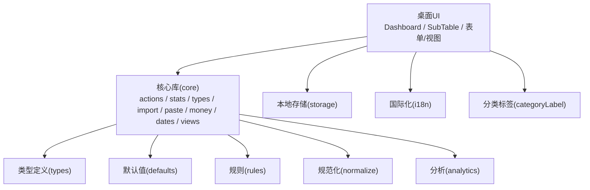
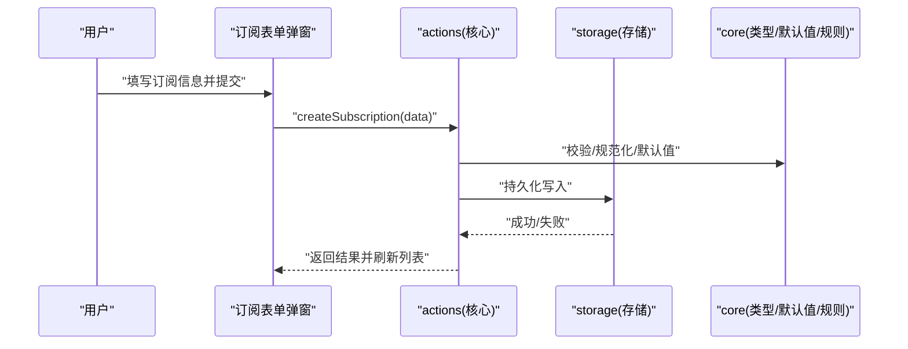
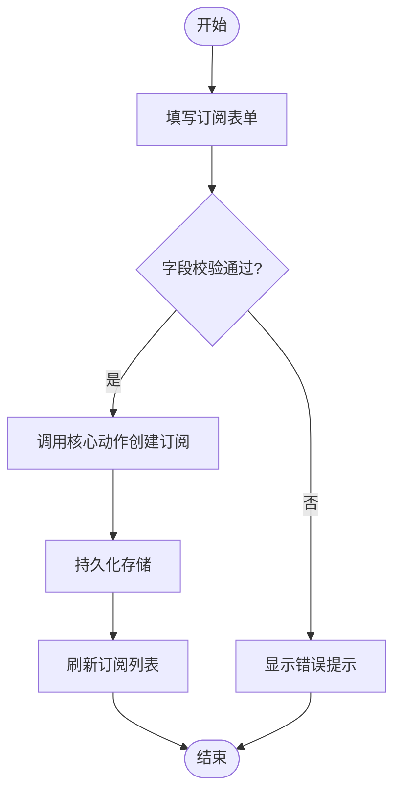
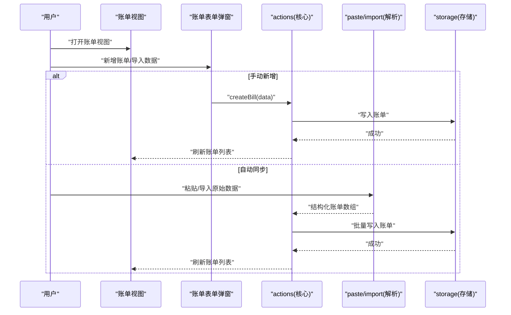
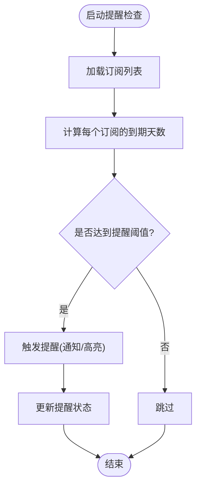
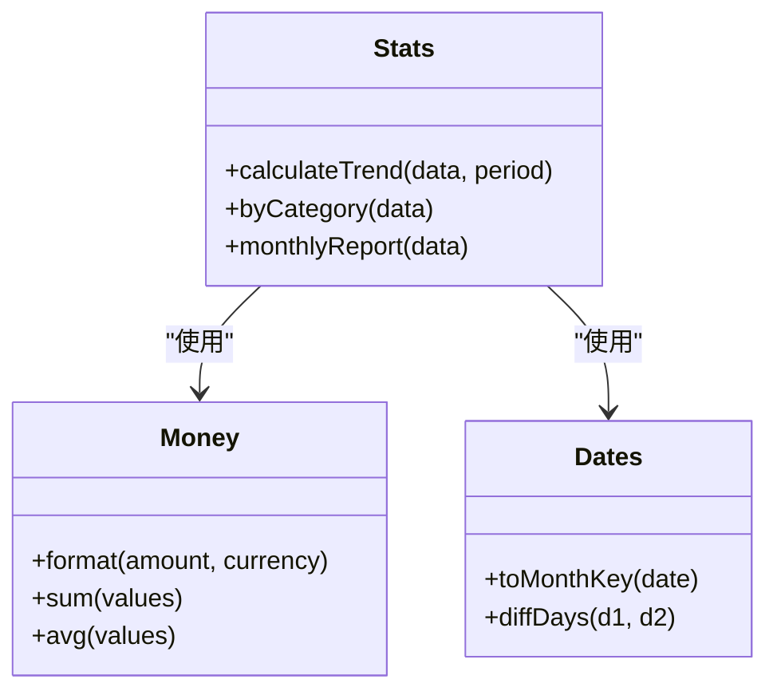
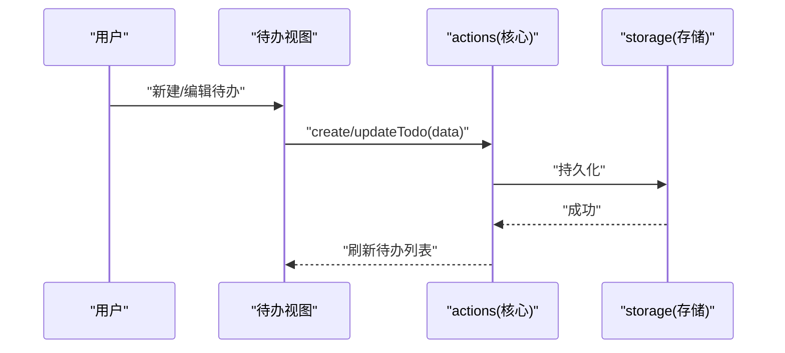
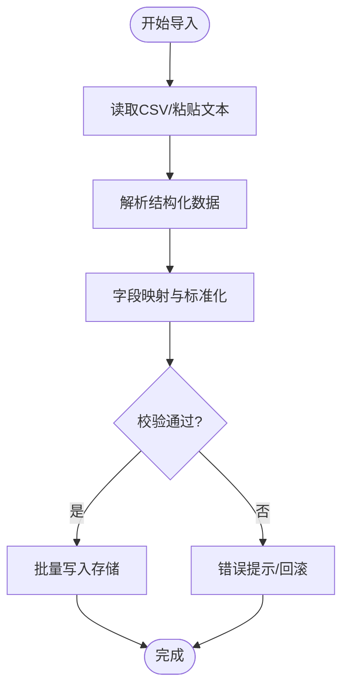
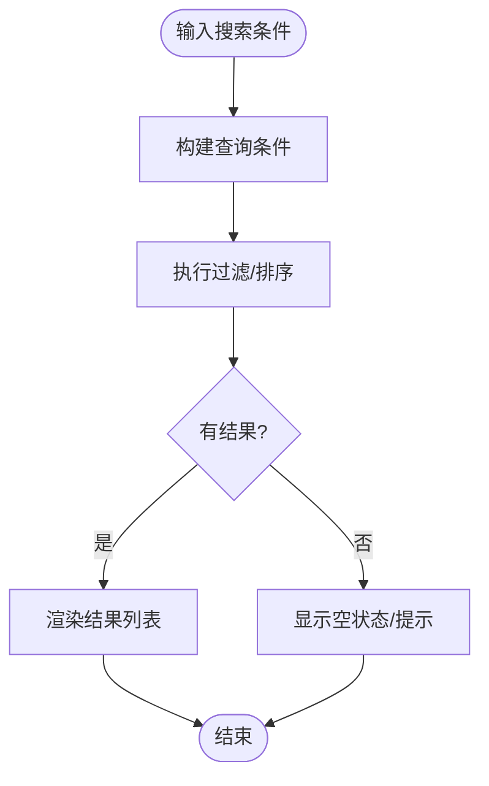
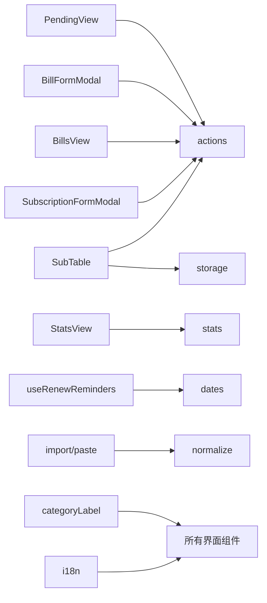

# 核心功能

<cite>
**本文引用的文件**   
- [apps/desktop/src/Dashboard.tsx](file://apps/desktop/src/Dashboard.tsx)
- [apps/desktop/src/SubTable.tsx](file://apps/desktop/src/SubTable.tsx)
- [apps/desktop/src/SubscriptionFormModal.tsx](file://apps/desktop/src/SubscriptionFormModal.tsx)
- [apps/desktop/src/BillsView.tsx](file://apps/desktop/src/BillsView.tsx)
- [apps/desktop/src/BillFormModal.tsx](file://apps/desktop/src/BillFormModal.tsx)
- [apps/desktop/src/PendingView.tsx](file://apps/desktop/src/PendingView.tsx)
- [apps/desktop/src/StatsView.tsx](file://apps/desktop/src/StatsView.tsx)
- [apps/desktop/src/useRenewReminders.ts](file://apps/desktop/src/useRenewReminders.ts)
- [apps/desktop/src/storage.ts](file://apps/desktop/src/storage.ts)
- [apps/desktop/src/subTableHandlers.ts](file://apps/desktop/src/subTableHandlers.ts)
- [apps/desktop/src/subscriptionFields.ts](file://apps/desktop/src/subscriptionFields.ts)
- [packages/core/src/actions.ts](file://packages/core/src/actions.ts)
- [packages/core/src/stats.ts](file://packages/core/src/stats.ts)
- [packages/core/src/types.ts](file://packages/core/src/types.ts)
- [packages/core/src/import.ts](file://packages/core/src/import.ts)
- [packages/core/src/paste.ts](file://packages/core/src/paste.ts)
- [packages/core/src/money.ts](file://packages/core/src/money.ts)
- [packages/core/src/dates.ts](file://packages/core/src/dates.ts)
- [packages/core/src/views.ts](file://packages/core/src/views.ts)
- [packages/core/src/defaults.ts](file://packages/core/src/defaults.ts)
- [packages/core/src/normalize.ts](file://packages/core/src/normalize.ts)
- [packages/core/src/rules.ts](file://packages/core/src/rules.ts)
- [packages/core/src/analytics.ts](file://packages/core/src/analytics.ts)
- [apps/desktop/src/i18n.ts](file://apps/desktop/src/i18n.ts)
- [apps/desktop/src/categoryLabel.ts](file://apps/desktop/src/categoryLabel.ts)
</cite>

## 目录
1. [简介](#简介)
2. [项目结构](#项目结构)
3. [核心组件](#核心组件)
4. [架构总览](#架构总览)
5. [详细组件分析](#详细组件分析)
6. [依赖关系分析](#依赖关系分析)
7. [性能考量](#性能考量)
8. [故障排查指南](#故障排查指南)
9. [结论](#结论)
10. [附录](#附录)

## 简介
本文件面向AI账号订阅管理项目的核心功能，围绕“订阅管理、账单跟踪、到期提醒、统计分析、待办事项、数据导入导出、搜索与过滤”等能力进行系统化说明。文档以用户可操作的功能为主线，结合前端界面与核心逻辑包（core）的实现要点，帮助读者快速理解系统如何工作以及如何扩展与维护。

## 项目结构
项目采用前后端分离的桌面应用架构：
- 桌面端（apps/desktop）：基于 React + Tauri 的前端界面与交互逻辑，负责订阅表单、账单视图、统计面板、提醒与持久化等。
- 核心库（packages/core）：提供领域模型、动作编排、统计计算、日期/金额处理、导入粘贴、规则与默认值等通用能力。
- 平台能力（apps/desktop/src-tauri）：通过 Rust 暴露数据库、OCR、监控等原生能力（本文聚焦前端与 core 层）。

图表来源
- [apps/desktop/src/Dashboard.tsx](file://apps/desktop/src/Dashboard.tsx)
- [apps/desktop/src/SubTable.tsx](file://apps/desktop/src/SubTable.tsx)
- [packages/core/src/actions.ts](file://packages/core/src/actions.ts)
- [packages/core/src/types.ts](file://packages/core/src/types.ts)
- [apps/desktop/src/storage.ts](file://apps/desktop/src/storage.ts)
- [apps/desktop/src/i18n.ts](file://apps/desktop/src/i18n.ts)
- [apps/desktop/src/categoryLabel.ts](file://apps/desktop/src/categoryLabel.ts)

章节来源
- [apps/desktop/src/Dashboard.tsx](file://apps/desktop/src/Dashboard.tsx)
- [apps/desktop/src/SubTable.tsx](file://apps/desktop/src/SubTable.tsx)
- [packages/core/src/index.ts](file://packages/core/src/index.ts)

## 核心组件
- 订阅管理
  - 新增订阅：通过订阅表单弹窗创建条目，支持名称、类别、价格、续费周期、下次到期日、备注等字段。
  - 编辑订阅：在表格行内或弹窗中修改字段，自动校验并保存。
  - 续费周期：支持月/季/年等周期配置，用于到期提醒与月度成本折算。
- 账单跟踪
  - 手动记录：账单视图支持新增账单，关联订阅、金额、币种、日期、支付方式等。
  - 自动同步：可通过粘贴/导入将外部账单数据解析入库（见导入与粘贴模块）。
- 到期提醒
  - 基于订阅的到期日与当前时间计算提醒阈值，触发通知或高亮显示。
- 统计分析
  - 支出趋势：按时间维度聚合支出，生成折线/柱状图数据。
  - 分类统计：按订阅类别汇总费用占比与趋势。
  - 月度报告：按月汇总订阅与账单，输出报表数据。
- 待办事项与任务追踪
  - 维护待办列表，支持状态切换、优先级、截止日期等。
- 数据导入导出
  - 支持CSV及常见格式导入；导出为CSV以便二次分析。
- 搜索与过滤
  - 支持按名称、类别、状态、日期范围等多条件筛选与全文检索。

章节来源
- [apps/desktop/src/SubscriptionFormModal.tsx](file://apps/desktop/src/SubscriptionFormModal.tsx)
- [apps/desktop/src/BillsView.tsx](file://apps/desktop/src/BillsView.tsx)
- [apps/desktop/src/BillFormModal.tsx](file://apps/desktop/src/BillFormModal.tsx)
- [apps/desktop/src/useRenewReminders.ts](file://apps/desktop/src/useRenewReminders.ts)
- [apps/desktop/src/StatsView.tsx](file://apps/desktop/src/StatsView.tsx)
- [apps/desktop/src/PendingView.tsx](file://apps/desktop/src/PendingView.tsx)
- [packages/core/src/import.ts](file://packages/core/src/import.ts)
- [packages/core/src/paste.ts](file://packages/core/src/paste.ts)
- [apps/desktop/src/SubTable.tsx](file://apps/desktop/src/SubTable.tsx)

## 架构总览
整体采用“界面层 + 核心逻辑层 + 存储/平台能力”的分层设计：
- 界面层：React 组件负责渲染与交互，调用 actions 与 hooks。
- 核心逻辑层：统一的数据模型、动作编排、统计与工具函数。
- 存储/平台能力：本地持久化与原生能力（如 OCR、数据库）由 Tauri 桥接。

图表来源
- [apps/desktop/src/SubscriptionFormModal.tsx](file://apps/desktop/src/SubscriptionFormModal.tsx)
- [packages/core/src/actions.ts](file://packages/core/src/actions.ts)
- [apps/desktop/src/storage.ts](file://apps/desktop/src/storage.ts)
- [packages/core/src/types.ts](file://packages/core/src/types.ts)
- [packages/core/src/defaults.ts](file://packages/core/src/defaults.ts)
- [packages/core/src/normalize.ts](file://packages/core/src/normalize.ts)
- [packages/core/src/rules.ts](file://packages/core/src/rules.ts)

## 详细组件分析

### 订阅管理（新增/编辑/续费周期）
- 新增订阅
  - 入口：订阅表单弹窗提交后调用核心动作创建订阅。
  - 数据流：表单数据 → 核心校验与规范化 → 写入存储 → 刷新表格。
- 编辑订阅
  - 入口：表格行编辑或弹窗编辑，更新字段后重新校验并保存。
- 续费周期
  - 支持多周期类型，影响到期计算与月度成本折算。
  - 与到期提醒联动，根据周期推算下一次到期日。

图表来源
- [apps/desktop/src/SubscriptionFormModal.tsx](file://apps/desktop/src/SubscriptionFormModal.tsx)
- [packages/core/src/actions.ts](file://packages/core/src/actions.ts)
- [apps/desktop/src/storage.ts](file://apps/desktop/src/storage.ts)
- [apps/desktop/src/subscriptionFields.ts](file://apps/desktop/src/subscriptionFields.ts)

章节来源
- [apps/desktop/src/SubscriptionFormModal.tsx](file://apps/desktop/src/SubscriptionFormModal.tsx)
- [apps/desktop/src/subscriptionFields.ts](file://apps/desktop/src/subscriptionFields.ts)
- [packages/core/src/actions.ts](file://packages/core/src/actions.ts)
- [packages/core/src/types.ts](file://packages/core/src/types.ts)
- [packages/core/src/defaults.ts](file://packages/core/src/defaults.ts)
- [packages/core/src/normalize.ts](file://packages/core/src/normalize.ts)
- [packages/core/src/rules.ts](file://packages/core/src/rules.ts)

### 账单跟踪（手动记录与自动同步）
- 手动记录
  - 账单视图提供新增账单表单，支持选择订阅、输入金额、币种、日期、支付渠道等。
  - 保存后进入账单列表，支持查看、编辑、删除。
- 自动同步
  - 粘贴/导入：从剪贴板或CSV导入账单数据，经解析与映射后批量入库。
  - 解析流程：文本识别 → 结构化提取 → 字段映射 → 去重/合并 → 入库。

图表来源
- [apps/desktop/src/BillsView.tsx](file://apps/desktop/src/BillsView.tsx)
- [apps/desktop/src/BillFormModal.tsx](file://apps/desktop/src/BillFormModal.tsx)
- [packages/core/src/paste.ts](file://packages/core/src/paste.ts)
- [packages/core/src/import.ts](file://packages/core/src/import.ts)
- [packages/core/src/actions.ts](file://packages/core/src/actions.ts)
- [apps/desktop/src/storage.ts](file://apps/desktop/src/storage.ts)

章节来源
- [apps/desktop/src/BillsView.tsx](file://apps/desktop/src/BillsView.tsx)
- [apps/desktop/src/BillFormModal.tsx](file://apps/desktop/src/BillFormModal.tsx)
- [packages/core/src/paste.ts](file://packages/core/src/paste.ts)
- [packages/core/src/import.ts](file://packages/core/src/import.ts)
- [packages/core/src/actions.ts](file://packages/core/src/actions.ts)

### 到期提醒系统（工作原理与配置）
- 工作原理
  - 读取订阅的到期日与续费周期，计算距离到期天数。
  - 当达到阈值时触发提醒（通知/高亮），并在列表中展示状态。
- 配置选项
  - 提醒阈值（如提前N天）、是否启用声音/弹窗、重复提醒策略等。
  - 与订阅周期联动，确保周期性提醒准确。

图表来源
- [apps/desktop/src/useRenewReminders.ts](file://apps/desktop/src/useRenewReminders.ts)
- [packages/core/src/dates.ts](file://packages/core/src/dates.ts)
- [packages/core/src/types.ts](file://packages/core/src/types.ts)

章节来源
- [apps/desktop/src/useRenewReminders.ts](file://apps/desktop/src/useRenewReminders.ts)
- [packages/core/src/dates.ts](file://packages/core/src/dates.ts)

### 统计分析（支出趋势、分类统计、月度报告）
- 支出趋势
  - 按时间维度聚合账单与订阅成本，生成趋势数据。
- 分类统计
  - 按订阅类别汇总费用，计算占比与变化趋势。
- 月度报告
  - 按月汇总订阅数量、总支出、平均支出、分类Top N等指标。

图表来源
- [packages/core/src/stats.ts](file://packages/core/src/stats.ts)
- [packages/core/src/money.ts](file://packages/core/src/money.ts)
- [packages/core/src/dates.ts](file://packages/core/src/dates.ts)

章节来源
- [apps/desktop/src/StatsView.tsx](file://apps/desktop/src/StatsView.tsx)
- [packages/core/src/stats.ts](file://packages/core/src/stats.ts)
- [packages/core/src/money.ts](file://packages/core/src/money.ts)
- [packages/core/src/dates.ts](file://packages/core/src/dates.ts)

### 待办事项管理与任务追踪
- 功能要点
  - 创建/编辑/删除待办，设置优先级、截止日期、完成状态。
  - 列表视图支持排序与筛选，便于任务推进。
- 数据流
  - 界面操作 → 核心动作 → 存储持久化 → 视图刷新。

图表来源
- [apps/desktop/src/PendingView.tsx](file://apps/desktop/src/PendingView.tsx)
- [packages/core/src/actions.ts](file://packages/core/src/actions.ts)
- [apps/desktop/src/storage.ts](file://apps/desktop/src/storage.ts)

章节来源
- [apps/desktop/src/PendingView.tsx](file://apps/desktop/src/PendingView.tsx)
- [packages/core/src/actions.ts](file://packages/core/src/actions.ts)

### 数据导入导出（CSV与其他格式）
- 导入
  - CSV/文本粘贴：解析字段映射，支持去重与冲突处理。
  - 解析流程：读取 → 清洗 → 映射 → 校验 → 入库。
- 导出
  - 将订阅、账单、待办等数据导出为CSV，便于外部分析。

图表来源
- [packages/core/src/import.ts](file://packages/core/src/import.ts)
- [packages/core/src/paste.ts](file://packages/core/src/paste.ts)
- [packages/core/src/normalize.ts](file://packages/core/src/normalize.ts)
- [apps/desktop/src/storage.ts](file://apps/desktop/src/storage.ts)

章节来源
- [packages/core/src/import.ts](file://packages/core/src/import.ts)
- [packages/core/src/paste.ts](file://packages/core/src/paste.ts)
- [packages/core/src/normalize.ts](file://packages/core/src/normalize.ts)
- [apps/desktop/src/storage.ts](file://apps/desktop/src/storage.ts)

### 搜索与过滤（快速定位订阅信息）
- 能力
  - 支持按名称、类别、状态、日期范围等条件组合筛选。
  - 支持模糊搜索与分页/虚拟滚动（大数据量场景）。
- 实现要点
  - 前端即时过滤，减少后端压力。
  - 索引优化（如按类别/日期建立索引）提升查询性能。

图表来源
- [apps/desktop/src/SubTable.tsx](file://apps/desktop/src/SubTable.tsx)
- [packages/core/src/views.ts](file://packages/core/src/views.ts)

章节来源
- [apps/desktop/src/SubTable.tsx](file://apps/desktop/src/SubTable.tsx)
- [packages/core/src/views.ts](file://packages/core/src/views.ts)

## 依赖关系分析
- 组件耦合
  - 界面组件依赖 core 的动作与工具函数，避免业务逻辑散落。
  - storage 作为统一持久化接口，解耦具体存储实现。
- 外部依赖
  - Tauri 提供原生能力（数据库、OCR、监控）。
  - i18n 提供多语言支持。
  - categoryLabel 提供分类标签映射。

图表来源
- [apps/desktop/src/SubTable.tsx](file://apps/desktop/src/SubTable.tsx)
- [apps/desktop/src/SubscriptionFormModal.tsx](file://apps/desktop/src/SubscriptionFormModal.tsx)
- [apps/desktop/src/BillsView.tsx](file://apps/desktop/src/BillsView.tsx)
- [apps/desktop/src/BillFormModal.tsx](file://apps/desktop/src/BillFormModal.tsx)
- [apps/desktop/src/StatsView.tsx](file://apps/desktop/src/StatsView.tsx)
- [apps/desktop/src/PendingView.tsx](file://apps/desktop/src/PendingView.tsx)
- [apps/desktop/src/useRenewReminders.ts](file://apps/desktop/src/useRenewReminders.ts)
- [packages/core/src/actions.ts](file://packages/core/src/actions.ts)
- [packages/core/src/stats.ts](file://packages/core/src/stats.ts)
- [packages/core/src/dates.ts](file://packages/core/src/dates.ts)
- [packages/core/src/import.ts](file://packages/core/src/import.ts)
- [packages/core/src/paste.ts](file://packages/core/src/paste.ts)
- [packages/core/src/normalize.ts](file://packages/core/src/normalize.ts)
- [apps/desktop/src/storage.ts](file://apps/desktop/src/storage.ts)
- [apps/desktop/src/i18n.ts](file://apps/desktop/src/i18n.ts)
- [apps/desktop/src/categoryLabel.ts](file://apps/desktop/src/categoryLabel.ts)

章节来源
- [packages/core/src/actions.ts](file://packages/core/src/actions.ts)
- [packages/core/src/stats.ts](file://packages/core/src/stats.ts)
- [packages/core/src/types.ts](file://packages/core/src/types.ts)
- [apps/desktop/src/storage.ts](file://apps/desktop/src/storage.ts)

## 性能考量
- 前端即时过滤与分页：对大数据量列表使用虚拟滚动与分页，降低渲染压力。
- 计算缓存：统计与趋势计算结果缓存，避免重复计算。
- 异步导入：大文件导入采用分块解析与进度反馈，避免阻塞主线程。
- 本地存储优化：批量写入与事务性更新，减少I/O次数。

[本节为通用指导，不直接分析具体文件]

## 故障排查指南
- 订阅表单提交失败
  - 检查字段校验规则与默认值配置。
  - 确认存储写入权限与数据结构一致性。
- 账单导入异常
  - 核对CSV字段映射与编码格式。
  - 查看解析日志与去重策略。
- 到期提醒未触发
  - 检查订阅到期日与周期配置是否正确。
  - 确认提醒阈值与调度任务是否正常。
- 统计报表数据不一致
  - 核对时间范围与货币换算逻辑。
  - 检查数据源是否包含已删除或归档项。

章节来源
- [packages/core/src/rules.ts](file://packages/core/src/rules.ts)
- [packages/core/src/defaults.ts](file://packages/core/src/defaults.ts)
- [packages/core/src/import.ts](file://packages/core/src/import.ts)
- [packages/core/src/paste.ts](file://packages/core/src/paste.ts)
- [apps/desktop/src/useRenewReminders.ts](file://apps/desktop/src/useRenewReminders.ts)
- [packages/core/src/stats.ts](file://packages/core/src/stats.ts)

## 结论
本项目以清晰的层次结构与模块化设计实现了订阅管理、账单跟踪、到期提醒、统计分析、待办事项、导入导出与搜索过滤等核心能力。通过 core 层的统一抽象，界面层得以专注于交互体验，同时保证数据一致性与可扩展性。建议在生产环境中加强数据校验、错误上报与性能监控，以提升稳定性与用户体验。

[本节为总结性内容，不直接分析具体文件]

## 附录
- 术语表
  - 订阅：周期性付费的服务账户（如AI服务）。
  - 账单：实际发生的消费记录。
  - 到期提醒：基于订阅到期日的通知机制。
  - 统计：对订阅与账单数据的聚合与分析。
- 常用路径参考
  - 订阅表单：apps/desktop/src/SubscriptionFormModal.tsx
  - 账单视图：apps/desktop/src/BillsView.tsx
  - 统计面板：apps/desktop/src/StatsView.tsx
  - 待办视图：apps/desktop/src/PendingView.tsx
  - 核心动作：packages/core/src/actions.ts
  - 统计计算：packages/core/src/stats.ts
  - 导入/粘贴：packages/core/src/import.ts, packages/core/src/paste.ts

[本节为补充信息，不直接分析具体文件]