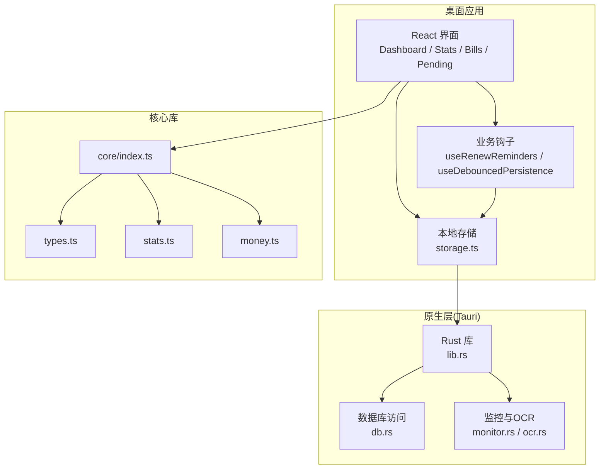
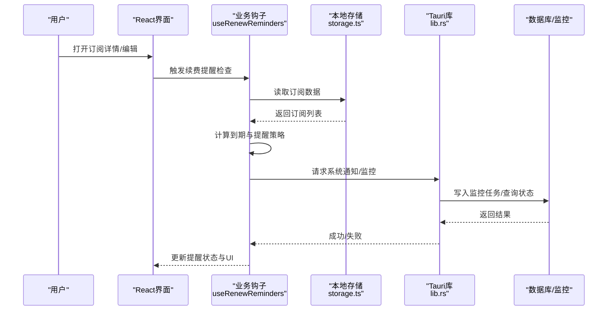
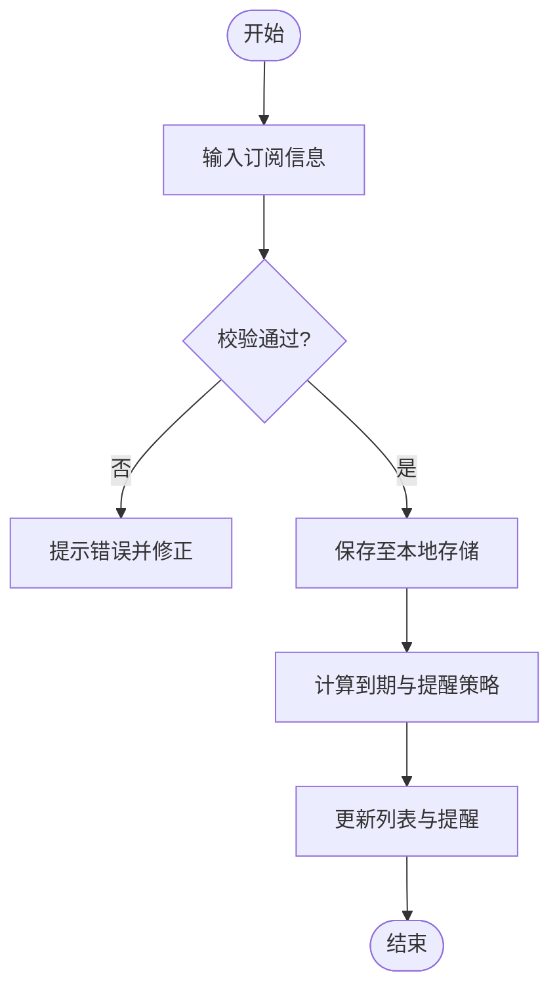
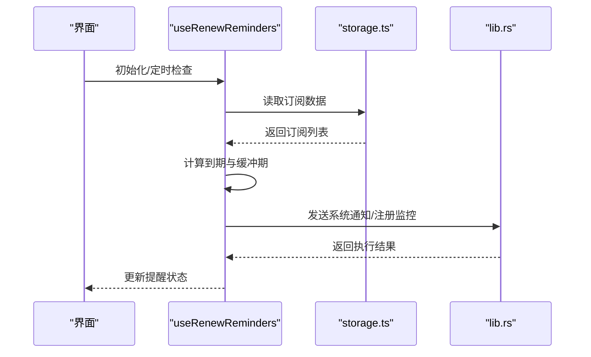
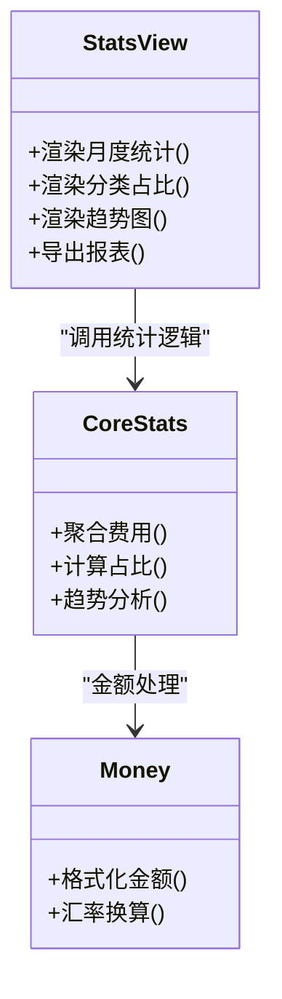
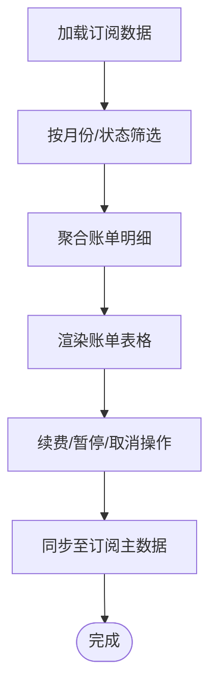
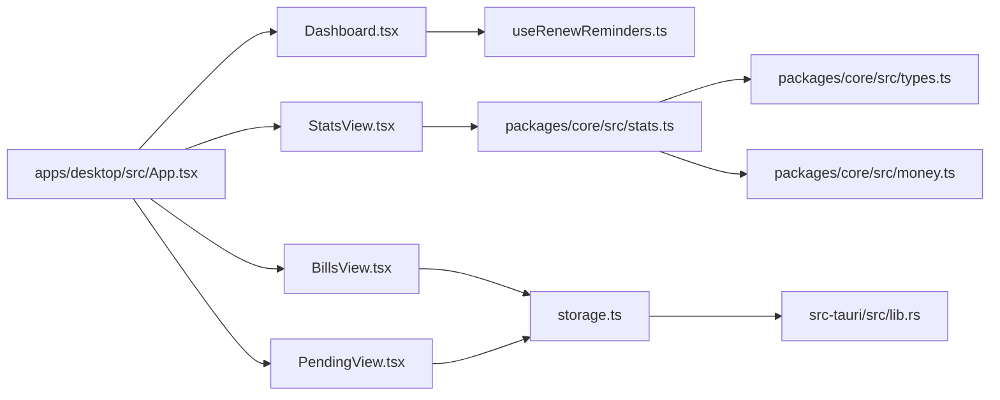

# 项目介绍

<cite>
**本文档引用的文件**   
- [README.md](file://README.md)
- [package.json](file://package.json)
- [apps/desktop/src/App.tsx](file://apps/desktop/src/App.tsx)
- [apps/desktop/src/Dashboard.tsx](file://apps/desktop/src/Dashboard.tsx)
- [apps/desktop/src/StatsView.tsx](file://apps/desktop/src/StatsView.tsx)
- [apps/desktop/src/BillsView.tsx](file://apps/desktop/src/BillsView.tsx)
- [apps/desktop/src/PendingView.tsx](file://apps/desktop/src/PendingView.tsx)
- [apps/desktop/src/SubscriptionFormModal.tsx](file://apps/desktop/src/SubscriptionFormModal.tsx)
- [apps/desktop/src/useRenewReminders.ts](file://apps/desktop/src/useRenewReminders.ts)
- [apps/desktop/src/storage.ts](file://apps/desktop/src/storage.ts)
- [apps/desktop/src-tauri/src/lib.rs](file://apps/desktop/src-tauri/src/lib.rs)
- [packages/core/src/index.ts](file://packages/core/src/index.ts)
- [packages/core/src/types.ts](file://packages/core/src/types.ts)
- [packages/core/src/stats.ts](file://packages/core/src/stats.ts)
- [packages/core/src/money.ts](file://packages/core/src/money.ts)
- [docs/product.md](file://docs/product.md)
</cite>

## 目录
1. [简介](#简介)
2. [项目结构](#项目结构)
3. [核心组件](#核心组件)
4. [架构总览](#架构总览)
5. [详细组件分析](#详细组件分析)
6. [依赖关系分析](#依赖关系分析)
7. [性能考量](#性能考量)
8. [故障排查指南](#故障排查指南)
9. [结论](#结论)
10. [附录](#附录)

## 简介
本项目是一款面向个人用户与小型团队的桌面应用，专注于AI账号订阅管理。它帮助用户集中跟踪和管理多个AI服务的订阅状态、到期时间、费用等关键信息，解决“多服务、多平台、易遗忘”的订阅痛点。通过订阅生命周期管理、智能提醒系统、统计分析仪表板等功能，让用户清晰掌握每笔订阅的成本与续费节奏，避免漏续或重复付费，提升财务与效率管理体验。

核心价值
- 统一视图：将分散在各平台的AI订阅集中在一个界面中管理
- 生命周期管理：从新增、续费、暂停到取消的全流程跟踪
- 智能提醒：基于到期时间与续费周期提供及时提醒
- 统计分析：按服务、类别、月份等多维度统计费用与趋势
- 本地优先：数据本地存储，隐私可控、离线可用

目标用户
- 个人开发者与自由职业者：使用多种AI工具（如模型API、绘图、写作助手等）
- 小型团队：协同管理团队共享的AI订阅账户与预算
- 对成本敏感的用户：需要精细化追踪订阅支出与优化策略

设计理念
- 以用户为中心：简洁直观的表单与列表，降低录入与维护成本
- 数据可迁移：结构化数据便于导入导出与跨设备同步（未来扩展）
- 可扩展架构：核心逻辑与UI解耦，便于后续增加新服务模板与分析维度

使用场景
- 月度账单复盘：查看当月订阅费用分布与同比变化
- 续费前准备：提前收到提醒，评估是否继续续费或降级套餐
- 团队协作：多人维护同一份订阅清单，确保信息一致

版本信息与更新历史概览
- 当前版本：见包配置中的版本号字段
- 更新频率：持续迭代，聚焦稳定性、易用性与分析能力增强
- 变更记录：详见文档与发布说明

章节来源
- [README.md](file://README.md)
- [package.json](file://package.json)
- [docs/product.md](file://docs/product.md)

## 项目结构
项目采用前后端分离与模块化设计：
- 桌面应用（Electron/Tauri）：前端React + TypeScript，后端Rust（Tauri），提供本地数据存储与系统级能力
- 核心库（packages/core）：领域模型、数据处理、统计计算、货币处理等通用逻辑
- 文档与脚本：产品说明、打包签名脚本、CI流水线等

图表来源
- [apps/desktop/src/App.tsx](file://apps/desktop/src/App.tsx)
- [apps/desktop/src/Dashboard.tsx](file://apps/desktop/src/Dashboard.tsx)
- [apps/desktop/src/StatsView.tsx](file://apps/desktop/src/StatsView.tsx)
- [apps/desktop/src/BillsView.tsx](file://apps/desktop/src/BillsView.tsx)
- [apps/desktop/src/PendingView.tsx](file://apps/desktop/src/PendingView.tsx)
- [apps/desktop/src/useRenewReminders.ts](file://apps/desktop/src/useRenewReminders.ts)
- [apps/desktop/src/storage.ts](file://apps/desktop/src/storage.ts)
- [apps/desktop/src-tauri/src/lib.rs](file://apps/desktop/src-tauri/src/lib.rs)
- [packages/core/src/index.ts](file://packages/core/src/index.ts)
- [packages/core/src/types.ts](file://packages/core/src/types.ts)
- [packages/core/src/stats.ts](file://packages/core/src/stats.ts)
- [packages/core/src/money.ts](file://packages/core/src/money.ts)

章节来源
- [apps/desktop/src/App.tsx](file://apps/desktop/src/App.tsx)
- [apps/desktop/src/Dashboard.tsx](file://apps/desktop/src/Dashboard.tsx)
- [apps/desktop/src/StatsView.tsx](file://apps/desktop/src/StatsView.tsx)
- [apps/desktop/src/BillsView.tsx](file://apps/desktop/src/BillsView.tsx)
- [apps/desktop/src/PendingView.tsx](file://apps/desktop/src/PendingView.tsx)
- [apps/desktop/src/useRenewReminders.ts](file://apps/desktop/src/useRenewReminders.ts)
- [apps/desktop/src/storage.ts](file://apps/desktop/src/storage.ts)
- [apps/desktop/src-tauri/src/lib.rs](file://apps/desktop/src-tauri/src/lib.rs)
- [packages/core/src/index.ts](file://packages/core/src/index.ts)
- [packages/core/src/types.ts](file://packages/core/src/types.ts)
- [packages/core/src/stats.ts](file://packages/core/src/stats.ts)
- [packages/core/src/money.ts](file://packages/core/src/money.ts)

## 核心组件
- 订阅表单与编辑：支持创建、编辑订阅项，包含名称、服务商、类别、价格、币种、计费周期、到期日、备注等字段
- 订阅列表与筛选：按状态、类别、到期时间等维度快速定位与管理
- 账单视图：按月聚合账单明细，支持导出与对比
- 待办与监控：展示即将到期、已过期、需续费的订阅，并提供一键操作入口
- 统计仪表板：多维度统计费用、趋势、占比，辅助决策
- 提醒系统：基于订阅到期与续费周期生成提醒任务
- 本地持久化：防抖写入与缓存，保证性能与一致性

章节来源
- [apps/desktop/src/SubscriptionFormModal.tsx](file://apps/desktop/src/SubscriptionFormModal.tsx)
- [apps/desktop/src/BillsView.tsx](file://apps/desktop/src/BillsView.tsx)
- [apps/desktop/src/PendingView.tsx](file://apps/desktop/src/PendingView.tsx)
- [apps/desktop/src/StatsView.tsx](file://apps/desktop/src/StatsView.tsx)
- [apps/desktop/src/useRenewReminders.ts](file://apps/desktop/src/useRenewReminders.ts)
- [apps/desktop/src/storage.ts](file://apps/desktop/src/storage.ts)

## 架构总览
整体采用“前端React + 核心库 + 原生层Tauri”的分层架构：
- 表现层（React）：负责交互与可视化
- 业务层（hooks与store）：封装订阅生命周期、提醒、统计等业务逻辑
- 数据层（storage与Tauri）：本地持久化、数据库访问、系统通知与监控
- 核心库（core）：类型定义、规则、统计、货币处理等通用能力

图表来源
- [apps/desktop/src/useRenewReminders.ts](file://apps/desktop/src/useRenewReminders.ts)
- [apps/desktop/src/storage.ts](file://apps/desktop/src/storage.ts)
- [apps/desktop/src-tauri/src/lib.rs](file://apps/desktop/src-tauri/src/lib.rs)

章节来源
- [apps/desktop/src/App.tsx](file://apps/desktop/src/App.tsx)
- [apps/desktop/src/Dashboard.tsx](file://apps/desktop/src/Dashboard.tsx)
- [apps/desktop/src/StatsView.tsx](file://apps/desktop/src/StatsView.tsx)
- [apps/desktop/src/BillsView.tsx](file://apps/desktop/src/BillsView.tsx)
- [apps/desktop/src/PendingView.tsx](file://apps/desktop/src/PendingView.tsx)
- [apps/desktop/src/useRenewReminders.ts](file://apps/desktop/src/useRenewReminders.ts)
- [apps/desktop/src/storage.ts](file://apps/desktop/src/storage.ts)
- [apps/desktop/src-tauri/src/lib.rs](file://apps/desktop/src-tauri/src/lib.rs)

## 详细组件分析

### 订阅生命周期管理
- 新增订阅：通过表单收集必要字段并校验，写入本地存储
- 续费与变更：支持修改价格、周期、到期日，自动重新计算提醒
- 暂停与取消：标记状态，影响统计与提醒策略
- 批量操作：支持多选、批量更新状态与字段

图表来源
- [apps/desktop/src/SubscriptionFormModal.tsx](file://apps/desktop/src/SubscriptionFormModal.tsx)
- [apps/desktop/src/storage.ts](file://apps/desktop/src/storage.ts)
- [apps/desktop/src/useRenewReminders.ts](file://apps/desktop/src/useRenewReminders.ts)

章节来源
- [apps/desktop/src/SubscriptionFormModal.tsx](file://apps/desktop/src/SubscriptionFormModal.tsx)
- [apps/desktop/src/storage.ts](file://apps/desktop/src/storage.ts)
- [apps/desktop/src/useRenewReminders.ts](file://apps/desktop/src/useRenewReminders.ts)

### 智能提醒系统
- 提醒策略：基于到期日、续费周期、缓冲天数生成提醒任务
- 提醒渠道：系统通知与界面内提醒
- 去重与合并：避免重复提醒，支持按订阅合并
- 可配置：允许用户自定义提醒阈值与渠道

图表来源
- [apps/desktop/src/useRenewReminders.ts](file://apps/desktop/src/useRenewReminders.ts)
- [apps/desktop/src/storage.ts](file://apps/desktop/src/storage.ts)
- [apps/desktop/src-tauri/src/lib.rs](file://apps/desktop/src-tauri/src/lib.rs)

章节来源
- [apps/desktop/src/useRenewReminders.ts](file://apps/desktop/src/useRenewReminders.ts)
- [apps/desktop/src/storage.ts](file://apps/desktop/src/storage.ts)
- [apps/desktop/src-tauri/src/lib.rs](file://apps/desktop/src-tauri/src/lib.rs)

### 统计分析仪表板
- 指标维度：按服务、类别、月份统计费用与占比
- 趋势分析：月度费用曲线与同比环比
- 异常检测：识别异常高消费与服务集中度风险
- 导出与分享：支持导出报表用于复盘与汇报

图表来源
- [apps/desktop/src/StatsView.tsx](file://apps/desktop/src/StatsView.tsx)
- [packages/core/src/stats.ts](file://packages/core/src/stats.ts)
- [packages/core/src/money.ts](file://packages/core/src/money.ts)

章节来源
- [apps/desktop/src/StatsView.tsx](file://apps/desktop/src/StatsView.tsx)
- [packages/core/src/stats.ts](file://packages/core/src/stats.ts)
- [packages/core/src/money.ts](file://packages/core/src/money.ts)

### 账单与待办视图
- 账单视图：按月聚合订阅费用，支持筛选与排序
- 待办视图：展示即将到期、已过期、需续费的订阅，提供快捷操作
- 数据一致性：与订阅主数据联动，确保状态同步

图表来源
- [apps/desktop/src/BillsView.tsx](file://apps/desktop/src/BillsView.tsx)
- [apps/desktop/src/PendingView.tsx](file://apps/desktop/src/PendingView.tsx)
- [apps/desktop/src/storage.ts](file://apps/desktop/src/storage.ts)

章节来源
- [apps/desktop/src/BillsView.tsx](file://apps/desktop/src/BillsView.tsx)
- [apps/desktop/src/PendingView.tsx](file://apps/desktop/src/PendingView.tsx)
- [apps/desktop/src/storage.ts](file://apps/desktop/src/storage.ts)

## 依赖关系分析
- 前端依赖：React生态（Vite、TypeScript、测试框架）
- 核心库依赖：类型定义、统计、货币处理、导入导出等
- 原生依赖：Tauri（Rust）提供本地能力（数据库、通知、监控）
- 构建与CI：GitHub Actions自动化构建与测试

图表来源
- [apps/desktop/src/App.tsx](file://apps/desktop/src/App.tsx)
- [apps/desktop/src/Dashboard.tsx](file://apps/desktop/src/Dashboard.tsx)
- [apps/desktop/src/StatsView.tsx](file://apps/desktop/src/StatsView.tsx)
- [apps/desktop/src/BillsView.tsx](file://apps/desktop/src/BillsView.tsx)
- [apps/desktop/src/PendingView.tsx](file://apps/desktop/src/PendingView.tsx)
- [apps/desktop/src/useRenewReminders.ts](file://apps/desktop/src/useRenewReminders.ts)
- [apps/desktop/src/storage.ts](file://apps/desktop/src/storage.ts)
- [apps/desktop/src-tauri/src/lib.rs](file://apps/desktop/src-tauri/src/lib.rs)
- [packages/core/src/stats.ts](file://packages/core/src/stats.ts)
- [packages/core/src/types.ts](file://packages/core/src/types.ts)
- [packages/core/src/money.ts](file://packages/core/src/money.ts)

章节来源
- [apps/desktop/src/App.tsx](file://apps/desktop/src/App.tsx)
- [apps/desktop/src/Dashboard.tsx](file://apps/desktop/src/Dashboard.tsx)
- [apps/desktop/src/StatsView.tsx](file://apps/desktop/src/StatsView.tsx)
- [apps/desktop/src/BillsView.tsx](file://apps/desktop/src/BillsView.tsx)
- [apps/desktop/src/PendingView.tsx](file://apps/desktop/src/PendingView.tsx)
- [apps/desktop/src/useRenewReminders.ts](file://apps/desktop/src/useRenewReminders.ts)
- [apps/desktop/src/storage.ts](file://apps/desktop/src/storage.ts)
- [apps/desktop/src-tauri/src/lib.rs](file://apps/desktop/src-tauri/src/lib.rs)
- [packages/core/src/stats.ts](file://packages/core/src/stats.ts)
- [packages/core/src/types.ts](file://packages/core/src/types.ts)
- [packages/core/src/money.ts](file://packages/core/src/money.ts)

## 性能考量
- 防抖持久化：减少频繁写入磁盘，提升响应速度
- 按需加载：视图与模块懒加载，降低首屏开销
- 数据聚合优化：在核心库中进行高效统计与缓存
- 原生能力利用：通过Tauri进行I/O与系统通知，避免阻塞UI线程

[本节为通用指导，不直接分析具体文件]

## 故障排查指南
- 数据不一致：检查本地存储与订阅主数据的同步逻辑，确认防抖写入是否生效
- 提醒未触发：验证提醒策略配置与系统通知权限，检查Tauri监控任务是否正常注册
- 统计异常：核对货币格式与汇率换算逻辑，确认时间范围与分组维度是否正确
- 导入失败：检查导入数据格式与字段映射，确保必填字段完整

章节来源
- [apps/desktop/src/storage.ts](file://apps/desktop/src/storage.ts)
- [apps/desktop/src/useRenewReminders.ts](file://apps/desktop/src/useRenewReminders.ts)
- [apps/desktop/src-tauri/src/lib.rs](file://apps/desktop/src-tauri/src/lib.rs)
- [packages/core/src/money.ts](file://packages/core/src/money.ts)
- [packages/core/src/stats.ts](file://packages/core/src/stats.ts)

## 结论
本项目以清晰的架构与实用的功能，帮助个人与小型团队高效管理AI订阅。通过订阅生命周期管理、智能提醒与统计分析，显著降低遗漏续费与成本失控的风险。未来将持续优化用户体验与扩展性，满足更多场景需求。

[本节为总结性内容，不直接分析具体文件]

## 附录
- 安装与运行：参考根目录包配置与README说明
- 开发环境：Node.js、Rust工具链、Tauri CLI
- 贡献指南：遵循代码规范与测试要求，提交PR前确保CI通过

章节来源
- [README.md](file://README.md)
- [package.json](file://package.json)
- [docs/product.md](file://docs/product.md)