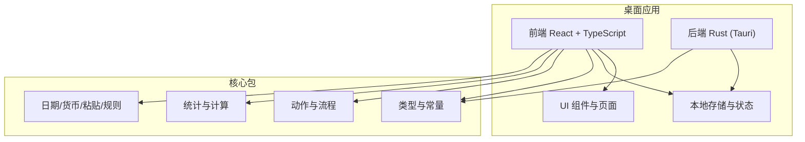
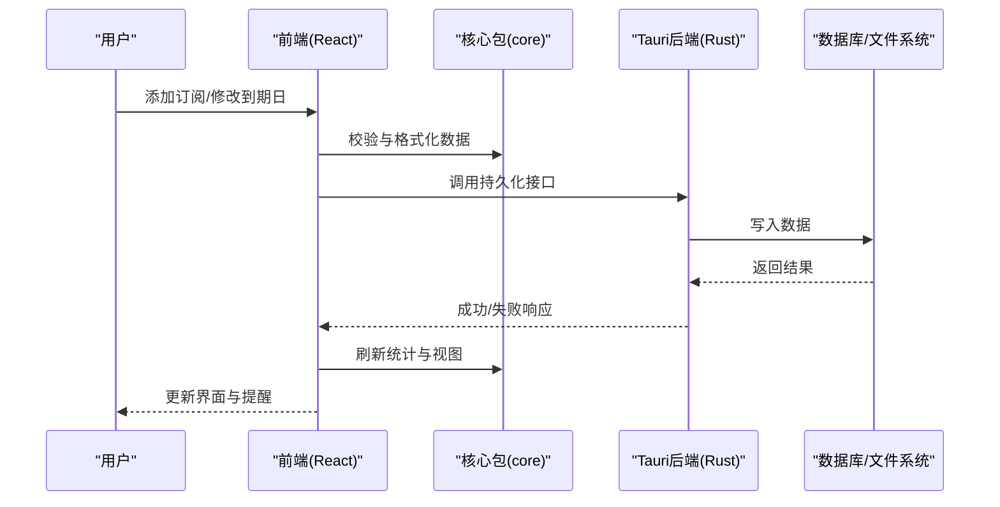
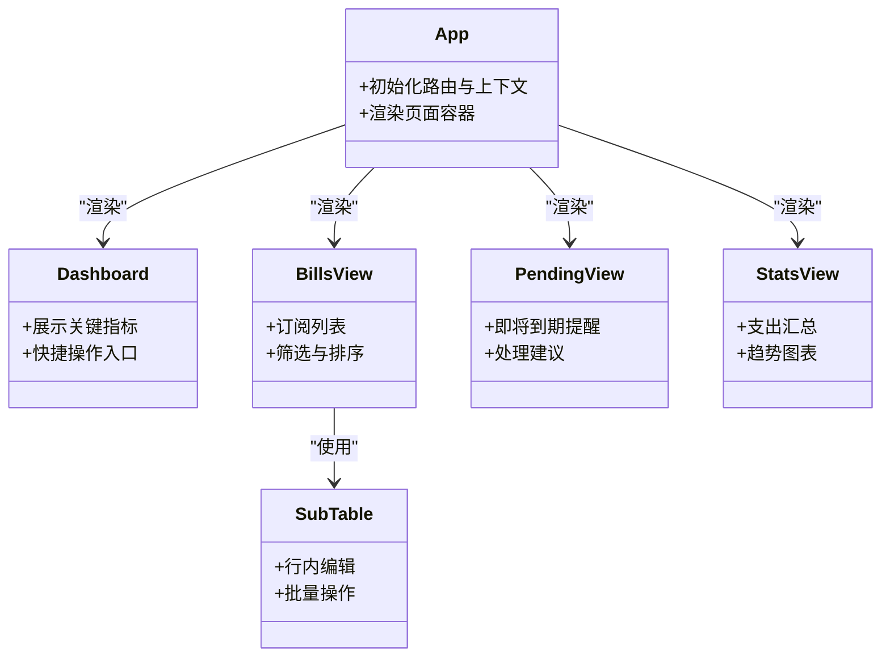
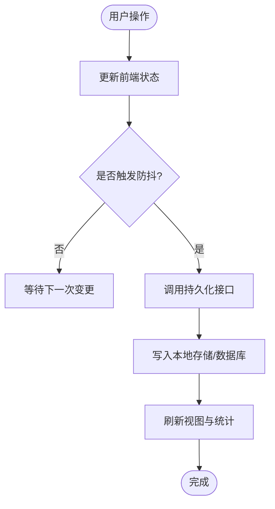
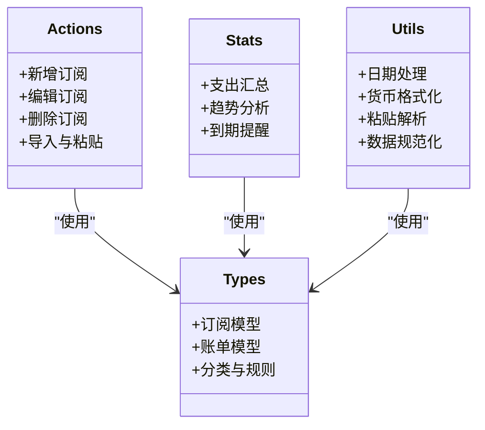
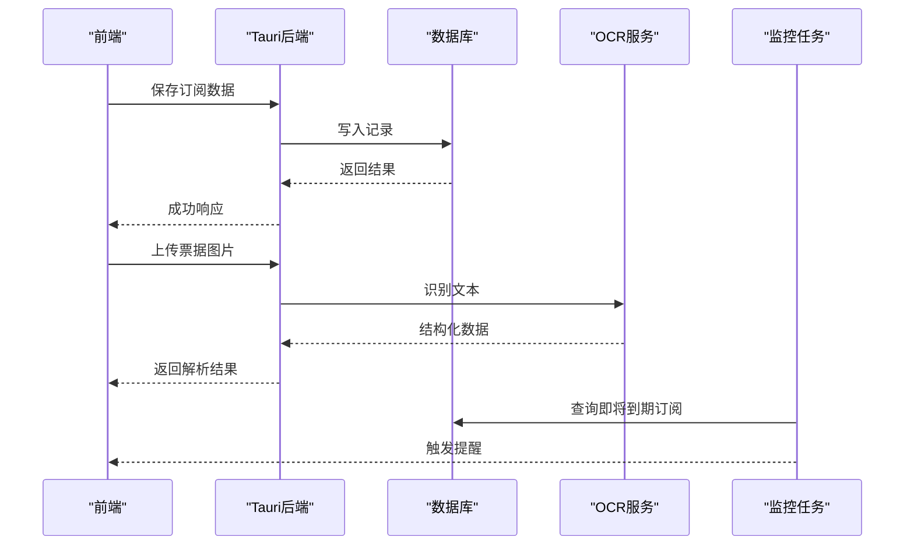
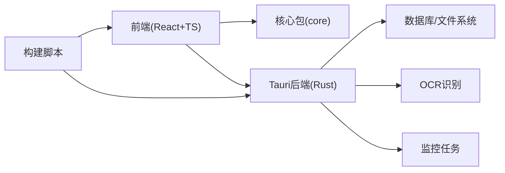

# 项目概览

<cite>
**本文引用的文件**   
- [README.md](file://README.md)
- [package.json](file://package.json)
- [apps/desktop/package.json](file://apps/desktop/package.json)
- [apps/desktop/vite.config.ts](file://apps/desktop/vite.config.ts)
- [apps/desktop/src/main.tsx](file://apps/desktop/src/main.tsx)
- [apps/desktop/src/App.tsx](file://apps/desktop/src/App.tsx)
- [apps/desktop/src/Dashboard.tsx](file://apps/desktop/src/Dashboard.tsx)
- [apps/desktop/src/BillsView.tsx](file://apps/desktop/src/BillsView.tsx)
- [apps/desktop/src/PendingView.tsx](file://apps/desktop/src/PendingView.tsx)
- [apps/desktop/src/StatsView.tsx](file://apps/desktop/src/StatsView.tsx)
- [apps/desktop/src/SubTable.tsx](file://apps/desktop/src/SubTable.tsx)
- [apps/desktop/src/storage.ts](file://apps/desktop/src/storage.ts)
- [apps/desktop/src/useDebouncedPersistence.ts](file://apps/desktop/src/useDebouncedPersistence.ts)
- [apps/desktop/src/i18n.ts](file://apps/desktop/src/i18n.ts)
- [apps/desktop/src/theme.ts](file://apps/desktop/src/theme.ts)
- [apps/desktop/src/utils/dateUtils.ts](file://apps/desktop/src/utils/dateUtils.ts)
- [apps/desktop/src-tauri/Cargo.toml](file://apps/desktop/src-tauri/Cargo.toml)
- [apps/desktop/src-tauri/tauri.conf.json](file://apps/desktop/src-tauri/tauri.conf.json)
- [apps/desktop/src-tauri/src/lib.rs](file://apps/desktop/src-tauri/src/lib.rs)
- [apps/desktop/src-tauri/src/main.rs](file://apps/desktop/src-tauri/src/main.rs)
- [apps/desktop/src-tauri/src/db.rs](file://apps/desktop/src-tauri/src/db.rs)
- [apps/desktop/src-tauri/src/monitor.rs](file://apps/desktop/src-tauri/src/monitor.rs)
- [apps/desktop/src-tauri/src/ocr.rs](file://apps/desktop/src-tauri/src/ocr.rs)
- [packages/core/src/index.ts](file://packages/core/src/index.ts)
- [packages/core/src/types.ts](file://packages/core/src/types.ts)
- [packages/core/src/actions.ts](file://packages/core/src/actions.ts)
- [packages/core/src/stats.ts](file://packages/core/src/stats.ts)
- [packages/core/src/money.ts](file://packages/core/src/money.ts)
- [packages/core/src/dates.ts](file://packages/core/src/dates.ts)
- [packages/core/src/defaults.ts](file://packages/core/src/defaults.ts)
- [packages/core/src/load.ts](file://packages/core/src/load.ts)
- [packages/core/src/normalize.ts](file://packages/core/src/normalize.ts)
- [packages/core/src/paste.ts](file://packages/core/src/paste.ts)
- [packages/core/src/rules.ts](file://packages/core/src/rules.ts)
- [packages/core/src/views.ts](file://packages/core/src/views.ts)
- [packages/core/src/analytics.ts](file://packages/core/src/analytics.ts)
- [scripts/sign-macos-app.sh](file://scripts/sign-macos-app.sh)
</cite>

## 目录
1. [简介](#简介)
2. [项目结构](#项目结构)
3. [核心组件](#核心组件)
4. [架构总览](#架构总览)
5. [详细组件分析](#详细组件分析)
6. [依赖关系分析](#依赖关系分析)
7. [性能考量](#性能考量)
8. [故障排查指南](#故障排查指南)
9. [结论](#结论)
10. [附录](#附录)

## 简介
本项目是一个用于管理各类AI服务订阅的桌面应用程序，目标是帮助用户集中跟踪订阅、到期提醒、账单管理与统计分析。应用采用Tauri框架构建跨平台桌面端，前端使用React与TypeScript，后端使用Rust提供系统级能力（如数据库访问、OCR识别、监控任务等）。核心业务逻辑与类型定义被抽象到独立的core包中，便于在桌面端与其他平台复用。

主要功能特性包括：
- 订阅生命周期管理：新增、编辑、删除、批量导入与粘贴解析
- 到期与续费提醒：基于日期计算与本地通知
- 账单视图与统计：按类别、时间维度汇总支出与趋势
- 数据持久化：本地存储与可选后端数据库
- 国际化与主题：多语言与明暗主题切换
- 扩展能力：OCR识别票据、后台监控任务

快速开始（概念性说明）：
- 安装要求：Node.js与Rust工具链（用于构建Tauri后端），具体版本以仓库配置为准
- 安装依赖：在项目根目录执行包管理器命令安装依赖
- 启动开发环境：运行桌面端开发服务器并加载Tauri窗口
- 基本使用：添加订阅、设置到期日、查看账单与统计、导出或导入数据

**章节来源**
- [README.md](file://README.md)
- [package.json](file://package.json)
- [apps/desktop/package.json](file://apps/desktop/package.json)

## 项目结构
项目采用Monorepo组织方式，包含以下关键模块：
- apps/desktop：Tauri桌面应用，前端React+Vite，后端Rust
- packages/core：共享的业务逻辑、类型与工具库
- scripts：构建与签名脚本
- docs：产品与设计文档

图表来源
- [apps/desktop/src/main.tsx](file://apps/desktop/src/main.tsx)
- [apps/desktop/src/App.tsx](file://apps/desktop/src/App.tsx)
- [apps/desktop/src-tauri/src/lib.rs](file://apps/desktop/src-tauri/src/lib.rs)
- [packages/core/src/index.ts](file://packages/core/src/index.ts)

**章节来源**
- [apps/desktop/vite.config.ts](file://apps/desktop/vite.config.ts)
- [apps/desktop/src-tauri/tauri.conf.json](file://apps/desktop/src-tauri/tauri.conf.json)
- [apps/desktop/src-tauri/Cargo.toml](file://apps/desktop/src-tauri/Cargo.toml)

## 核心组件
- 前端入口与路由：应用主入口初始化React与路由，挂载根组件
- 页面与视图：仪表盘、账单列表、待处理项、统计视图、订阅表格
- 表单与弹窗：订阅表单、到期日选择器、设置与监控弹窗
- 数据层：本地存储、防抖持久化、国际化与主题
- 后端能力：数据库操作、OCR识别、监控任务调度

这些组件共同构成订阅管理的完整工作流：用户在前端操作，通过Tauri调用Rust后端进行持久化与系统级任务，核心包提供统一的数据模型与计算逻辑。

**章节来源**
- [apps/desktop/src/main.tsx](file://apps/desktop/src/main.tsx)
- [apps/desktop/src/App.tsx](file://apps/desktop/src/App.tsx)
- [apps/desktop/src/Dashboard.tsx](file://apps/desktop/src/Dashboard.tsx)
- [apps/desktop/src/BillsView.tsx](file://apps/desktop/src/BillsView.tsx)
- [apps/desktop/src/PendingView.tsx](file://apps/desktop/src/PendingView.tsx)
- [apps/desktop/src/StatsView.tsx](file://apps/desktop/src/StatsView.tsx)
- [apps/desktop/src/SubTable.tsx](file://apps/desktop/src/SubTable.tsx)
- [apps/desktop/src/storage.ts](file://apps/desktop/src/storage.ts)
- [apps/desktop/src/useDebouncedPersistence.ts](file://apps/desktop/src/useDebouncedPersistence.ts)
- [apps/desktop/src/i18n.ts](file://apps/desktop/src/i18n.ts)
- [apps/desktop/src/theme.ts](file://apps/desktop/src/theme.ts)
- [apps/desktop/src/utils/dateUtils.ts](file://apps/desktop/src/utils/dateUtils.ts)
- [apps/desktop/src-tauri/src/db.rs](file://apps/desktop/src-tauri/src/db.rs)
- [apps/desktop/src-tauri/src/monitor.rs](file://apps/desktop/src-tauri/src/monitor.rs)
- [apps/desktop/src-tauri/src/ocr.rs](file://apps/desktop/src-tauri/src/ocr.rs)

## 架构总览
整体架构遵循“前端交互—核心逻辑—后端能力”的分层设计：
- 前端负责用户界面与交互，调用核心包的类型与工具函数
- 核心包提供订阅数据模型、动作流程、统计与日期/货币处理
- Tauri后端暴露Rust能力给前端，实现数据库读写、OCR与监控任务

图表来源
- [apps/desktop/src/App.tsx](file://apps/desktop/src/App.tsx)
- [packages/core/src/actions.ts](file://packages/core/src/actions.ts)
- [apps/desktop/src-tauri/src/lib.rs](file://apps/desktop/src-tauri/src/lib.rs)
- [apps/desktop/src-tauri/src/db.rs](file://apps/desktop/src-tauri/src/db.rs)

**章节来源**
- [apps/desktop/src-tauri/src/main.rs](file://apps/desktop/src-tauri/src/main.rs)
- [apps/desktop/src-tauri/src/lib.rs](file://apps/desktop/src-tauri/src/lib.rs)

## 详细组件分析

### 前端应用与视图
- 主入口与根组件：初始化应用上下文、路由与全局状态
- 仪表盘：展示关键指标与快捷操作
- 账单视图：列出订阅账单，支持筛选与排序
- 待处理视图：显示即将到期或需要处理的订阅
- 统计视图：按时间维度与类别汇总支出
- 订阅表格：行内编辑、批量操作与导入导出

图表来源
- [apps/desktop/src/App.tsx](file://apps/desktop/src/App.tsx)
- [apps/desktop/src/Dashboard.tsx](file://apps/desktop/src/Dashboard.tsx)
- [apps/desktop/src/BillsView.tsx](file://apps/desktop/src/BillsView.tsx)
- [apps/desktop/src/PendingView.tsx](file://apps/desktop/src/PendingView.tsx)
- [apps/desktop/src/StatsView.tsx](file://apps/desktop/src/StatsView.tsx)
- [apps/desktop/src/SubTable.tsx](file://apps/desktop/src/SubTable.tsx)

**章节来源**
- [apps/desktop/src/main.tsx](file://apps/desktop/src/main.tsx)
- [apps/desktop/src/App.tsx](file://apps/desktop/src/App.tsx)
- [apps/desktop/src/Dashboard.tsx](file://apps/desktop/src/Dashboard.tsx)
- [apps/desktop/src/BillsView.tsx](file://apps/desktop/src/BillsView.tsx)
- [apps/desktop/src/PendingView.tsx](file://apps/desktop/src/PendingView.tsx)
- [apps/desktop/src/StatsView.tsx](file://apps/desktop/src/StatsView.tsx)
- [apps/desktop/src/SubTable.tsx](file://apps/desktop/src/SubTable.tsx)

### 数据持久化与状态管理
- 本地存储：封装浏览器或桌面环境的存储API
- 防抖持久化：避免频繁写入，提升性能
- 国际化与主题：提供多语言与明暗主题切换

图表来源
- [apps/desktop/src/storage.ts](file://apps/desktop/src/storage.ts)
- [apps/desktop/src/useDebouncedPersistence.ts](file://apps/desktop/src/useDebouncedPersistence.ts)

**章节来源**
- [apps/desktop/src/storage.ts](file://apps/desktop/src/storage.ts)
- [apps/desktop/src/useDebouncedPersistence.ts](file://apps/desktop/src/useDebouncedPersistence.ts)
- [apps/desktop/src/i18n.ts](file://apps/desktop/src/i18n.ts)
- [apps/desktop/src/theme.ts](file://apps/desktop/src/theme.ts)

### 核心包（Core）
核心包提供跨平台复用的数据类型、动作流程、统计与工具函数：
- 类型与默认值：订阅、账单、分类等数据结构与默认配置
- 动作与流程：订阅的增删改查、导入粘贴、规则匹配
- 统计与计算：支出汇总、趋势分析、到期提醒计算
- 工具函数：日期处理、货币格式化、粘贴解析、数据规范化

图表来源
- [packages/core/src/types.ts](file://packages/core/src/types.ts)
- [packages/core/src/actions.ts](file://packages/core/src/actions.ts)
- [packages/core/src/stats.ts](file://packages/core/src/stats.ts)
- [packages/core/src/money.ts](file://packages/core/src/money.ts)
- [packages/core/src/dates.ts](file://packages/core/src/dates.ts)
- [packages/core/src/defaults.ts](file://packages/core/src/defaults.ts)
- [packages/core/src/load.ts](file://packages/core/src/load.ts)
- [packages/core/src/normalize.ts](file://packages/core/src/normalize.ts)
- [packages/core/src/paste.ts](file://packages/core/src/paste.ts)
- [packages/core/src/rules.ts](file://packages/core/src/rules.ts)
- [packages/core/src/views.ts](file://packages/core/src/views.ts)
- [packages/core/src/analytics.ts](file://packages/core/src/analytics.ts)

**章节来源**
- [packages/core/src/index.ts](file://packages/core/src/index.ts)
- [packages/core/src/types.ts](file://packages/core/src/types.ts)
- [packages/core/src/actions.ts](file://packages/core/src/actions.ts)
- [packages/core/src/stats.ts](file://packages/core/src/stats.ts)
- [packages/core/src/money.ts](file://packages/core/src/money.ts)
- [packages/core/src/dates.ts](file://packages/core/src/dates.ts)
- [packages/core/src/defaults.ts](file://packages/core/src/defaults.ts)
- [packages/core/src/load.ts](file://packages/core/src/load.ts)
- [packages/core/src/normalize.ts](file://packages/core/src/normalize.ts)
- [packages/core/src/paste.ts](file://packages/core/src/paste.ts)
- [packages/core/src/rules.ts](file://packages/core/src/rules.ts)
- [packages/core/src/views.ts](file://packages/core/src/views.ts)
- [packages/core/src/analytics.ts](file://packages/core/src/analytics.ts)

### 后端能力（Tauri + Rust）
- 应用入口与配置：Tauri应用初始化与能力声明
- 数据库操作：本地SQLite或其他存储引擎的读写
- OCR识别：票据图片文字提取与结构化
- 监控任务：定时检查到期与发送提醒

图表来源
- [apps/desktop/src-tauri/src/main.rs](file://apps/desktop/src-tauri/src/main.rs)
- [apps/desktop/src-tauri/src/lib.rs](file://apps/desktop/src-tauri/src/lib.rs)
- [apps/desktop/src-tauri/src/db.rs](file://apps/desktop/src-tauri/src/db.rs)
- [apps/desktop/src-tauri/src/ocr.rs](file://apps/desktop/src-tauri/src/ocr.rs)
- [apps/desktop/src-tauri/src/monitor.rs](file://apps/desktop/src-tauri/src/monitor.rs)

**章节来源**
- [apps/desktop/src-tauri/Cargo.toml](file://apps/desktop/src-tauri/Cargo.toml)
- [apps/desktop/src-tauri/tauri.conf.json](file://apps/desktop/src-tauri/tauri.conf.json)
- [apps/desktop/src-tauri/src/main.rs](file://apps/desktop/src-tauri/src/main.rs)
- [apps/desktop/src-tauri/src/lib.rs](file://apps/desktop/src-tauri/src/lib.rs)
- [apps/desktop/src-tauri/src/db.rs](file://apps/desktop/src-tauri/src/db.rs)
- [apps/desktop/src-tauri/src/ocr.rs](file://apps/desktop/src-tauri/src/ocr.rs)
- [apps/desktop/src-tauri/src/monitor.rs](file://apps/desktop/src-tauri/src/monitor.rs)

## 依赖关系分析
- 前端依赖核心包：类型、动作、统计与工具函数
- 前端与后端通过Tauri通信：调用Rust能力进行持久化与系统任务
- 构建与打包：Vite构建前端，Tauri打包为桌面应用，脚本辅助签名

图表来源
- [apps/desktop/package.json](file://apps/desktop/package.json)
- [apps/desktop/vite.config.ts](file://apps/desktop/vite.config.ts)
- [apps/desktop/src-tauri/Cargo.toml](file://apps/desktop/src-tauri/Cargo.toml)
- [scripts/sign-macos-app.sh](file://scripts/sign-macos-app.sh)

**章节来源**
- [apps/desktop/package.json](file://apps/desktop/package.json)
- [apps/desktop/vite.config.ts](file://apps/desktop/vite.config.ts)
- [apps/desktop/src-tauri/Cargo.toml](file://apps/desktop/src-tauri/Cargo.toml)
- [scripts/sign-macos-app.sh](file://scripts/sign-macos-app.sh)

## 性能考量
- 防抖持久化：减少频繁写入，降低I/O压力
- 本地缓存：常用数据缓存，提升加载速度
- 统计计算优化：增量更新与懒加载，避免全量重算
- 后端异步任务：OCR与监控任务异步执行，不阻塞UI

[本节为通用指导，无需特定文件引用]

## 故障排查指南
- 启动失败：检查Node.js与Rust工具链版本是否符合要求
- 构建错误：确认依赖安装完整，清理缓存后重试
- 数据存储异常：检查本地存储权限与路径
- OCR识别失败：确认图片格式与清晰度，检查OCR服务可用性
- 提醒未触发：检查系统通知权限与定时任务状态

**章节来源**
- [apps/desktop/src-tauri/src/db.rs](file://apps/desktop/src-tauri/src/db.rs)
- [apps/desktop/src-tauri/src/ocr.rs](file://apps/desktop/src-tauri/src/ocr.rs)
- [apps/desktop/src-tauri/src/monitor.rs](file://apps/desktop/src-tauri/src/monitor.rs)

## 结论
本项目通过Tauri将React前端与Rust后端有机结合，提供了完整的AI订阅管理能力。核心包确保了逻辑复用与一致性，前后端协作实现了高效的用户体验与强大的系统级能力。对于初学者，可从基础功能入手逐步了解；对于有经验的开发者，可深入后端能力与核心包扩展点，进一步定制与优化。

[本节为总结性内容，无需特定文件引用]

## 附录
- 快速开始步骤（概念性）：
  - 安装Node.js与Rust工具链
  - 克隆仓库并进入项目目录
  - 安装依赖：执行包管理器命令
  - 启动开发环境：运行桌面端开发服务器
  - 基本使用：添加订阅、查看账单与统计、设置提醒

- iOS适配说明：
  - 参考iOS目录中的说明文档，了解移动端适配策略与限制

**章节来源**
- [apps/ios/README.md](file://apps/ios/README.md)
- [README.md](file://README.md)